Autumn might just be my favourite season: boots, scarves, warm light, red leaves. When the weather is good, Autumn can be unbeatably stunning.

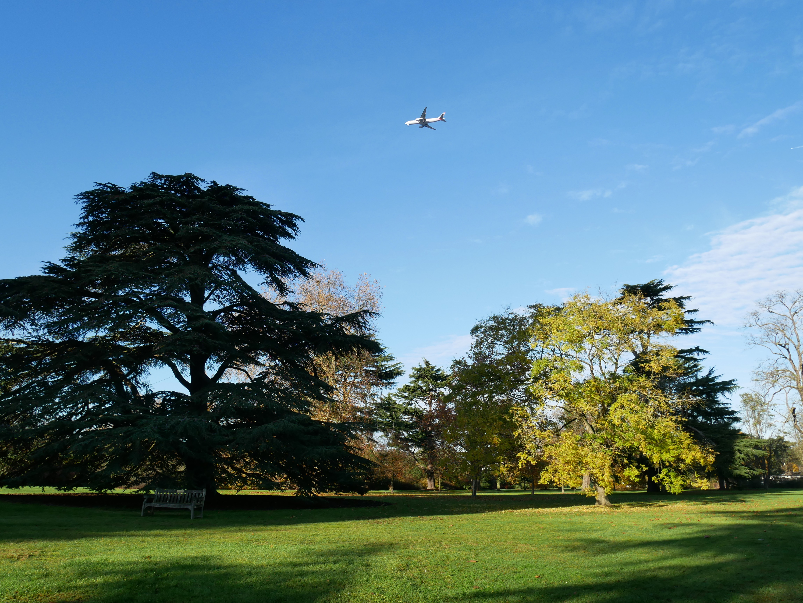

It's no surprise then that in my favourite season, I found myself at my favourite place: Kew Gardens. Where better to escape the noise of the city and wind down with a palette of fire colours, and maybe a hot chocolate or three...?

|  |  |
| --- | --- |
| 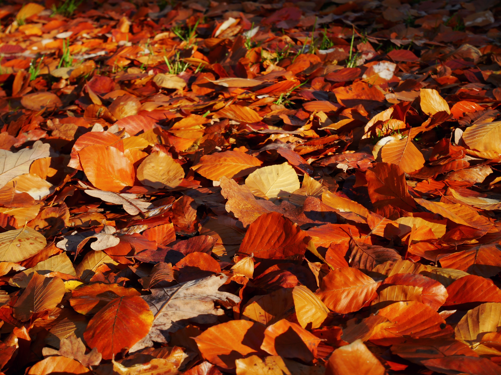 | 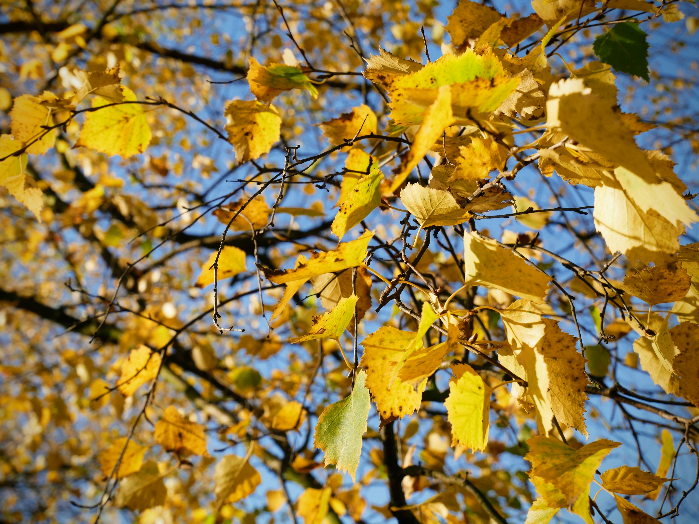

One of my resolutions in 2017 was to go on more solo adventures - so even if Aidan and Greg didn't fancy leaving the warmth and comfort of home, I'd still get my weekend nature kick regardless.

|  |  |
| --- | --- |
|  | 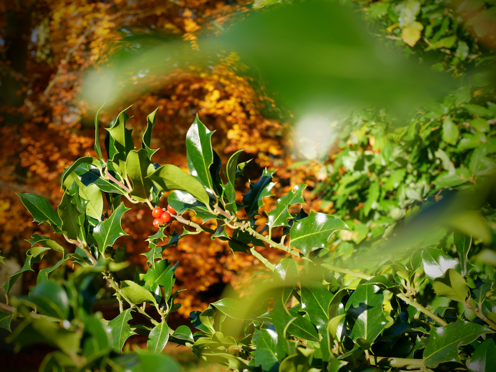

And what better backdrop to catch up with some Christmas card writing?!

|  |  |
| --- | --- |
| 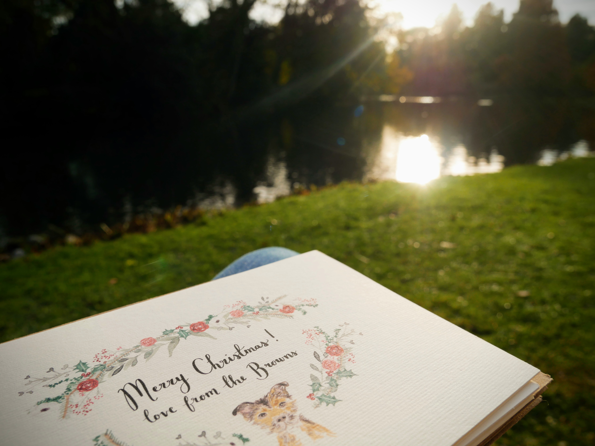 | 

To confirm, yes, we are the sort of people who buy personalised pet cards...I'm not sorry. If you like what you see, be sure to take a look at [Wildflower Illustration Co.](https://www.wildflowerillustrationco.com/) for the best cards and artwork, from the sweetest and most talented couple.

I stayed in this spot, perched on a solitary bench for quite some time; lost in my own thoughts and relishing in the late afternoon sunshine. When my hands got too cold for more card writing, I moved on and was rewarded with this adorable fungi. You can hardly see him there in the photo...there wasn't mushroom. (I can hear the groans from here!)

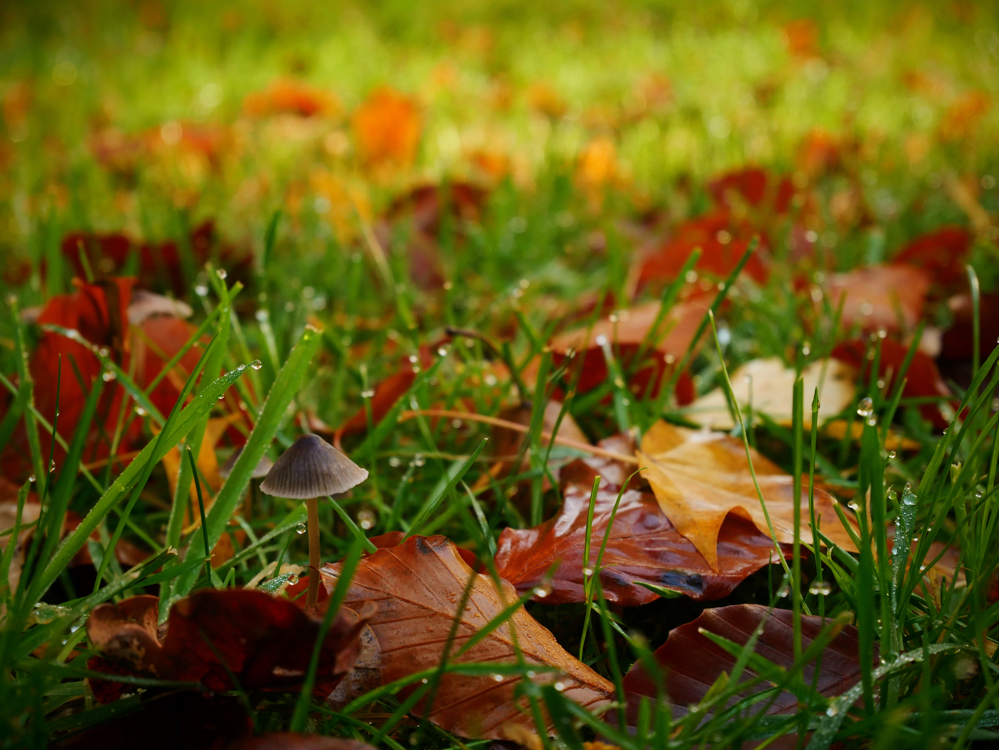

To complete my afternoon out, I stopped by the rose garden to see the last of the summer's stragglers. I wasn't disappointed.

|  |  |
| --- | --- |
| 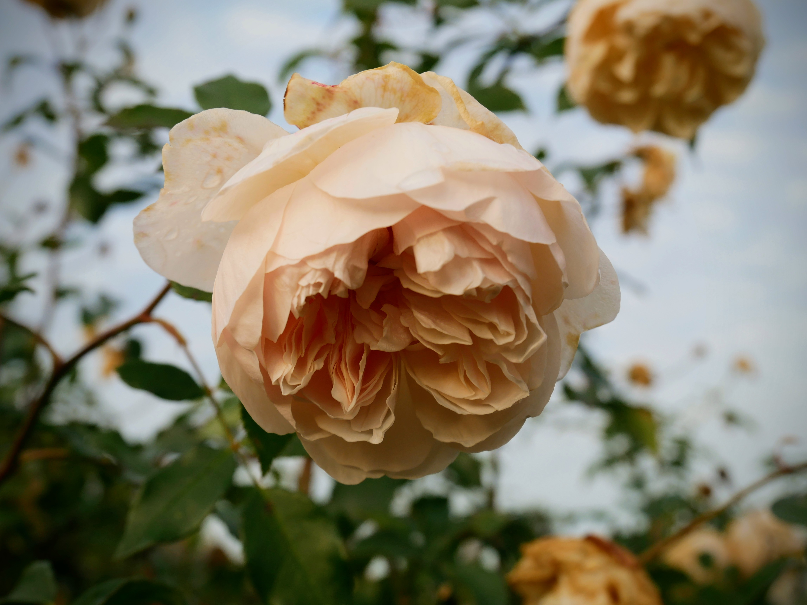 | 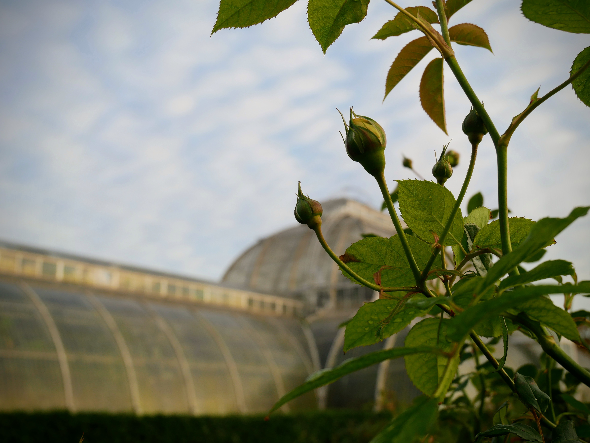

Just look at these clouds! Altocumulus, maybe?!

|  |  |
| --- | --- |
| 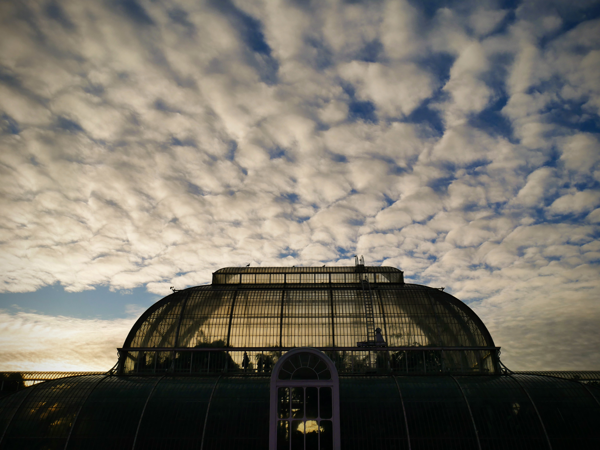 | 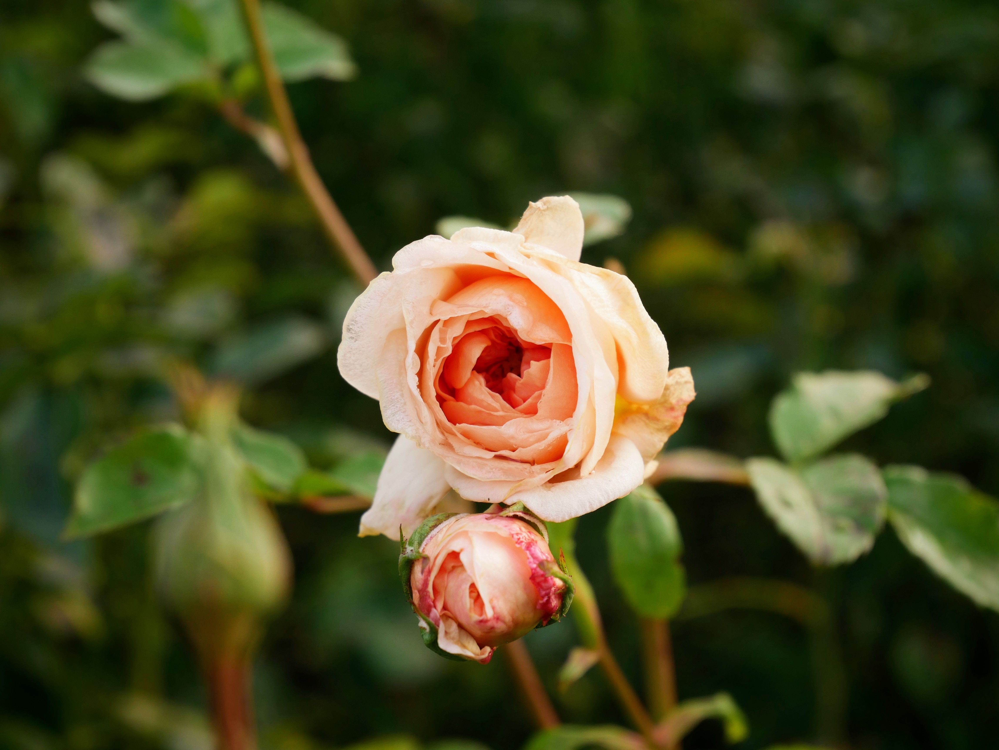

As the light started to fade, I retraced my steps back to the Lion Gate, stopping en route at the Shirley Shirwood Gallery. I was just in time to visit the Rebecca Law's amazing exhibition 'Life in Death'. The exhibition showcased a huge collection of dried flowers, hung in scented garland upon garland.

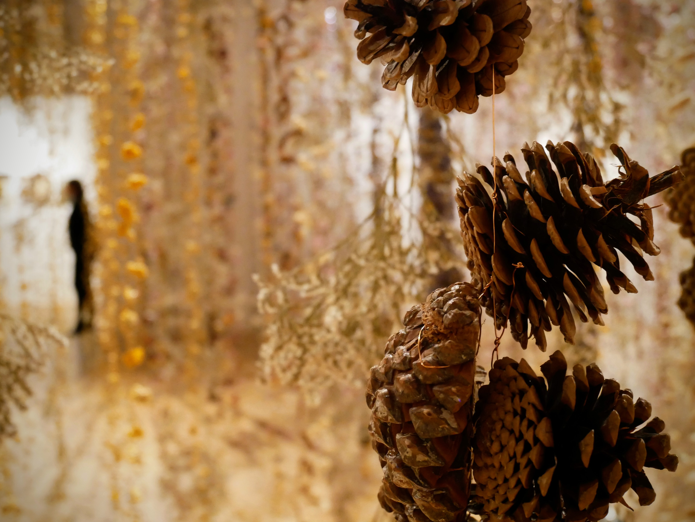

|  |  |
| --- | --- |
| 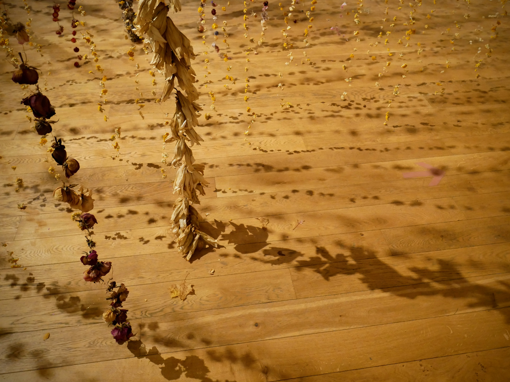 | 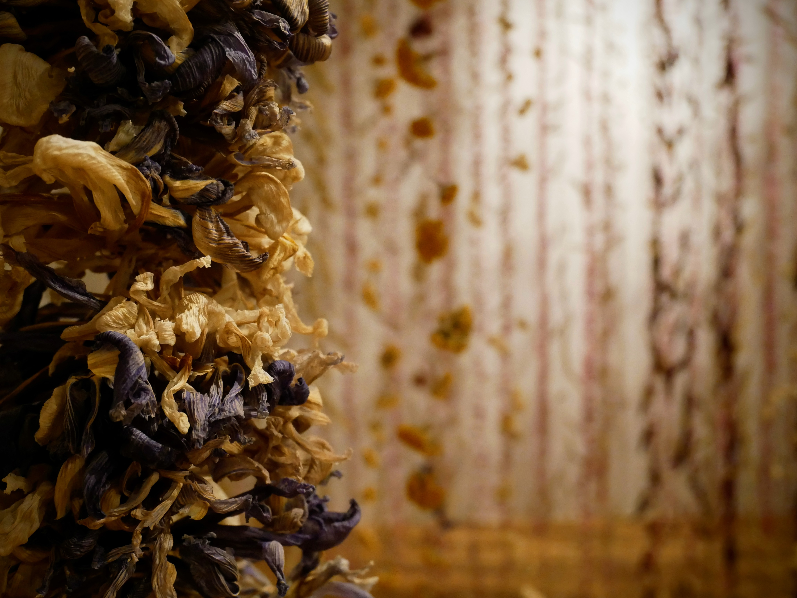

A truly powerful statement on life and life after death. Accutely aware of my own mortality, but remarkably relaxed about it, I decided it was finally time to return to my vegetating chaps; ready to tell them about my day and impart some of my nature inspired zen.

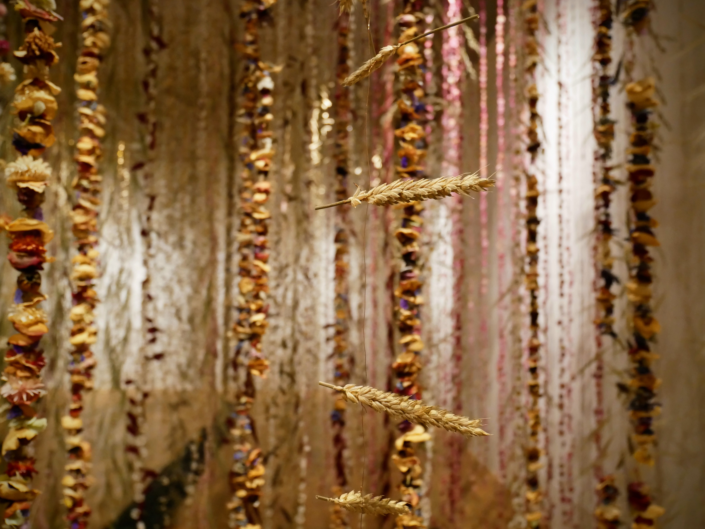

###The useful bits:###
- Transport
- Exhibitions