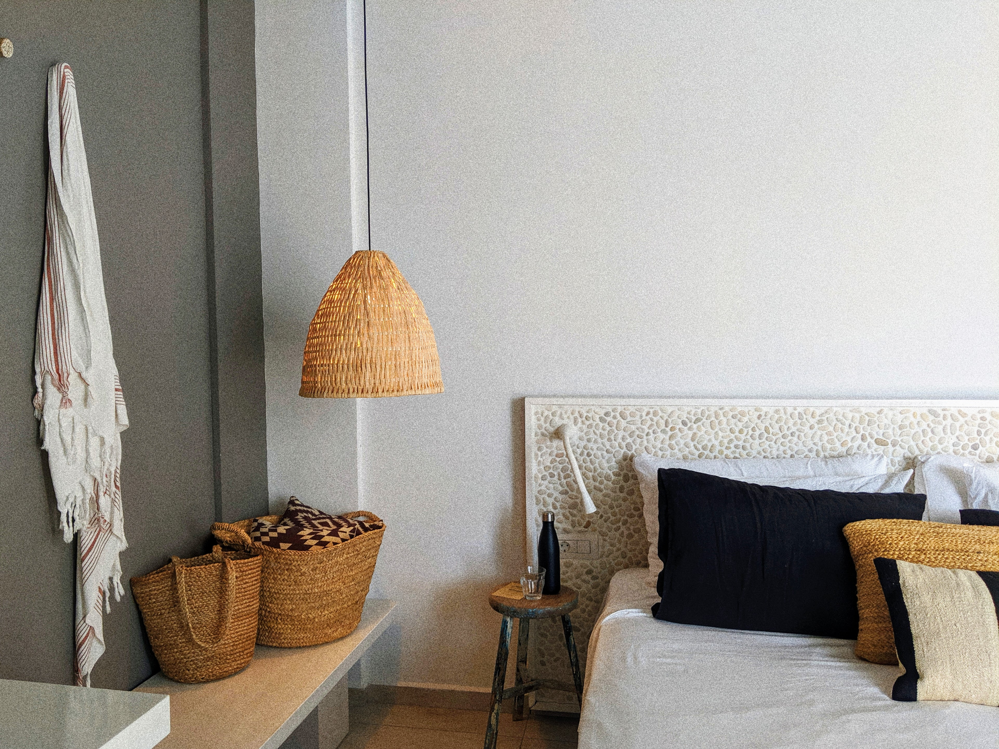
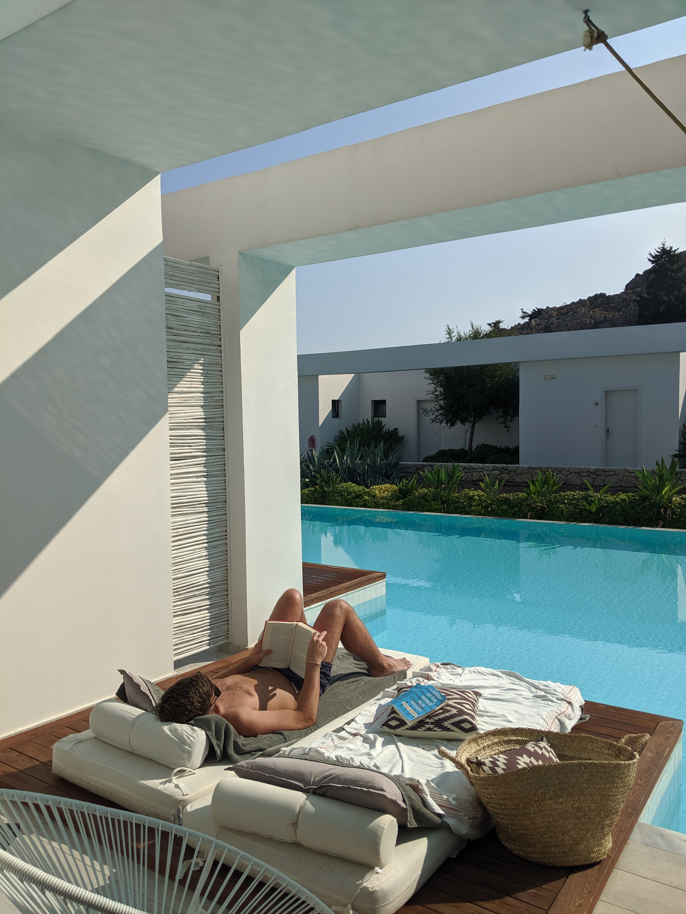

It's a common opinion that 'moons' are getting a bit excessive. But as someone who enjoyed both a minimoon and a honeymoon, surely it was only right to score the hat-trick and go for the babymoon?

In all seriousness, a final holiday, just the two of us, before a new family member was due to take up all of our time, money and energy... a no-brainer.

We stayed at [Casa Cook Rhodes](https://casacook.com/casa-cook-rhodes), an adults-only hotel in Kolymbia, Rhodes. Touted as a 'lifestyle boutique' hotel, we were keen to rest, recuperate and relax in the late October sun.

|                                               |                                             |
| --------------------------------------------- | ------------------------------------------- |
|  |  |

Almost all of the rooms have their own terraces, with sunbeds jutting out onto a shared pool. The cool water was the perfect tonic for when the 30 degree heat got a little too much. And at 26 weeks pregnant? There were a lot of pool dips!

|                                             |                                             |
| ------------------------------------------- | ------------------------------------------- |
|  |  |

Now if you know me, you'll know that while I do love sunbathing, I'm also not the best at sitting still for extended periods of time. So a few days into our trip, we (I use the word 'we' very loosely here) decided to go for a walk (hike?). I think I can still hear the echoes of Aidan's groans now...

But first? A breakfast of champions.

|                                                                           |                                                                           |
| ------------------------------------------------------------------------- | ------------------------------------------------------------------------- |
|  |  |

I'd googled a walk that serendipitously commenced at the edge of the hotel garden, so we found the start, and up we climbed. I'd advertised the walk as an easy 30 minute stroll... I'd lied. We were aiming for Tsambika Monastery and a view point across the local beaches. And for views? You need the height!

Even Aidan reluctantly agreed though - the views were worth the exertion!

|                                             |                                               |
| ------------------------------------------- | --------------------------------------------- |
|  |  |

Such a stunning view of Tsambika beach - a long, sandy beach that we added to our to do list for the following days.

|                                  |                                  |
| -------------------------------- | -------------------------------- |
|  |  |

With such a beautiful backdrop, we took the chance to take the first photo of our family of three: me, Aidan, and his most impressive holiday beard!

And last but not least - after all that physical extertion, a final swim of the day was much deserved. A wonderful day, with a wonderful man at my side.

|                                               |                                             |
| --------------------------------------------- | ------------------------------------------- |
|  |  |

###The useful bits:###

- Check out [Casa Cook Rhodes](https://casacook.com/casa-cook-rhodes) if you're keen for a slice of luxury. After our initial booking fell through, we rebooked with [loveholidays.co.uk](loveholidays.co.uk).
- The walk to Tsambika Monastery is ever so simple: go through gate, walk up. That said, there are some more detailed instructions on [Trip Advisor](https://www.tripadvisor.co.uk/ShowUserReviews-g635615-d4946226-r532696327-Monastery_Tsambika-Kolimbia_Rhodes_Dodecanese_South_Aegean.html).
