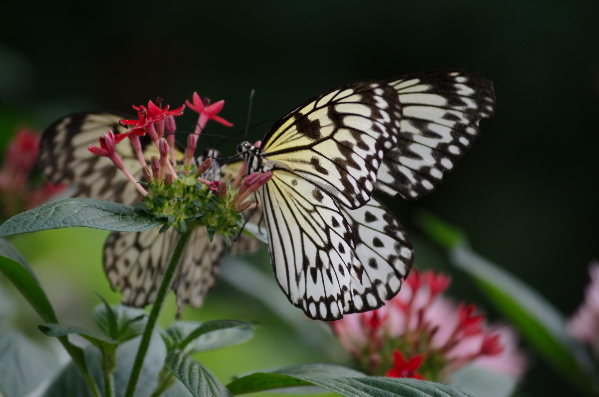
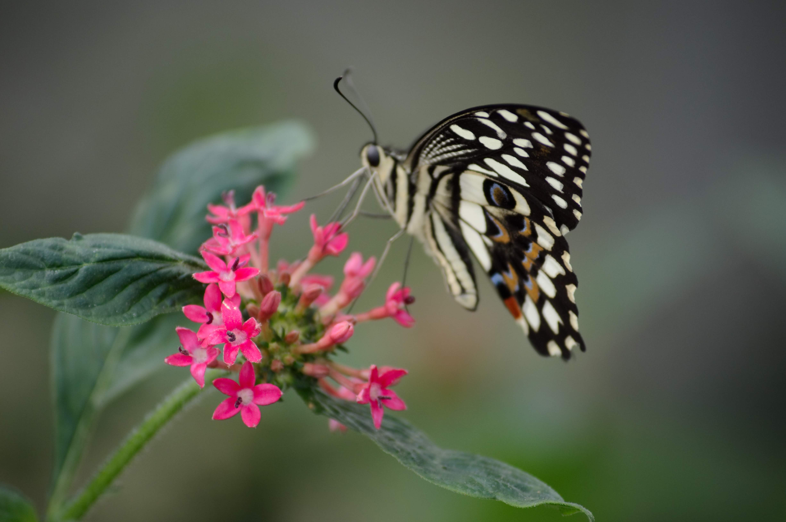
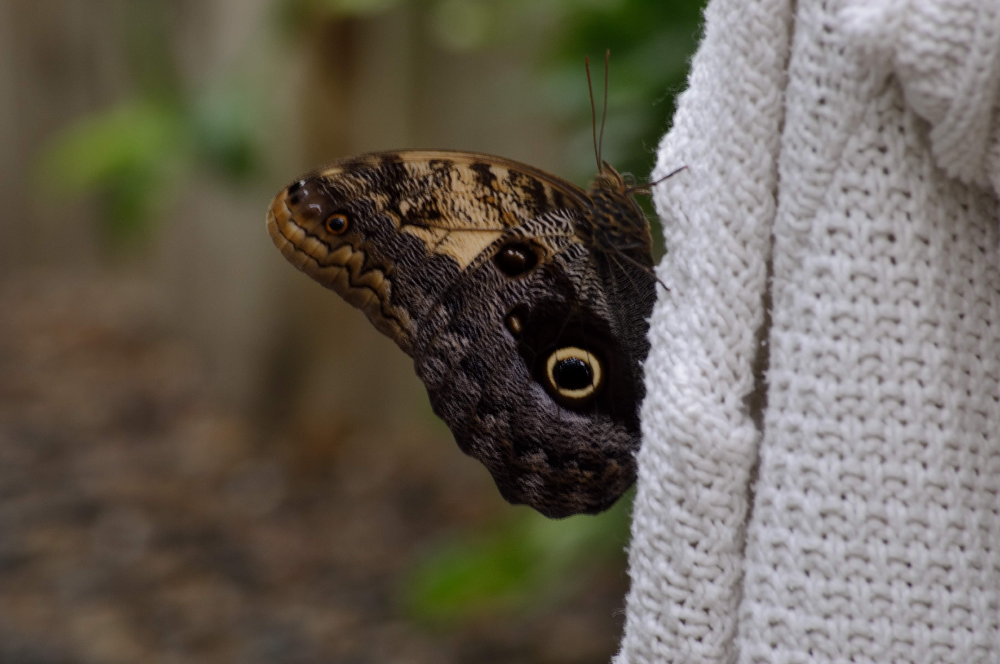
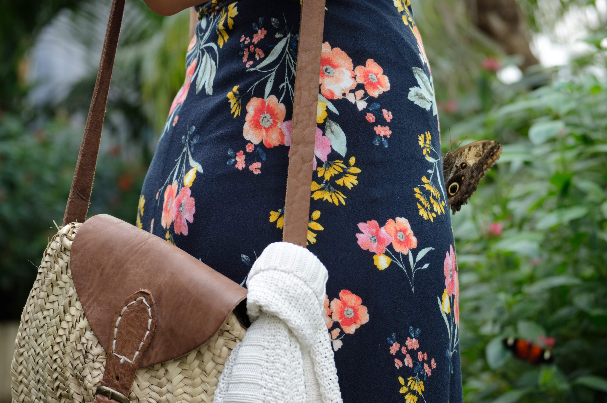
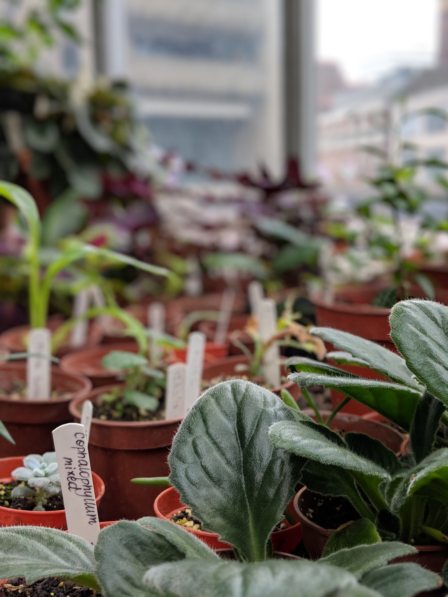
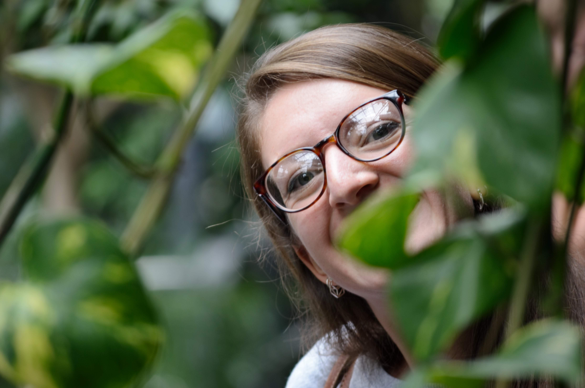
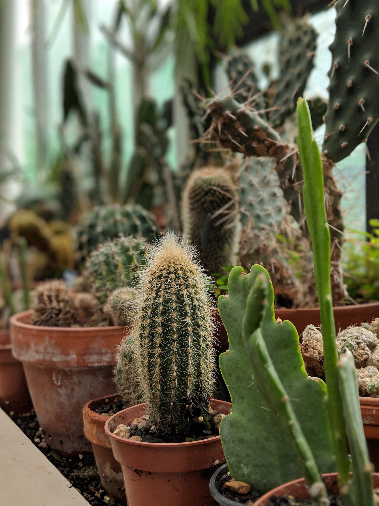
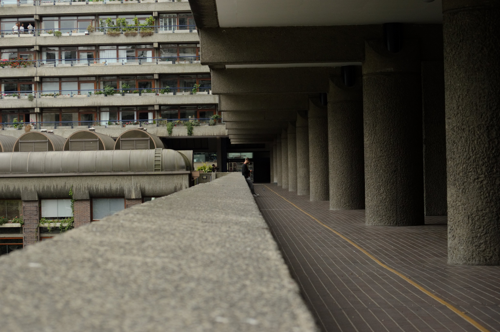
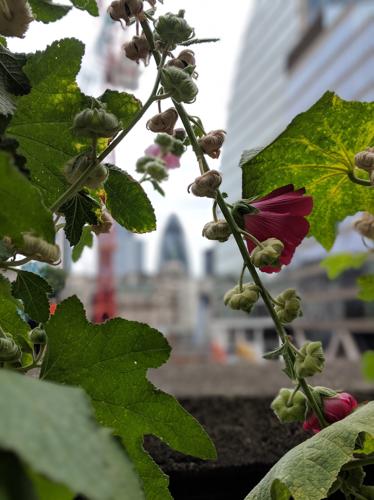
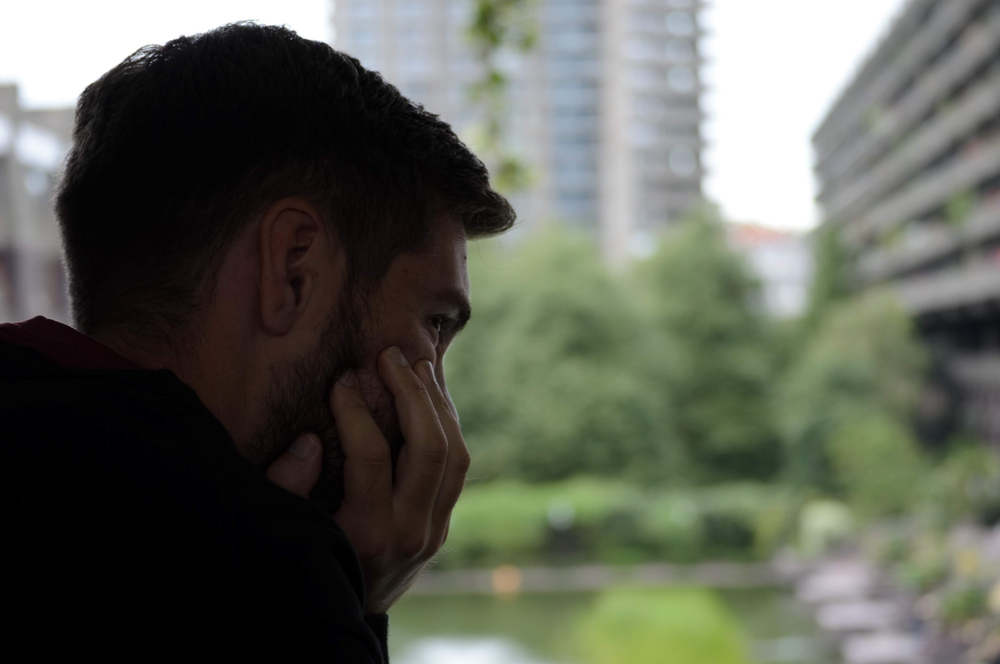

Yes, this is a cheat post. We're merging two separate days into one - pretty obvious when you see our outfits and the vastly different weather conditions.

Luckily, each trip was only a morning out, so it would be easy to combine the two and have a full day of London adventuring. Brunch is mandatory, of course.

| | |
| --- | --- |
| | |

First up, the butterflies at the [Natural History Museum](http://www.nhm.ac.uk/). I was fortunate enough to win tickets at work: tickets which included a hot drink and pastry (not to be sniffed at!) as well as early-bird entry before the Museum officially opened at 10am.

We'd been to this pop-up exhibit a couple of times before, so we knew it was worth the slightly early Saturday start!

| | |
| --- | --- |
| | |

Having the place mostly to ourselves was a real treat, and the butterflies were ready for their close-ups. Even more of a treat...seeing the lesser-spotted Aidan lurking in the bushes!

| | |
| --- | --- |
| | |

Next up was a trip to the [Barbican Conservatory](https://www.barbican.org.uk/whats-on/2019/event/conservatory) and a photography exhibition. Remember, we're ignoring that a full night's sleep passed between the two events...

| | |
| --- | --- |
| | |

We've lived in London for over 4 years and both love gardens, and yet, we'd never visited the green house. Combining the exhibition (paid for) with the free Conservatory visit seemed like the perfect Sunday plan.

| | |
| --- | --- |
| | |

The Dorothea Lange exhibition ['The Politics of Seeing'](https://www.barbican.org.uk/our-story/press-room/dorothea-lange-politics-of-seeing) had been on our list for some time. You'll likely recognise one of her most famous photographs, 'Migrant Mother'. The emotive shot, taken of Florence Owens Thompson, was an iconic image taken during the Great Depression in 1930s America, and it's just as affecting today.

| | |
| --- | --- |
| | |

Photography wasn't allowed in the exhibition, so instead I'll impress upon you with my humble words - go. Please go. Regardless of the photographs themselves, the themes of environmentalism, economic despair, depression and nationalism are still relevant and topical. Especially as we find ourselves in a time when separatism seems to be shouting louder than simple human compassion.

*Edit: the exhibition sadly ended in September but keep an eye out, and perhaps conduct some research on this amazing woman, her life and enormous body of work.*

###The useful bits:###

- '[Sensational Butterflies](http://www.nhm.ac.uk/discover/sensational-butterflies-bringing-the-jungle-to-london.html)' at the Natural History Museum is an annual pop-up tent, just outside the main building. I love butterflies so I'm a bit biased, but it's a fun way to spend a morning although perhaps not worth a whole trip in its own right.
- The [Natural History Museum](http://www.nhm.ac.uk/visit/getting-here.html) is easily accessible: only a 5 minute walk from South Kensington tube station (on the District, Piccadilly and Circle lines).
- [The Barbican](https://www.barbican.org.uk/your-visit/getting-here/map-directions) is also just as accessible: a 4 minute walk from the Tube station of the same name or about 7 minutes from Moorgate (our choice as it's on the Northern Line).
- The Barbican Conservatory is only open on certain Sundays and Bank Holidays from 12-5pm.

