Wasn't the final weekend in February GLORIOUS? Even if it did bring on all sorts of anxiety at the state of our poor planet. Nonetheless, akin to drinking a glass of champagne when the Titanic was sinking*, we decided to make the most of the unseasonably warm weather. 

*Thank you, Alice, for the apt analogy.

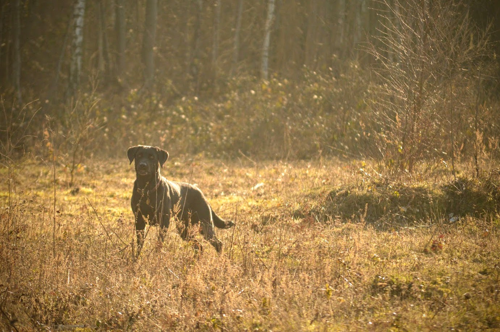

Even better than a weekend walk with my boys? A weekend walk with friends and their gorgeous labrador. We soon bundled into the car, layers and all, and headed to Box Hill for an 11km circular walk.

| | |
| --- | --- |
|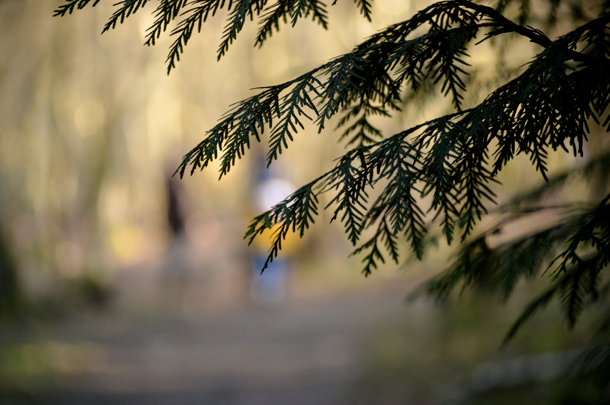 | 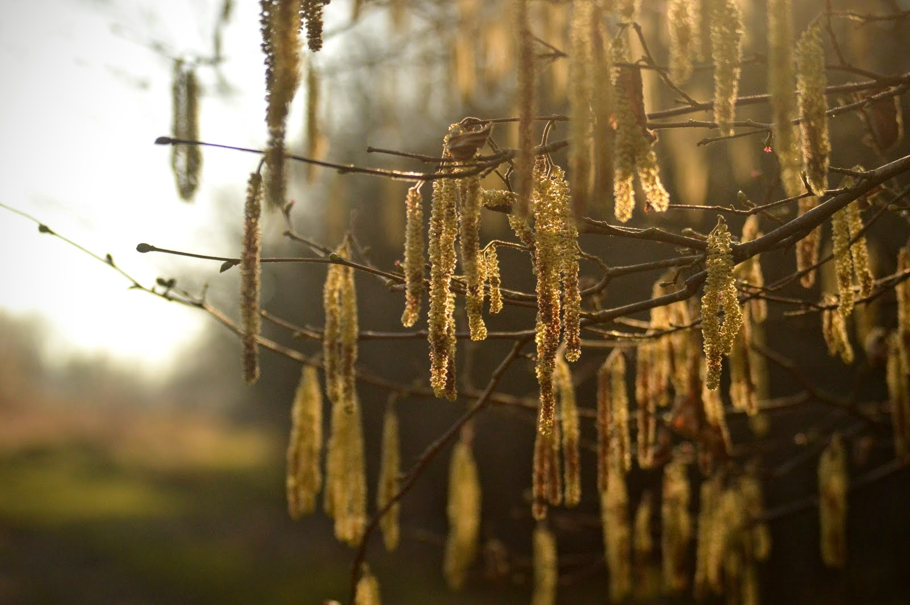|

It's my fourth time walking this route, and I just love it. It gives you exactly what you'd look for in a country walk: rolling green fields, dense woodland (pine and deciduous), stunning views and a pub perfectly located at the halfway point.

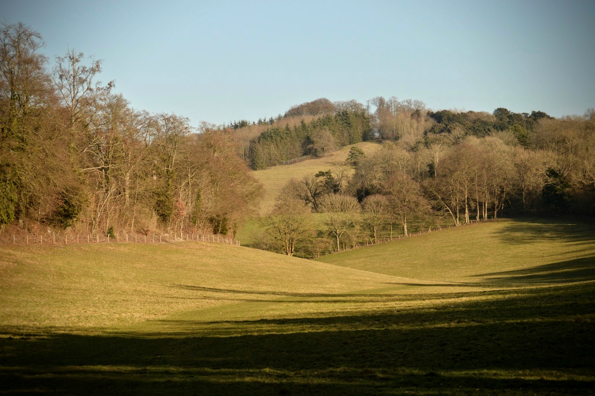

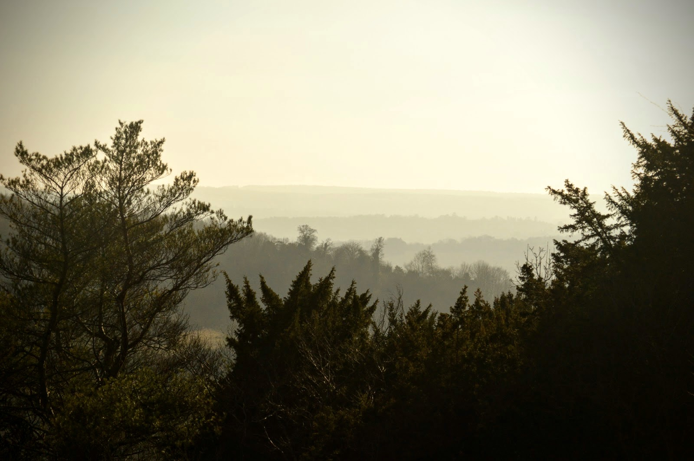

After a decent pub lunch, we contined on our way and tackled a few more gentle (and not so gentle) ascents. The views are quite spectucular, and you might even see a tree-dwelling acrobat like we did...

| | |
| --- | --- |
|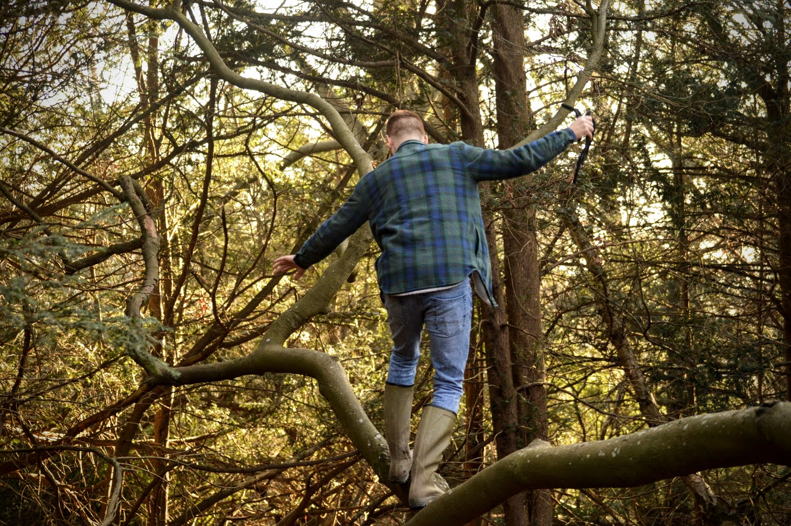 | 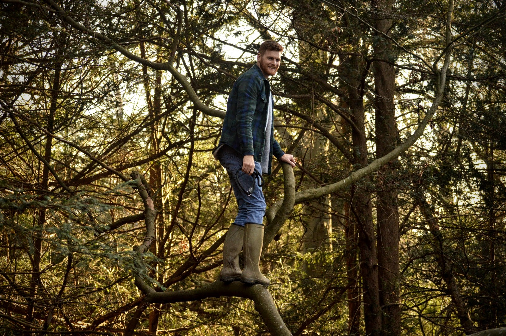|

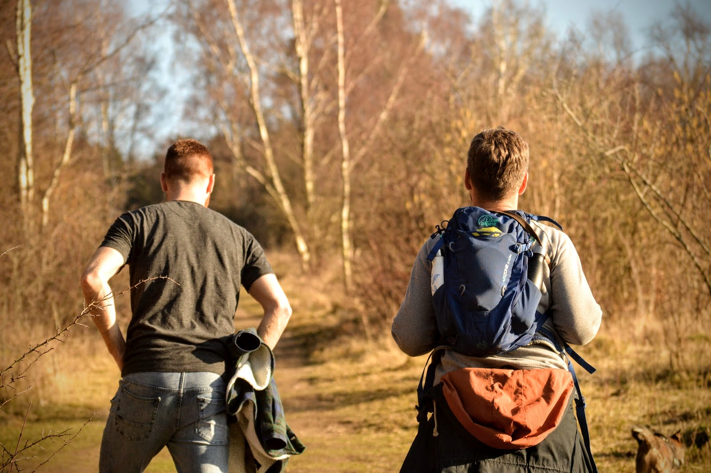

It would have been rude not to take a little break at Juniper Top to take in the views (and give our thighs and lungs a little respite).

| | |
| --- | --- |
|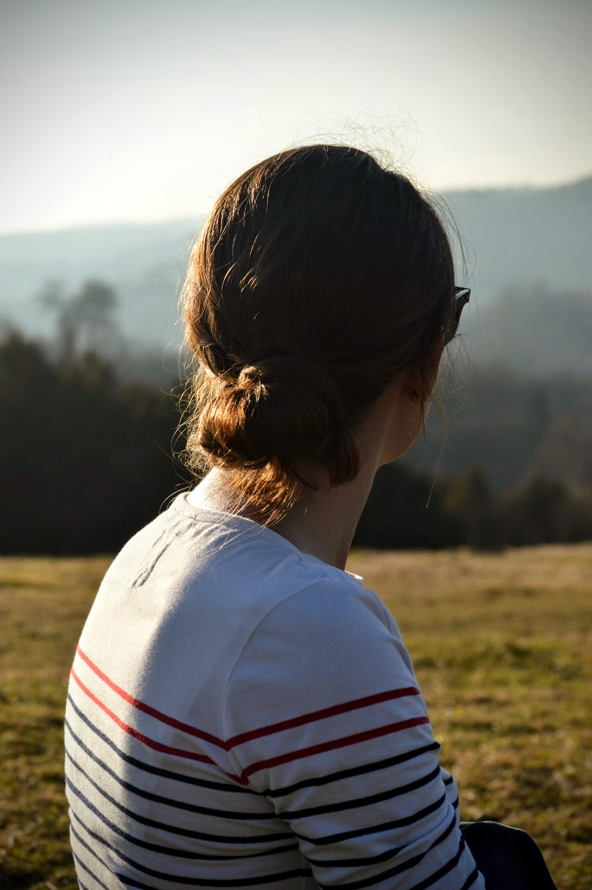 | 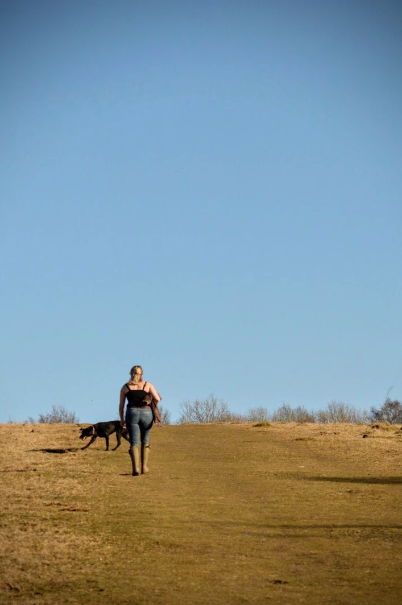|

Clearly the dogs agreed, and chose their favourite humans to rest with. Isn't that right, Ellie and Greg?!

| | |
| --- | --- |
|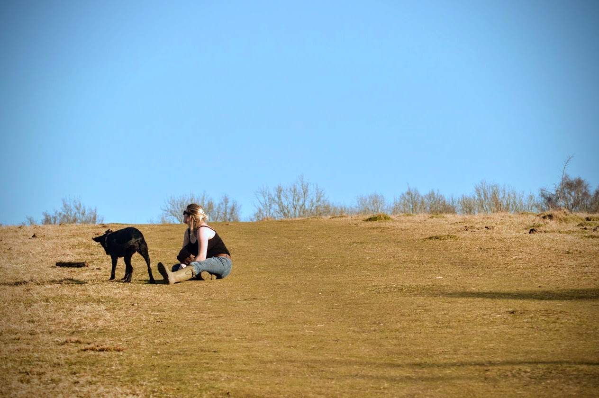 | 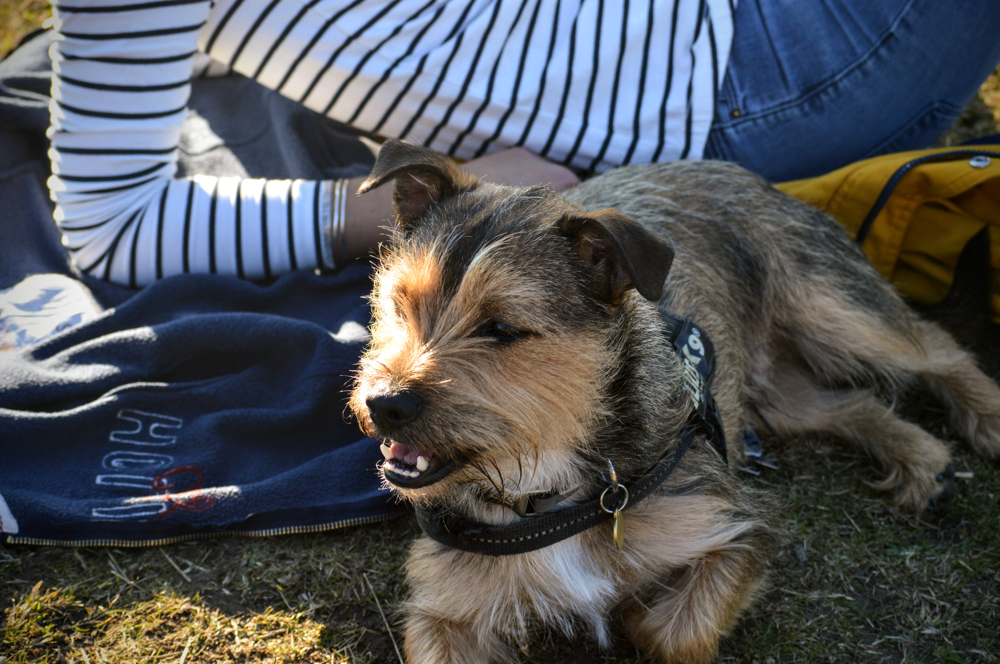|

A quick stop at the top for a group shot (taken by a harried Mum who we "saved" from the endless story being relayed by her daughter), and we were on our way back down the hill and homeward bound.

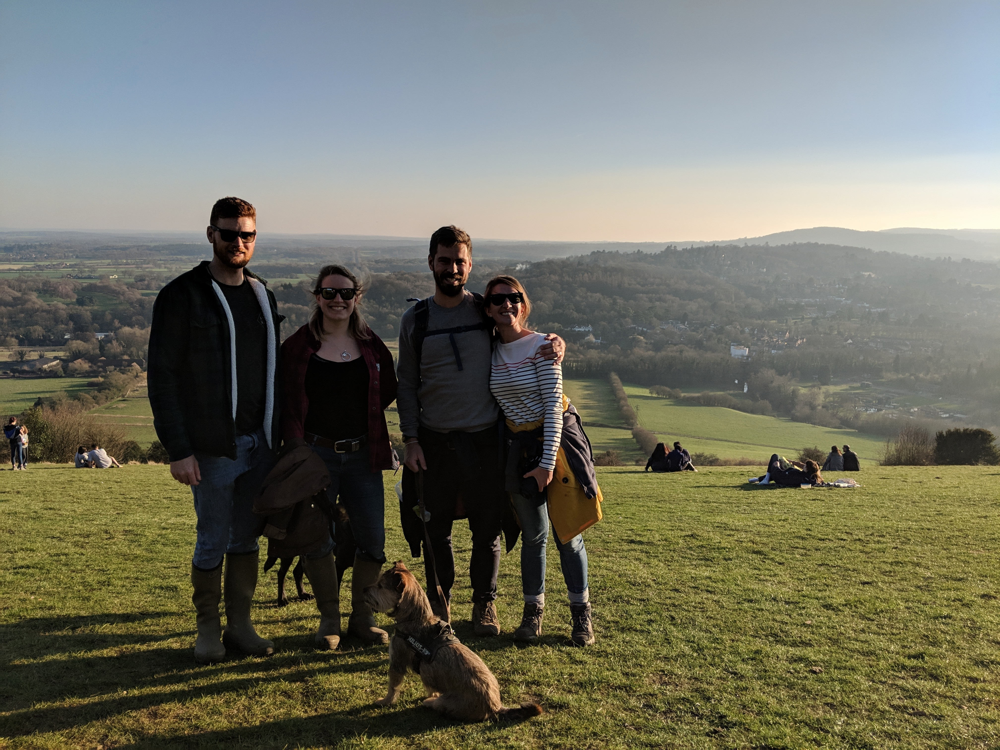

One final stop to make the most of that golden light, then home for curry, card games and wine. Perfect.

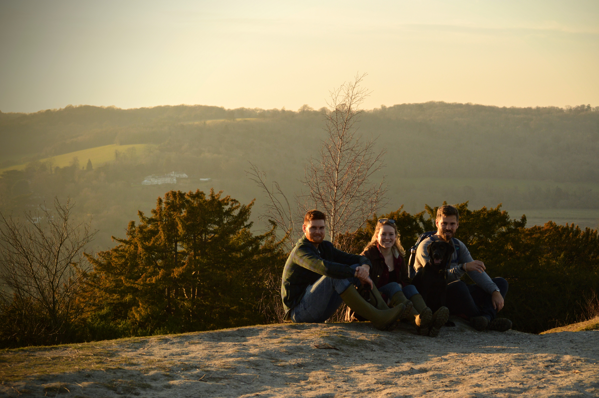

Note: some of the pictures from our day out aren't as crisp as we'd like. Serves us right for faffing about with the ISO settings willy nilly!

###The useful bits:###
- The walk starts and ends at Box Hill & Westhumble station, so it's ideally located especially if you don't have access to a car.
- Train services to Boxhill & Westhumble go from London Victoria roughly once an hour, and take around an hour to arrive.
- I found our walking route on the [Saturday Walkers Club website](https://www.walkingclub.org.uk/walk/box-hill-circular/) and couldn't recommend it more highly. The directions are comprehensive, accurate and absolutely charming.
- The [King William IV pub](http://www.thekingwilliamiv.com/) is perfectly located for a lunch time stop. Although it advertises its pub food as "no frills", we've yet to be disappointed!
- When you arrive at Box Hill, don't be surprised to find that the coffee shop closes at 4pm, as we were. Sorry again, Andrew...