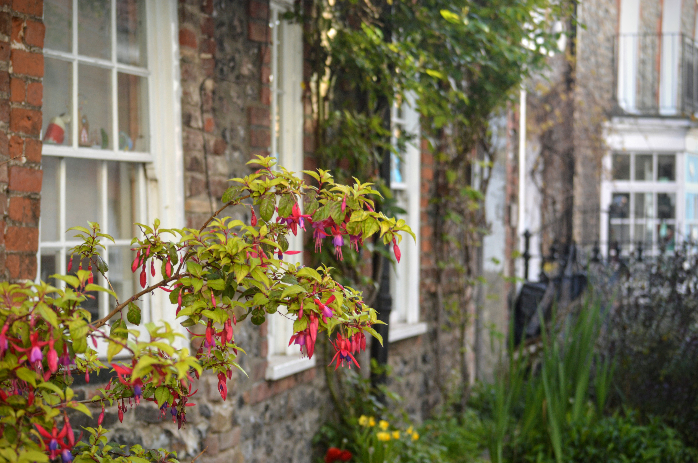
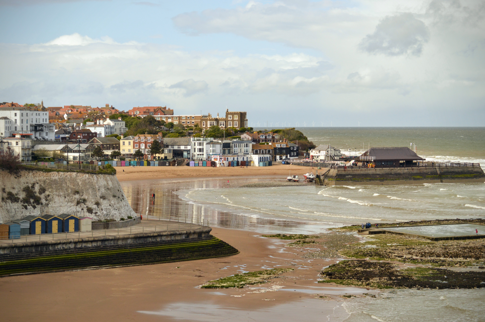
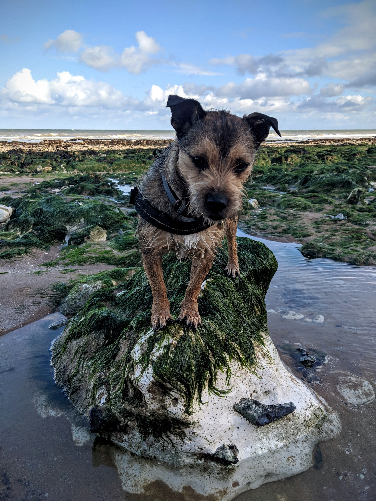
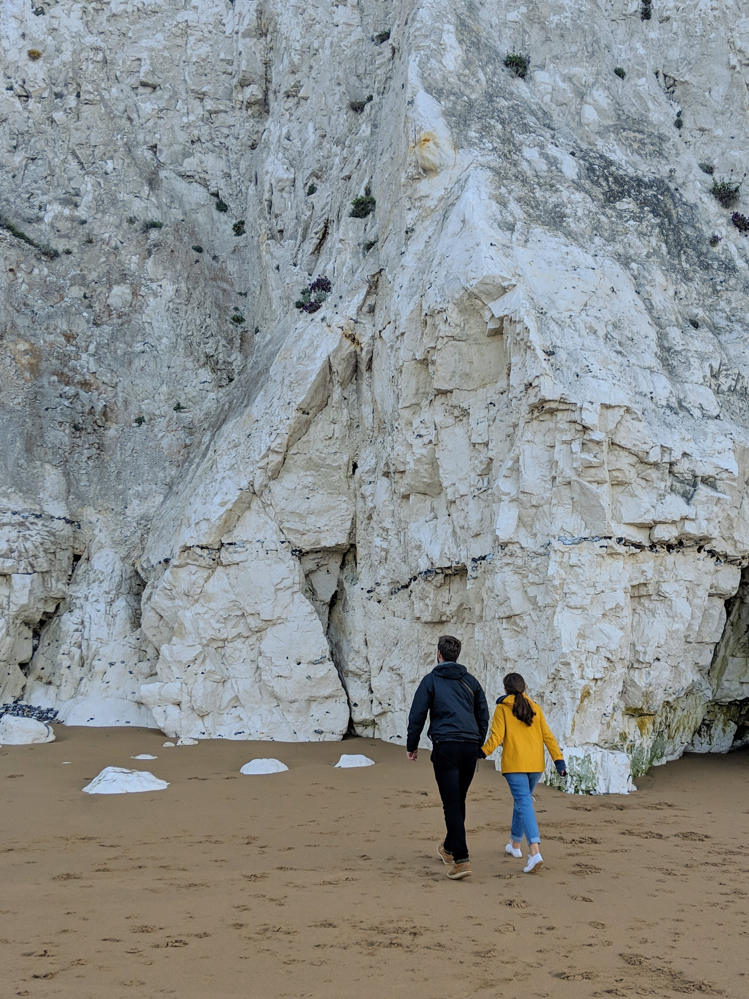
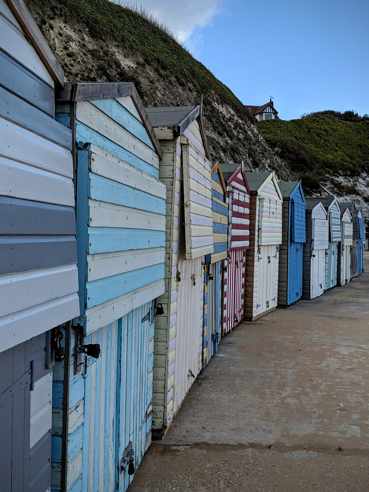
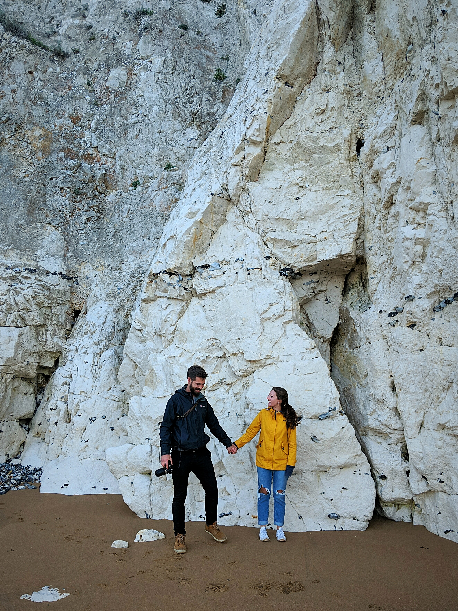
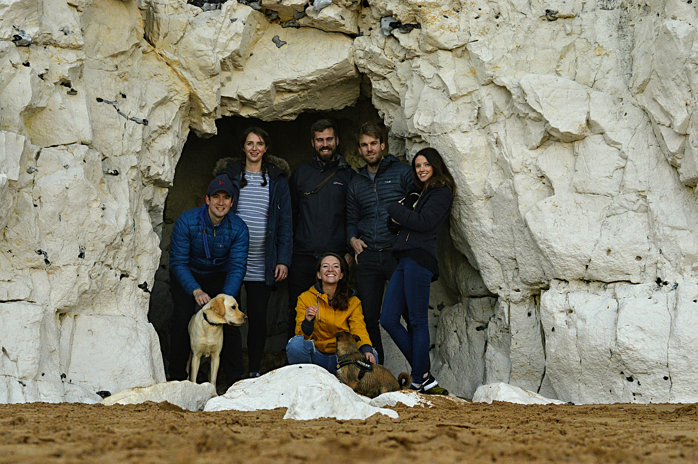
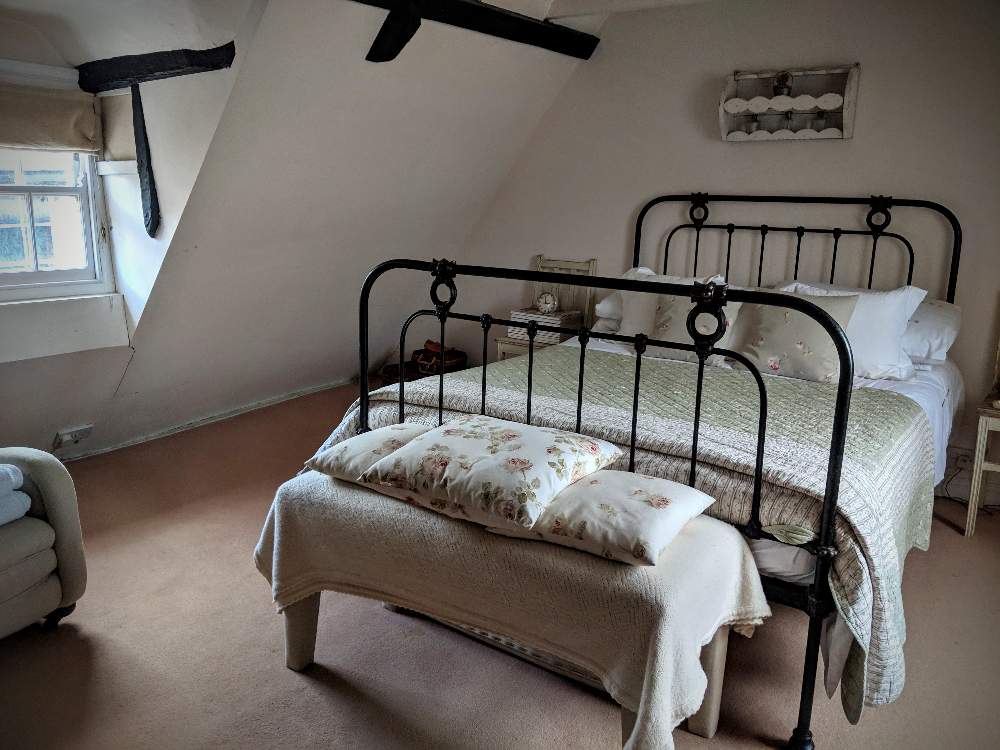
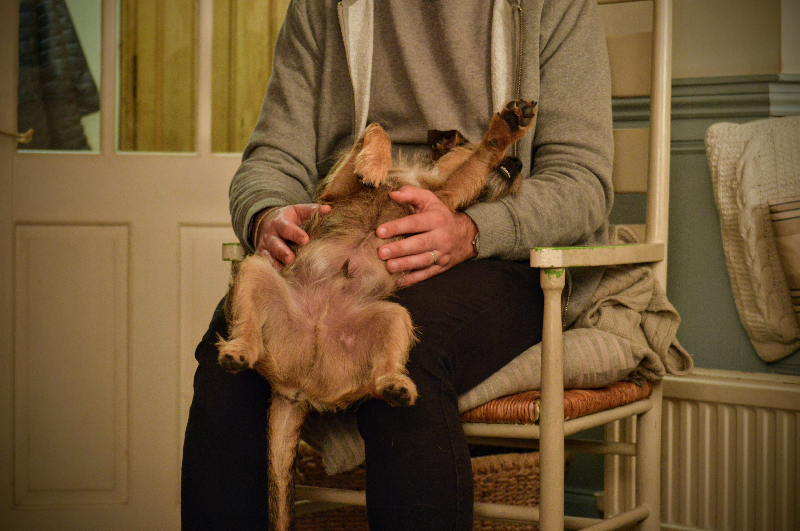

For the Bank Holiday and as a final hoorah before our friends welcomed their first child, we headed to the Kent coast for a relaxed weekend away, dogs in tow - naturally.

Only a 2 hour drive from London, Broadstairs was the perfect location for our trip. Even better was the [Grade II listed Airbnb](https://www.airbnb.co.uk/rooms/22628812?source_impression_id=p3_1569272853_nB61IYnKMmodrnCk) Stu found for us on a quiet cobbled street in the middle of town.

|                                       |                                       |
| ------------------------------------- | ------------------------------------- |
|  |  |

Upon arrival, we were greeted with blue skies and fine weather, so we headed straight out for a brisk beach walk. Just check out that view...

No, this view! Hello puppy! _Heart melts._

We chose to stretch our legs along the beach towards Ramsgate, via Louisa Bay and Dumpton Bay. These sections were dog friendly, so the pooches could enjoy the sea, sand and seaweed.

|                                                  |                                                    |
| ------------------------------------------------ | -------------------------------------------------- |
|  |  |

There are few things more refreshing than a windy coastal walk - just what we all needed after a few hours on the M25!

|                                                    |                                                                          |
| -------------------------------------------------- | ------------------------------------------------------------------------ |
|  |  |

As we headed back, we unanimously agreed to a fish and chips takeaway dinner. Well, when in Rome...

But first, a group shot before our newest gang member arrived in a couple of weeks.

And after all that sea air and the huge portions of fish and chips? Up to bed, of course.

###The useful bits:###

- Broadstairs is a 1hr30 train journey from London St Pancras, and a return will set you back around £40.
- Alternatively, the drive took us roughly 2 hours, and we had a bit more freedom when we were there.
- We mostly enjoyed relaxing in each other's company (dogs included) and eating. But, if you're looking for more activities, check out the ['Visit Broadstairs'](https://www.visitbroadstairs.co.uk/) website.
- The ['Visit Thanet'](https://www.visitthanet.co.uk/) website is a bit more comprehensive and covers neighbouring Ramsgate and Margate, also.
- If you're planning on taking your four-legged friend, be sure to check out the council website for a [useful guide to dog friendly beaches](https://www.thanet.gov.uk/info-pages/dogs-and-our-beaches/).
