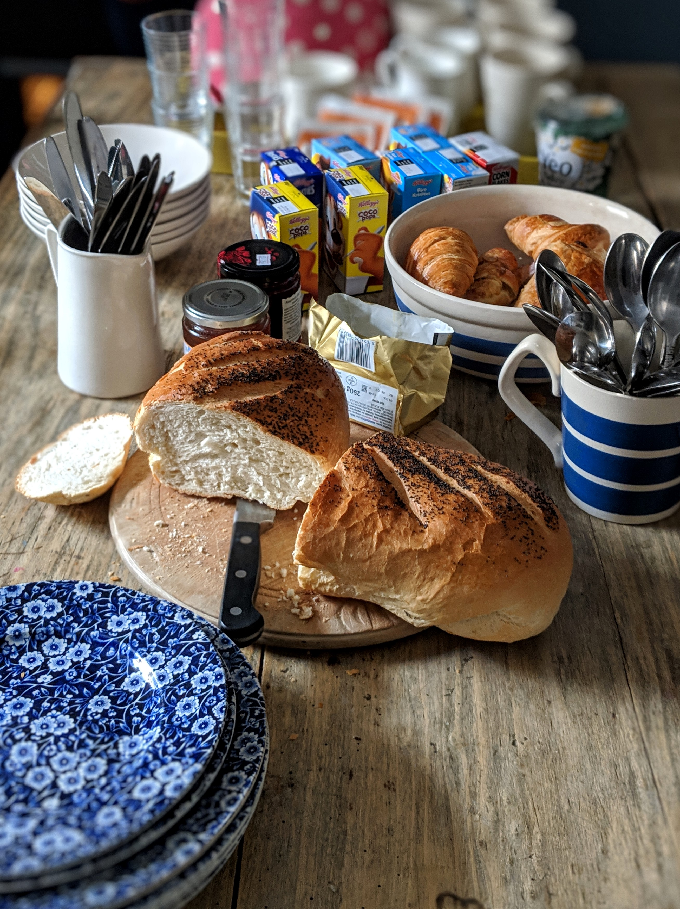
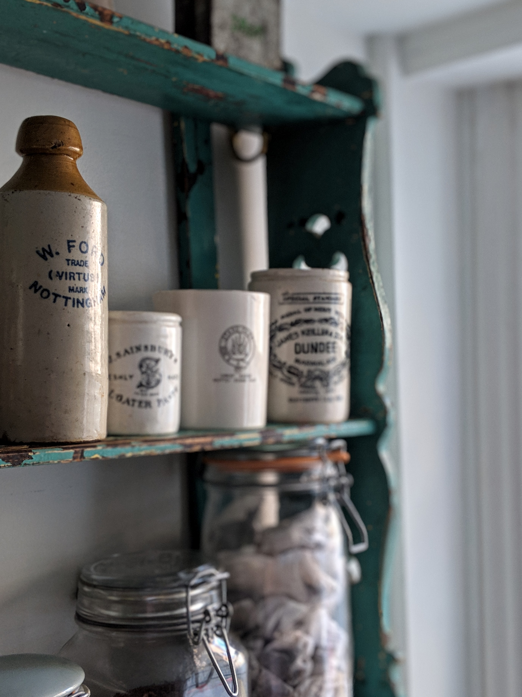
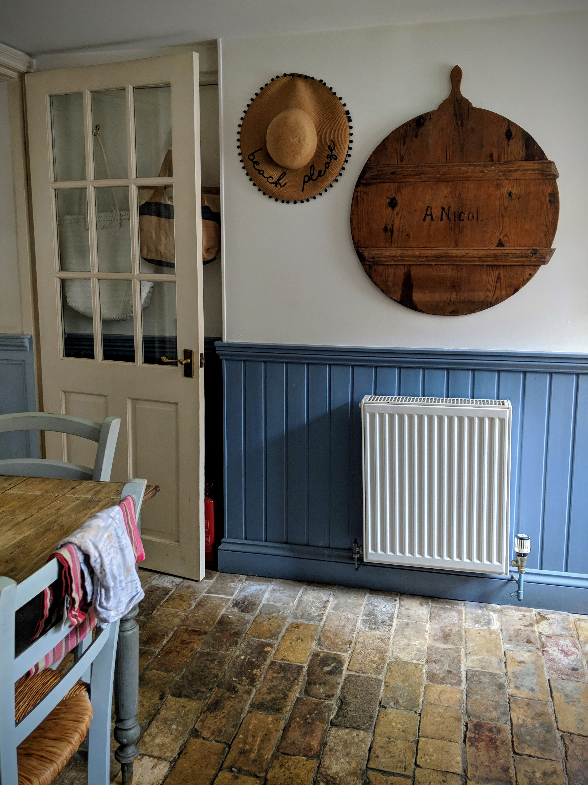
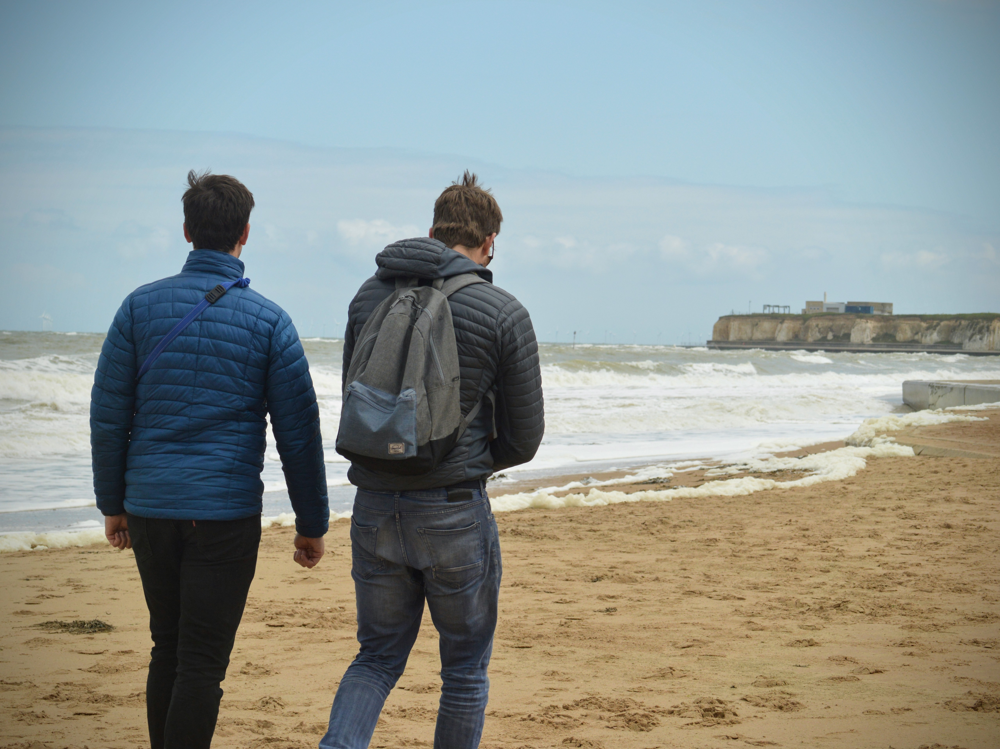
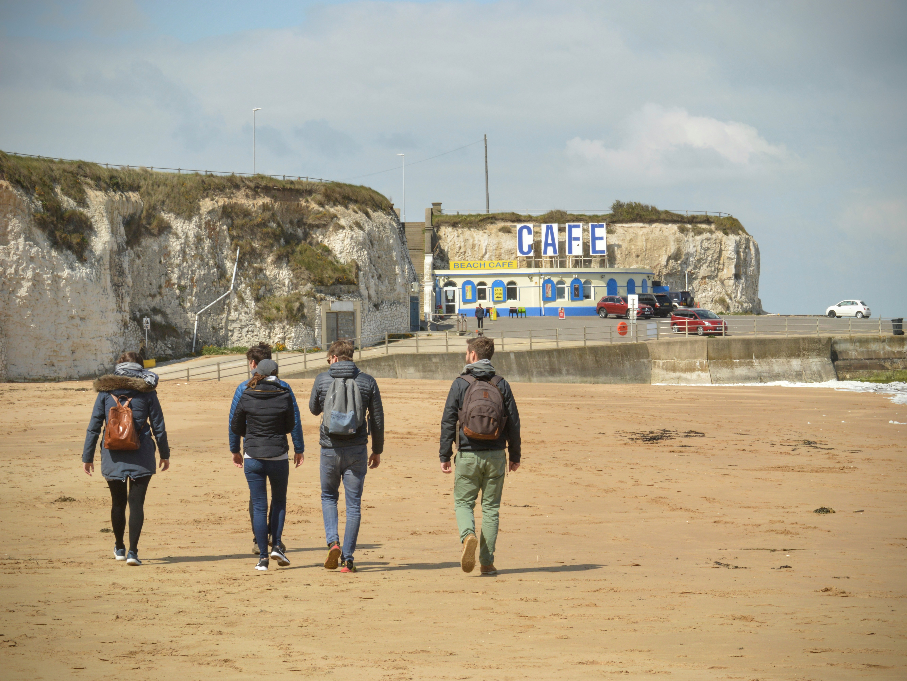
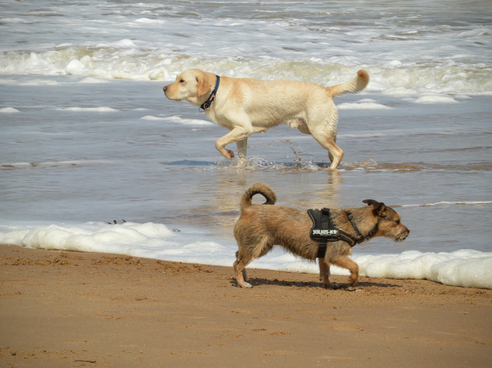
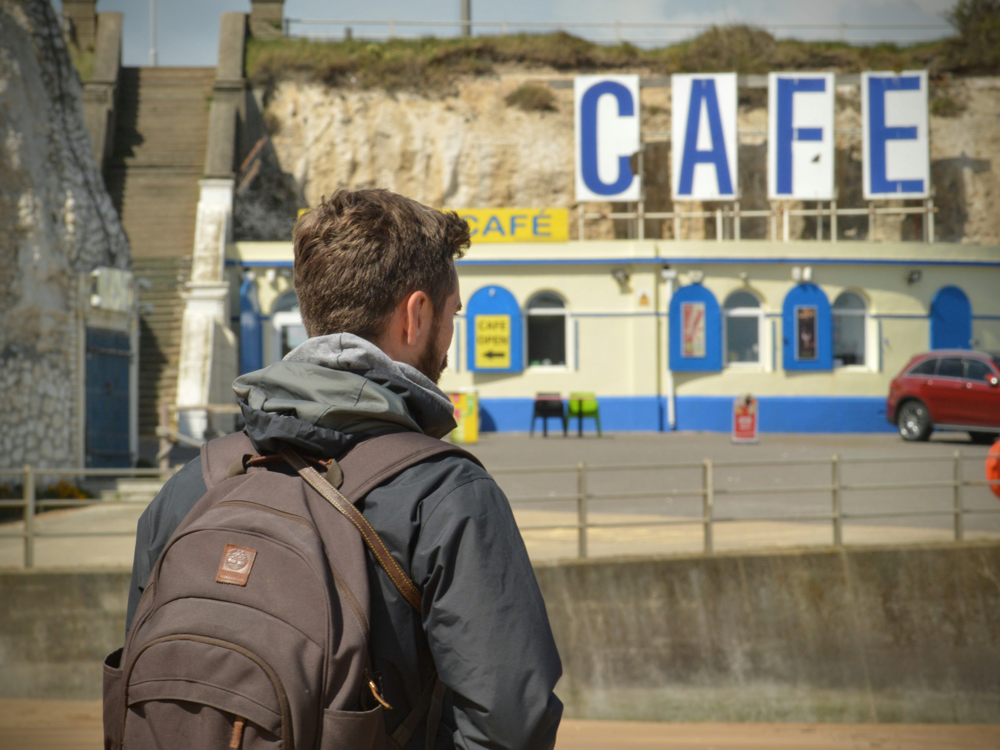
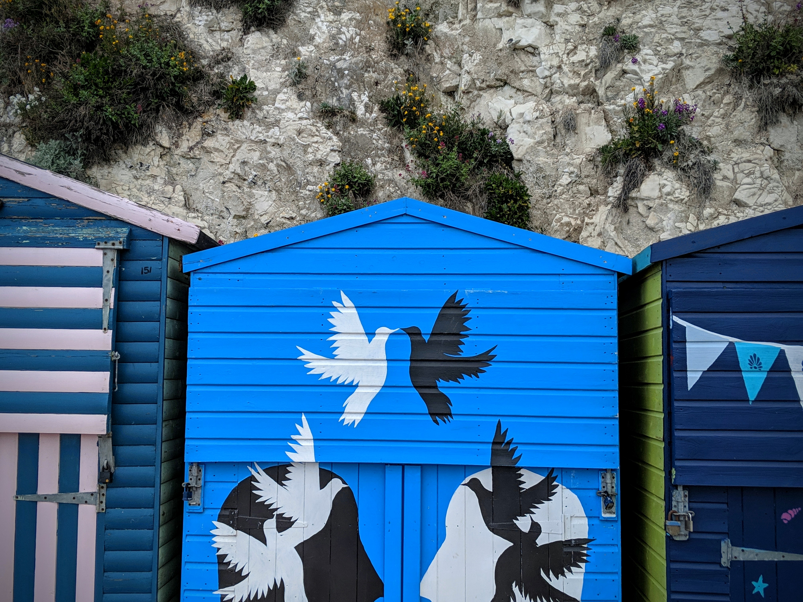
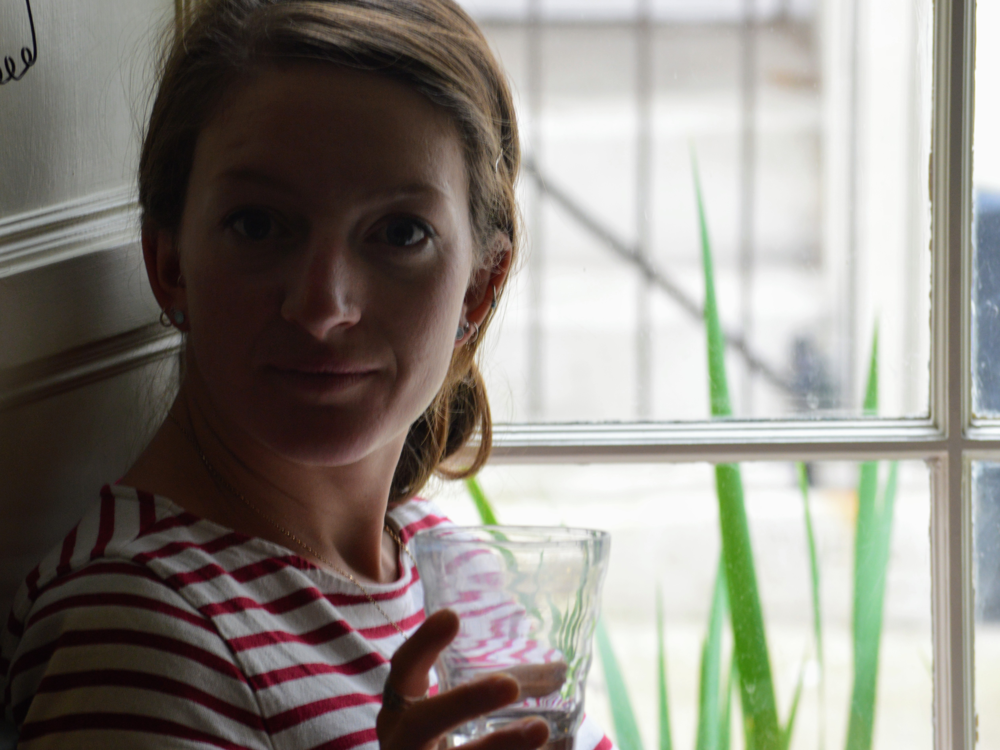
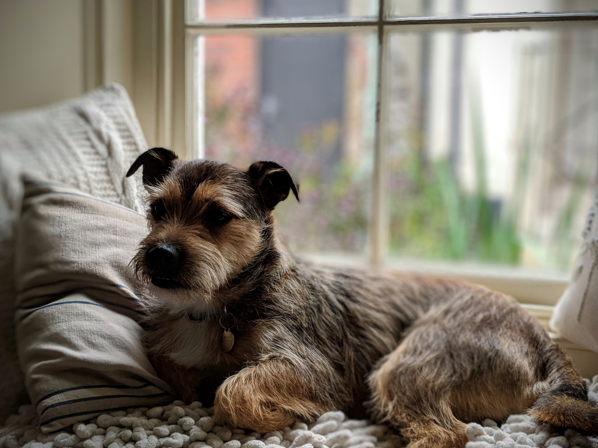

After sleeping off our fish and chips, we woke up to more beautiful sunshine on day two.

First on the agenda? A breakfast feast, of course. It should be noted here that Stu and Mill had already been out for a 6.30am cycle. Mental.

|                                                                                 |                                                                                 |
| ------------------------------------------------------------------------------- | ------------------------------------------------------------------------------- |
|  |  |

We took another look online at the list of [dog friendly beaches](https://www.thanet.gov.uk/info-pages/dogs-and-our-beaches/) and decided to take short drive to Cliftonville for another windy, refreshing walk.

|                                                   |                                                   |
| ------------------------------------------------- | ------------------------------------------------- |
|  |  |

Buddy and Greg raced around the beach, dashing into the waves and chasing each other's (and their own) tails. Greg has a mixed relationship with water, but is a real sucker for peer pressure!

|                                        |                                        |
| -------------------------------------- | -------------------------------------- |
|  |  |

Exhausted from watching their high-energy antics, we searched out coffee. And as if by magic...spot the sign!

|                                        |                                        |
| -------------------------------------- | -------------------------------------- |
|  |  |

After some lattes and cakes split 6 ways, we drove back to Broadstairs ready for a relaxing afternoon stroll and reading our books at the [Airbnb](https://www.airbnb.co.uk/rooms/22628812?source_impression_id=p3_1569272853_nB61IYnKMmodrnCk).

|                                                                           |                                        |
| ------------------------------------------------------------------------- | -------------------------------------- |
|  |  |

I started and then devoured 'All The Light We Cannot See' - highly recommended.

|                                                   |                                                   |
| ------------------------------------------------- | ------------------------------------------------- |
|  |  |

Sometimes adventures don't have to be full to brimming with scheduled activities and sightseeing.

Sometimes the best weekends are spent catching up with friends. Throw in good food, sea air, some cuddly dogs and one tiny puppy, and you're onto a winner.

###The useful bits:###

(Repeated from previous post for easy access.)

- Broadstairs is a 1hr30 train journey from London St Pancras, and a return will set you back around £40.
- Alternatively, the drive took us roughly 2 hours, and we had a bit more freedom when we were there.
- If you're looking for more activities, check out the ['Visit Broadstairs'](https://www.visitbroadstairs.co.uk/) website.
- The ['Visit Thanet'](https://www.visitthanet.co.uk/) website is more comprehensive and covers neighbouring Ramsgate and Margate, also.
- If you're planning on taking your four-legged friend, be sure to check out the council website for a [useful guide to dog friendly beaches](https://www.thanet.gov.uk/info-pages/dogs-and-our-beaches/).
