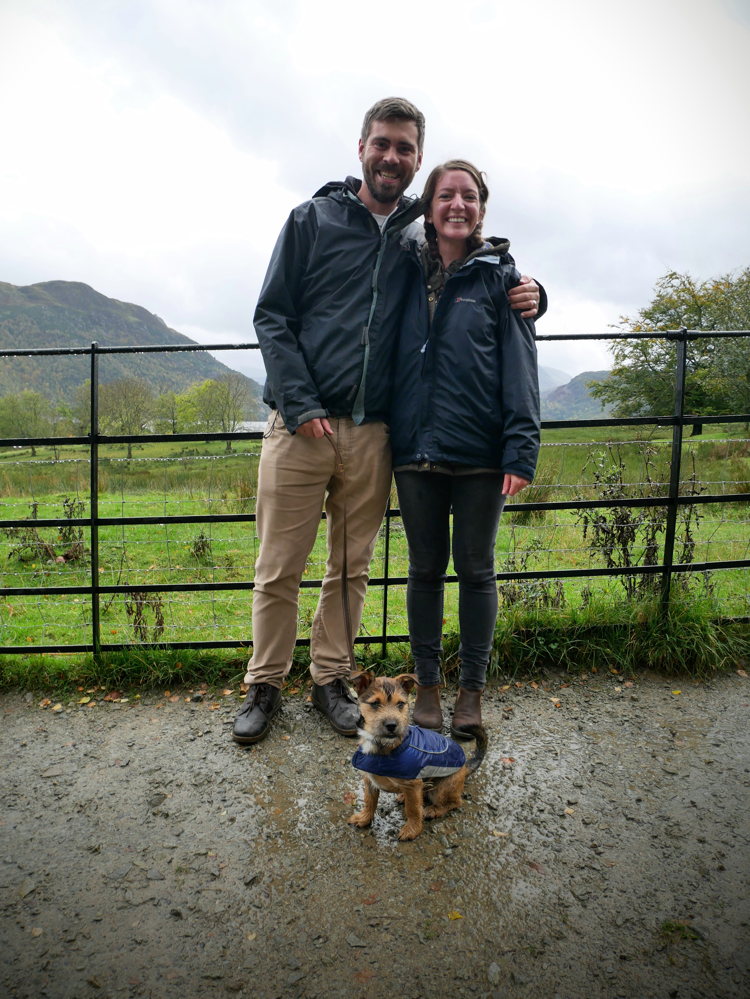

Day two and it looked like the good weather was on hiatus. Understandably some of us were less enthusiastic to leave the cosy [shepherd's hut](https://www.theherdwickhuts.co.uk/) than others...

|                                |                                |
| ------------------------------ | ------------------------------ |
|  |  |

Regardless, we packed up our waterproofs and headed out to Windermere for some brunch and retail therapy.

Strangely enough, torrential rain isn't all that conducive to photo taking so we don't have much to show for our wanderings.

Keen to see more of the local sights, we decided to drive to Ullswater to see the National Trust site at [Aira Force](https://www.nationaltrust.org.uk/aira-force-and-ullswater), which would be all the more impressive after heavy rainfall.

|                                |                                |
| ------------------------------ | ------------------------------ |
|  |  |

By the time we arrived (and after a hairy mountain drive), the weather had started to clear.

|                                |                                |
| ------------------------------ | ------------------------------ |
|  |  |

Some interesting facts about the waterfall:

- Its total height is over 20 metres.
- The stream which flows over the fall is called 'Aira Beck'.
- 'Aira' is derived from Old Norse and roughly translates to the 'river at the gravel bank'. So, Aira Force is 'the waterfall on gravel-bank river'. Thanks Wikipedia!
- William Wordsworth famously refers to the "wild stream of Aira" in his (surprisingly long) poem 'The Somnambulist'.

At the end of the woodland trail, the sun even came out for us. Now try and spot the Greg...

After a couple of scones and some tea at the cafe, we jumped back into the car. Our journey home took us back over Kirkstone Pass, the Lake District's highest road.

All the more enjoyable without the torrential rain as we could enjoy the view on the way back down to Ambleside.

###The useful bits:###

- Aira Force is free to visit. As with a lot of National Trust sites, it's just the parking that you have to pay for (£5 for a couple of hours).
- The circular walk around the falls will take you around 20 minutes. Dogs are welcome but must be kept on leads.
- We didn't explore too much, but saw that lots of good walks started from the waterfall or at Ullswater.
- The National Trust website also mentions a boat trip from Glenridding to Aira Force, which would be a fun trip out.
