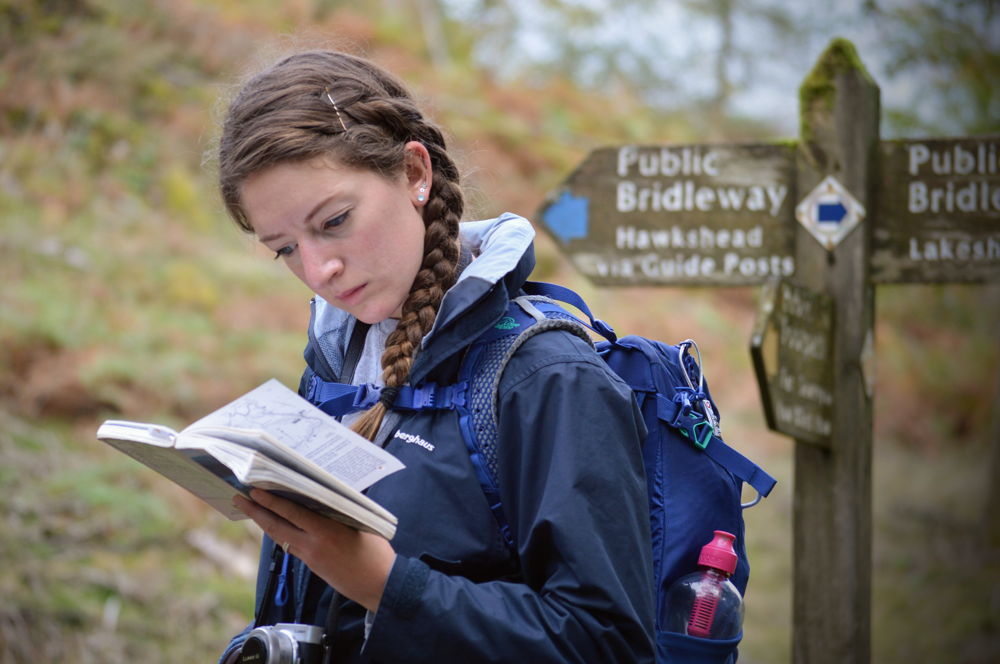

For our final full day, we found an 11km circular walk around Latterbarrow, Blelham Tarn and the shores of Lake Windermere.

But first, a family photo outside of our hut!

The walk officially starts at Red Nab car park, but we couldn't resist signs for [Wray Castle](https://www.nationaltrust.org.uk/wray-castle) en route.

|                                   |                                   |
| --------------------------------- | --------------------------------- |
|  |  |

Although we didn't enter, we enjoyed strolling around the perimeter of the gothic building. One of my favourite facts of the trip: this private house was built using inheritance from a 'gin fortune'. What dreams are made of!

Starting at Red Nab car park, we commenced our walk and immediately climbed up into the trees and away from the lake.

The weather was brisk but not too cold, and we very much enjoyed seeing Greg blend in with the autumn colours and the dropped leaves.

After a short uphill stretch, the walk rounded a corner and into some open shrub area. We got a little lost trying to follow a crumbling wall, but this just added to the sense of adventure.

When we came across a fellow ambler, we had to take our opportunity for another family photo. Let's play 'spot the Greg' again...

Found him, and now ready for his close-up!

After another mile or so, we reached Latterbarrow and revelled in the views and the strong winds.

|                                   |                                   |
| --------------------------------- | --------------------------------- |
|  |  |

After a sheltered lunch, we started to make the descent towards Blelham Tarn.

Unfortunately, the final stretch became a bit of a challenge as the banks of the lake had burst, making the path unpassable.

|                                   |                                   |
| --------------------------------- | --------------------------------- |
|  |  |

A muddy uphill climb, some sheep, some barbed wire and we were back on our way and extremely hungry!

The closest town and on our way back to Ambleside was Hawkshead. When parking up, we asked a couple of passersby for their dinner recommendations, and [the Sun Inn](https://www.sun-inn.info/) was the clear winner.

Unassuming from the outside, the Sun Inn quickly bowled us over, and we had a most impressive 3 course meal.

|                                   |                                   |
| --------------------------------- | --------------------------------- |
|  |  |

|                                   |                                   |
| --------------------------------- | --------------------------------- |
|  |  |

I'd love to tell you what we ate, but it all went down so quickly so you'll just have to take my word for it: sensational.

An unexpectedly glamourous end to a wonderful day. The sleeping dog at our feet wholeheartedly agreed!

###The useful bits:###

- A note about the shepherd's hut: we found that one log on the burner wasn't quite enough to see us through until morning. But two... two will have you wake up at 2am in a hot sweat and panting. Hopefully you'll have more success than us at finding a happy medium!
- We found our walk in an old book kindly lent to us by a friend.
- [This walk](https://my.viewranger.com/route/details/MTU4NjA1Nw==) is similar, but is quite a bit longer. We had to be quite conscious of walk durations as Greg was still a little puppy.
