Keen to take advantage of a trip to the Lake District for a dear friend's wedding, we booked some additional annual leave, found a [shepherd's hut](https://www.theherdwickhuts.co.uk/) at Rydal Water and had our base for the week.

After a long drive and some rain, we were thrilled to arrive - albeit slightly unprepared for the conditions as I hadn't realised the Hut didn't have electricity (rookie error, I know!). Regardless, we settled in, fired up the log burner and enjoyed our first cosy night in the hut.

|                                       |                                       |
| ------------------------------------- | ------------------------------------- |
| 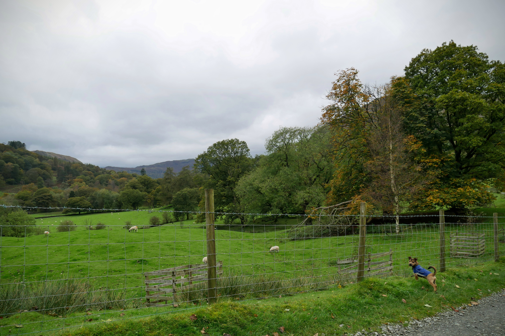 | 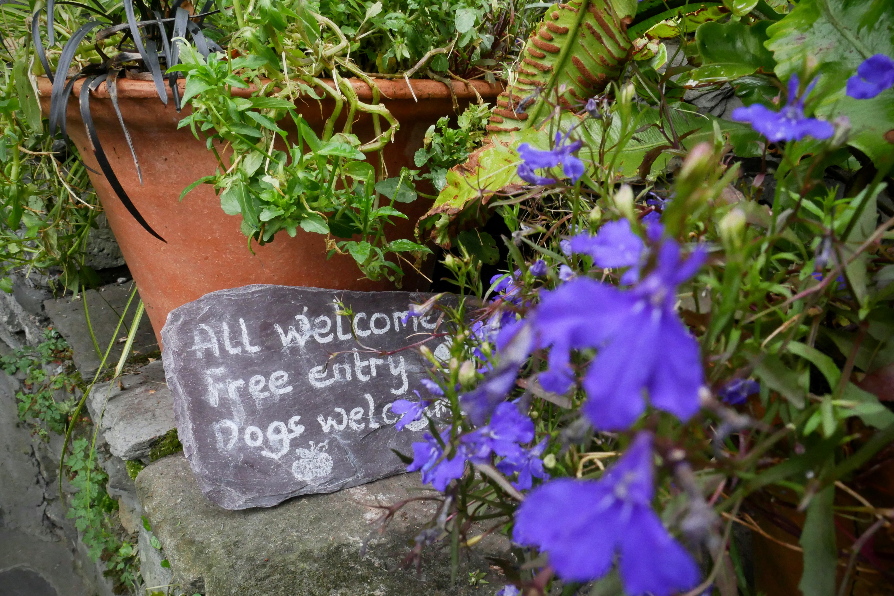 |

We woke on the first morning to sun and blue skies - an unusual occurrence in the mountains. Friends had recommended a circular walk, starting at the huts, through to Ambleside, around Loughrigg Fell and ending at Grasmere and Rydal Water. And so, off we went...

|                                       |                                       |
| ------------------------------------- | ------------------------------------- |
| 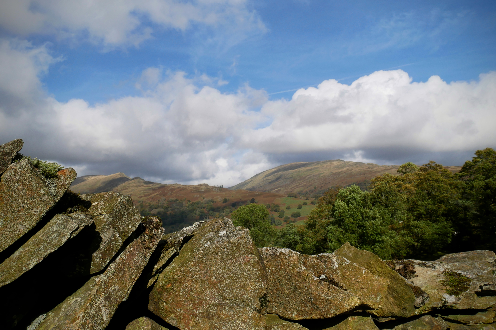 | 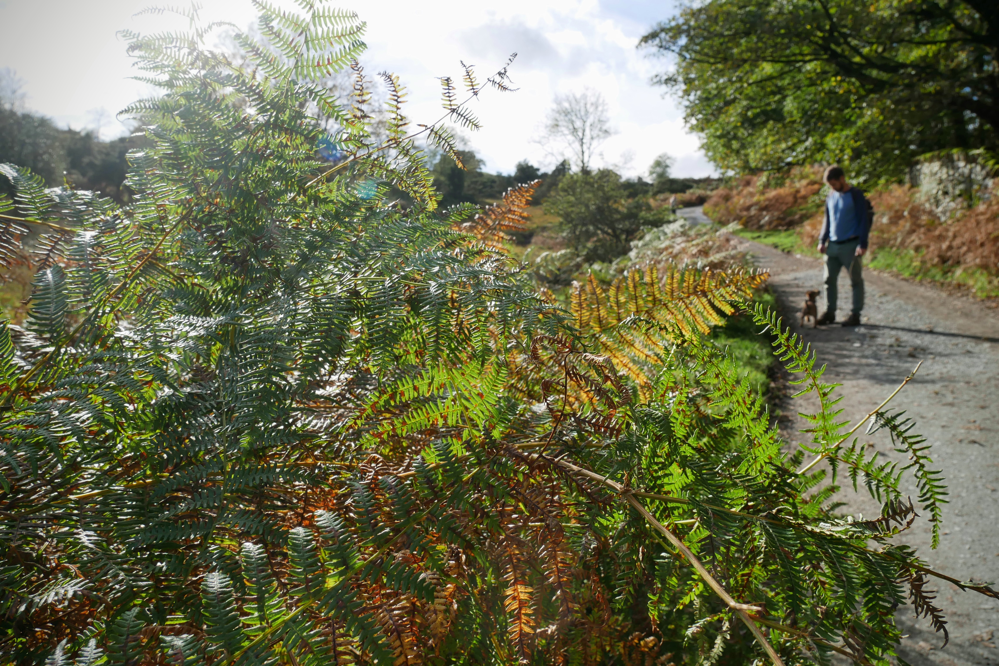 |

The views were spectacular and we couldn't have enjoyed the peace and quiet more. Witnessing Greg's first sheep experience was also a pleasure to behold (and definitely worth keeping him on a lead for!).

|                                       |                                       |
| ------------------------------------- | ------------------------------------- |
| 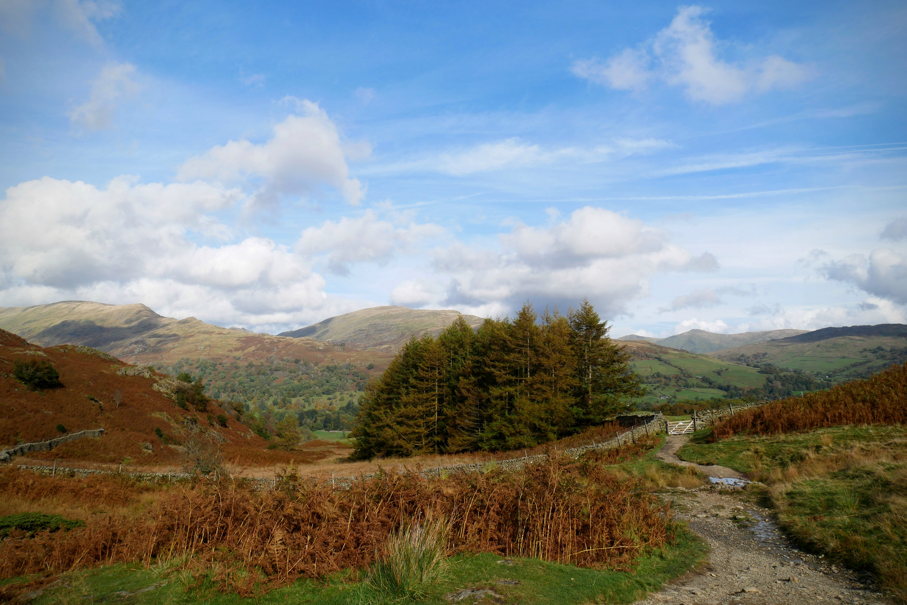 | 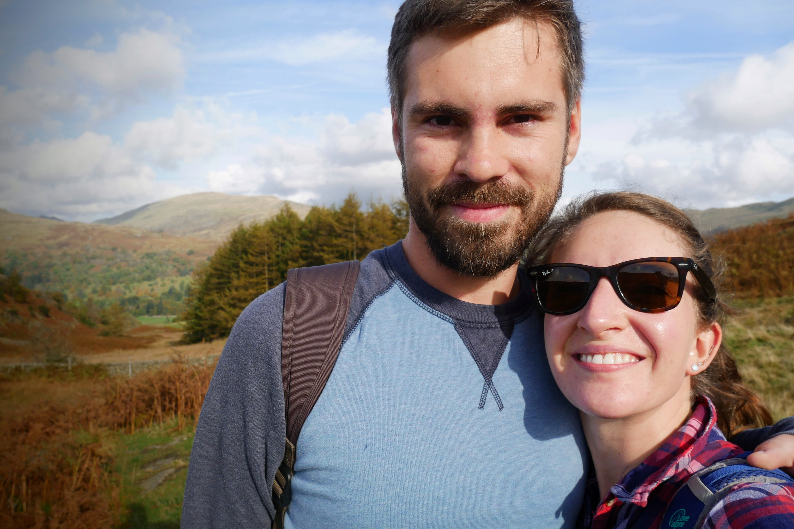 |

As we rounded a corner, we stumbled upon a proposal in progress and happily obliged the newly betrothed couple's wish for a photo. What a stunning backdrop for that all important question!

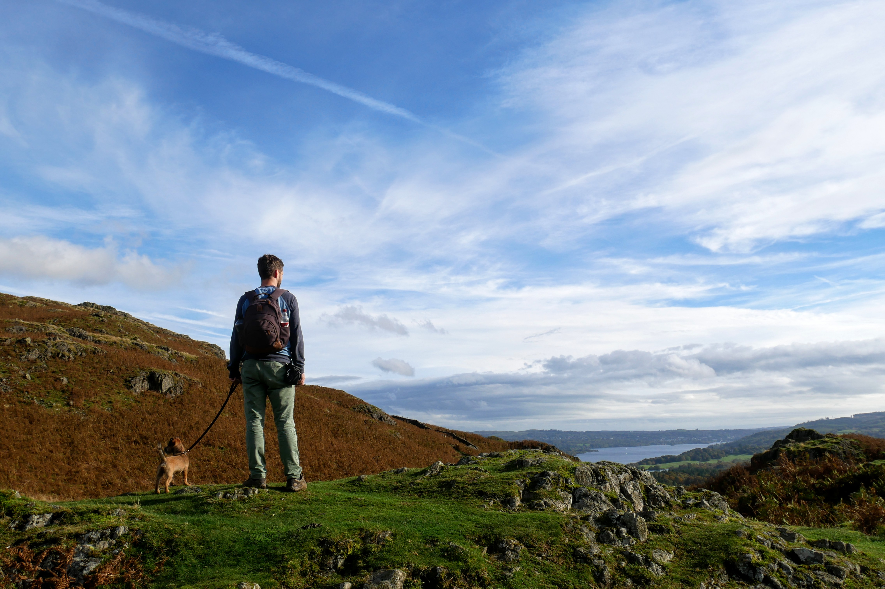

Around this point, our pooch started to get a little tired. He's only got small legs after all, and the wind was blowing quite a gail at Loughrigg Fell. Sometimes a snuggle is all that's needed to top up the energy stores!

|                                       |                                       |
| ------------------------------------- | ------------------------------------- |
| 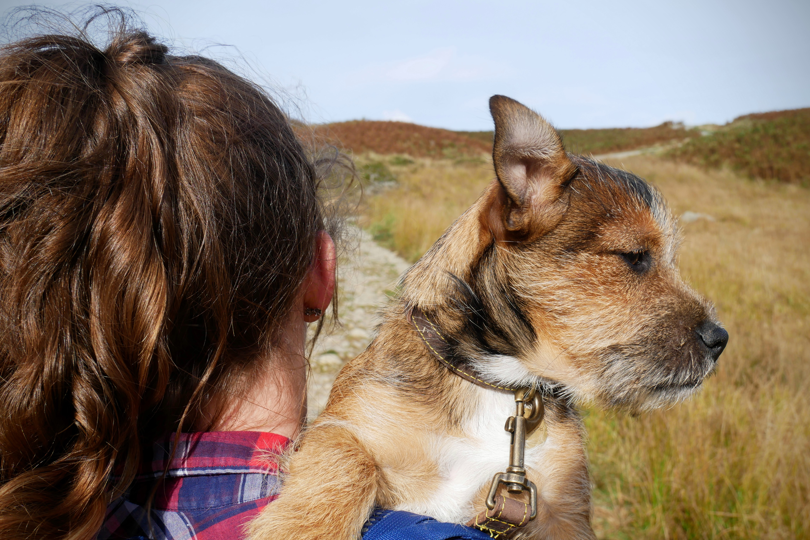 | 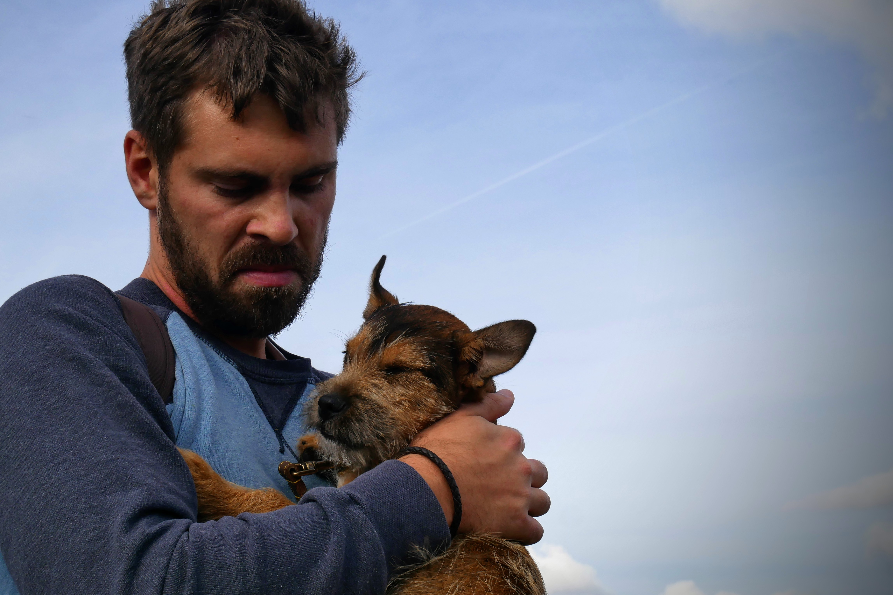 |

We continued the walk, uncovering one beautiful vista after the next - and being spoiled by the unseasonal sunshine!

As we started to reach the final descent, we rounded upon stunning Rydal Water and Grasmere. As you can see, Greg had recovered some energy and obliged us in an impromptu photoshoot. What a looker!

|                                       |                                       |
| ------------------------------------- | ------------------------------------- |
| 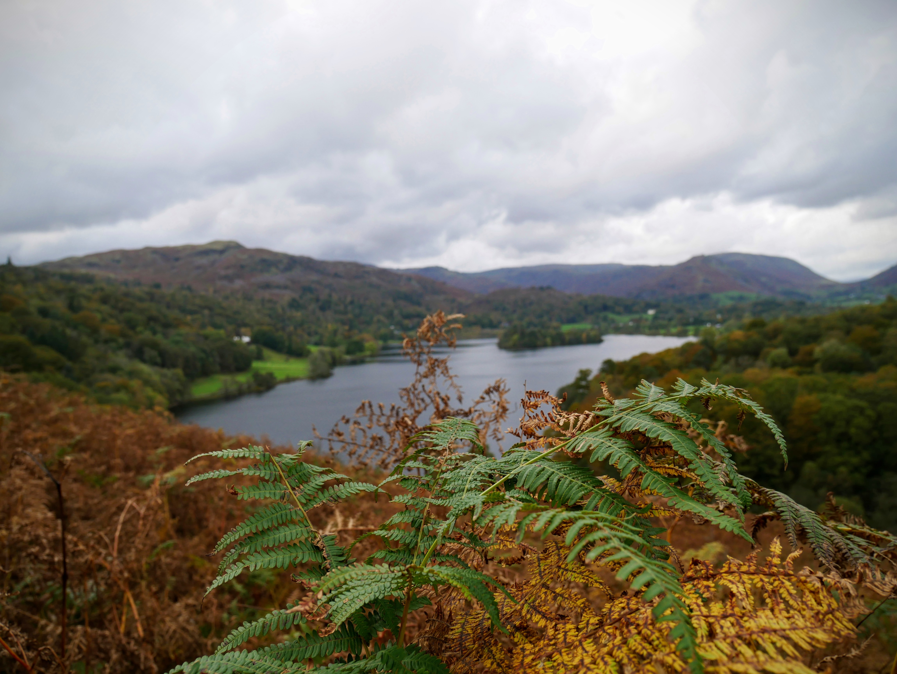 | 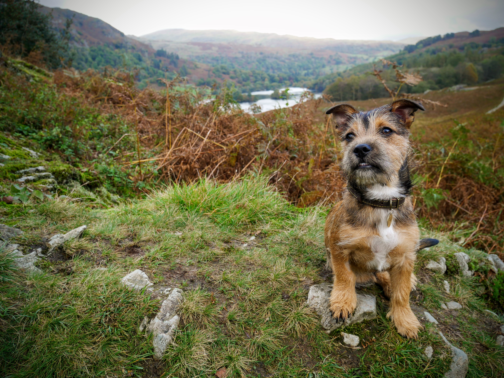 |

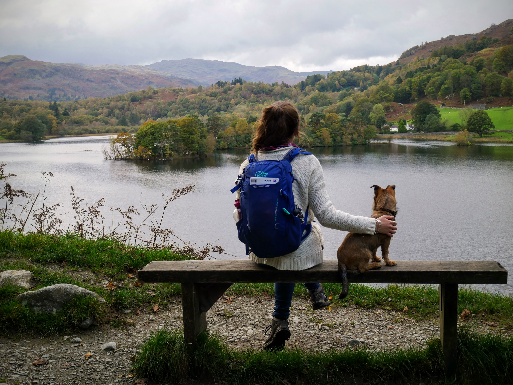

And what's a long country walk if it doesn't end in a pub with a pint? Throw in an open fire and scrabble, and you're onto a winner. Staycations are seriously underrated.

|                                       |                                       |
| ------------------------------------- | ------------------------------------- |
| 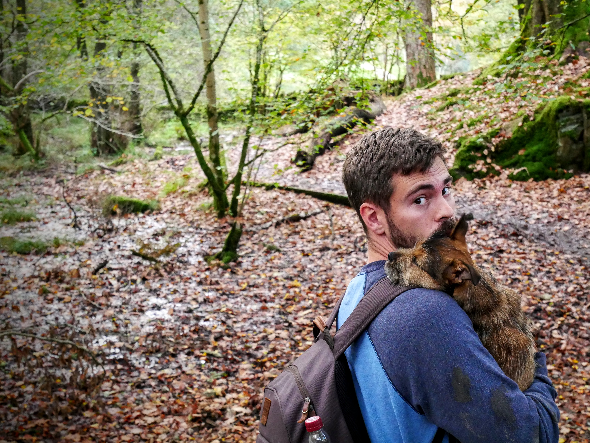 | 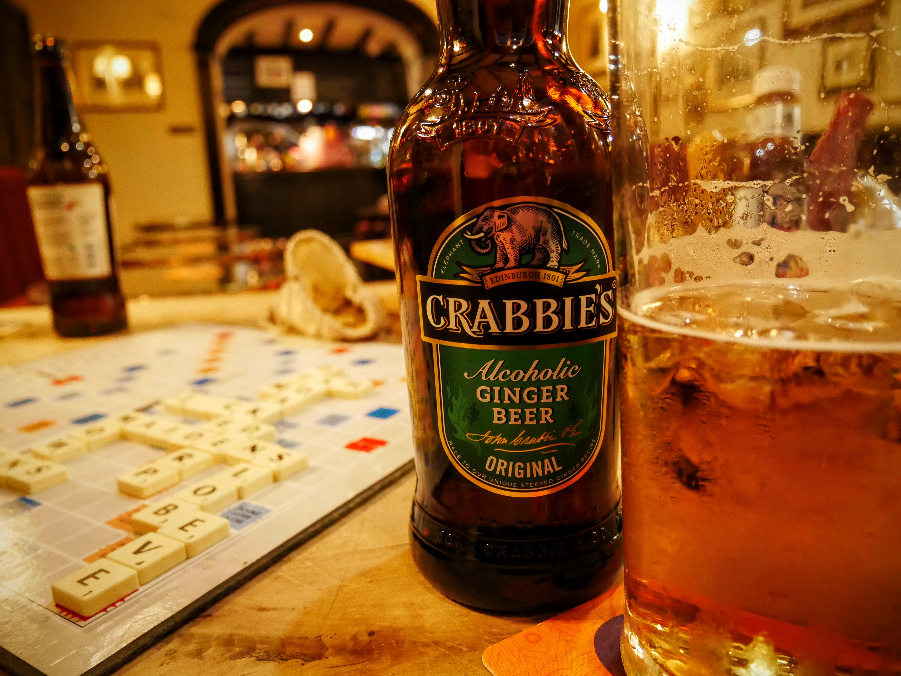 |

###The useful bits:###

- [This walk online](https://www.walkingbritain.co.uk/walk-3075-description) is the most similar to ours - definitely worth a look.
- We passed [Rydal Cave](http://www.english-lakes.com/rydal_cave.html) on the way down. Worth a stop if you're walking past, this quarry was carved into the rock over 200 years ago and supplied roofing slates for the surrounding area.
- Don't forget to pack for all weathers and LAYER: we were lucky with a reliably sunny day, but the temperature (and precipitation) can change in mere moments.
