India had long been on my travel wish-list, so when a break in work contracts coincided with a darling friend's round-the-world trip, it seemed like the fates had aligned especially.

Kochi was our first stop and the perfect introduction to incredible, insane India.

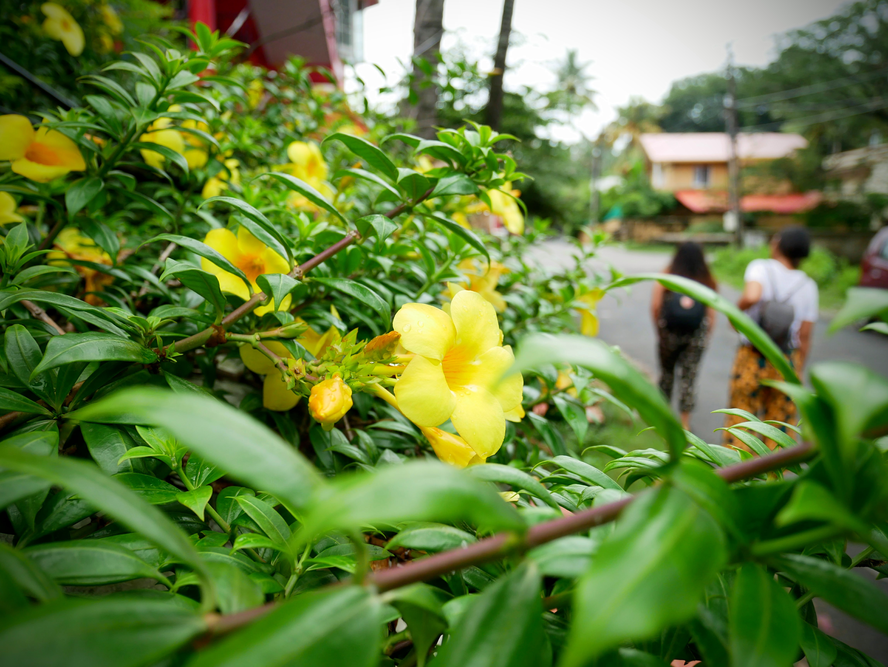

Our trip started in June: monsoon season in India. Not discouraged by the thought of rain (we're used to it after all...), we set out from [Jojie's Homestay](https://www.booking.com/hotel/in/jojies-homestay-fortkochi.en-gb.html?aid=311076;label=jojies-homestay-fortkochi-1FQkYCVfvCSw9Mq7J80Y4gS162189374156%3Apl%3Ata%3Ap1%3Ap2%3Aac%3Aap1t1%3Aneg%3Afi%3Atiaud-285284111686%3Akwd-327388356694%3Alp9045909%3Ali%3Adec%3Adm;sid=faa00bda9a6d3fc5659e3e84e07ac007;dest_id=-2093645;dest_type=city;dist=0;hapos=1;hpos=1;room1=A%2CA;sb_price_type=total;sr_order=popularity;srepoch=1549807724;srpvid=452e637577240363;type=total;ucfs=1&#hotelTmpl) to explore.

| | |
| --- | --- |
| | 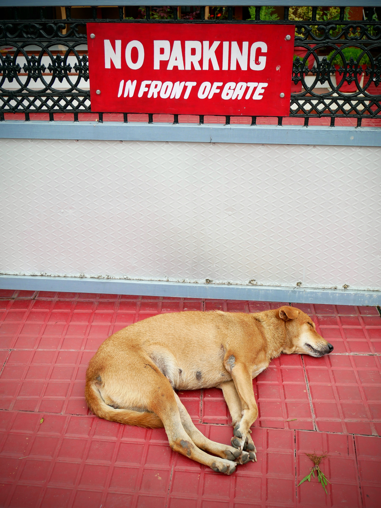|

We'd sense checked our itinerary with our hosts and received the seal of approval. So after around a 25 minute walk, we arrived to the [Dutch Palace](https://www.tripadvisor.co.uk/Attraction_Review-g297633-d325097-Reviews-Mattancherry_Palace-Kochi_Cochin_Ernakulam_District_Kerala.html) (officially called Mattancherry Palace).

The Palace is really a museum now and unfortunately photos weren't allowed. Built in the 16th century and adorned with murals of religious imagery, it's definitely worth a visit. My favourite part was reading about [Marumakkathayam](https://en.wikipedia.org/wiki/Marumakkathayam) - a system where property and family names were passed down to the females rather than the males in a family.

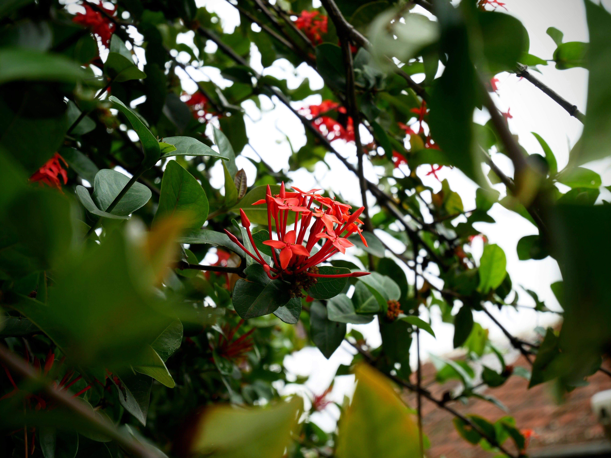

Next on our itinerary was an incense shop where we were also given beautiful henna tattoos on our hands (thanks to a voucher from Sophia, our homestay host). En route, we passed this fabulous mural and self-portrait!

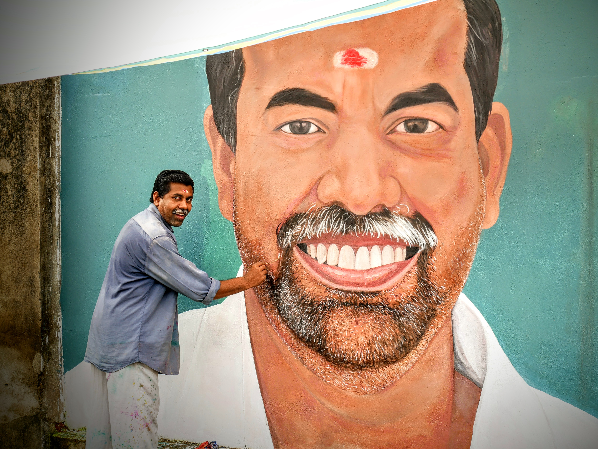

| | |
| --- | --- |
|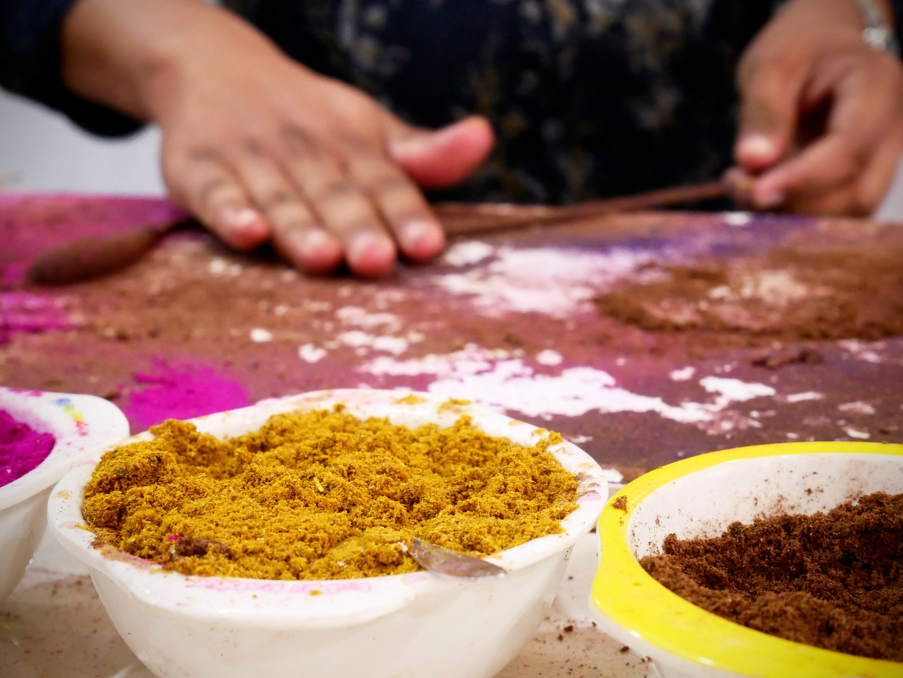 | 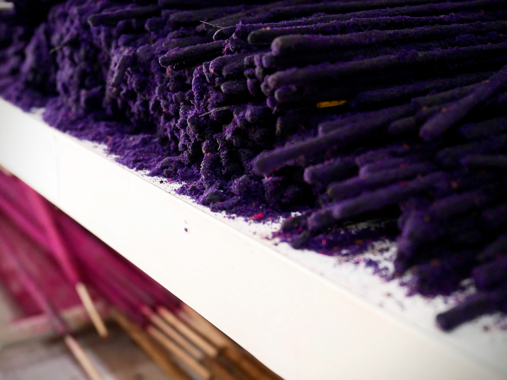|

Charlotte and Hannah managed to persuade me to join them on a visit to a fortune teller's house next, and we jumped in a rickshaw to get there. 10 minutes after arriving, the heavens really opened and we saw our first proper monsoon rain. Perhaps the visit was providential after all.

For 500 rupees (around £5) I was told that I'm 'arrogant', Aidan is 'good' and that we'd have two children: a boy and a girl. I suppose only time will tell!

| | |
| --- | --- |
|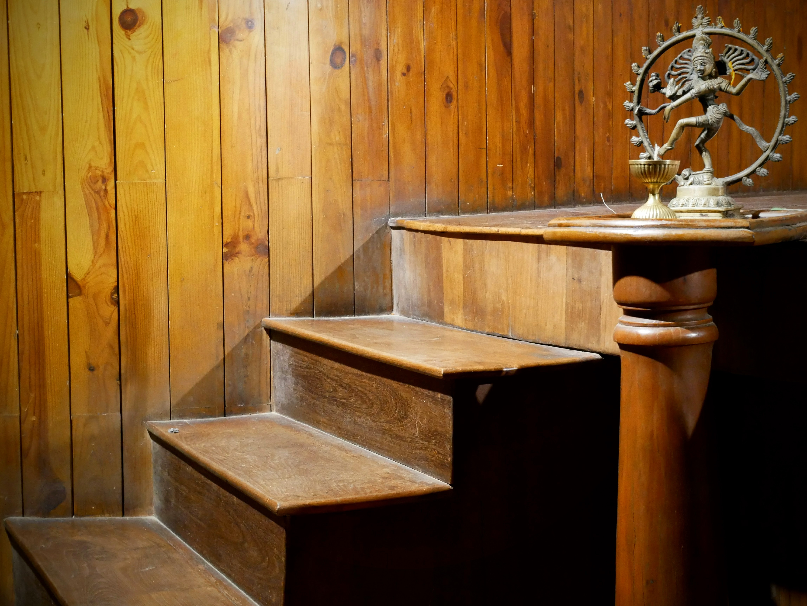 | 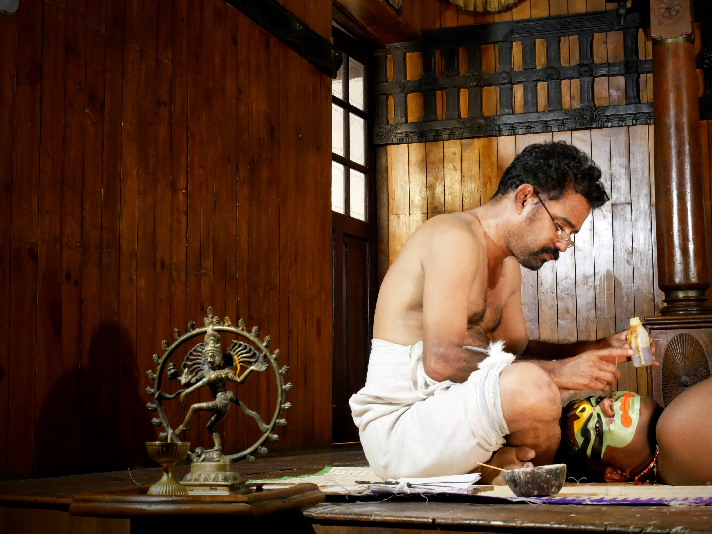|

After a dinner of [Gobi Manchurian](https://en.wikipedia.org/wiki/Gobi_manchurian) (fried cauliflower in a rich, dark gravy) and parotta bread (a slightly greasy layered flatbread), we headed to a Kathakali show of traditional dancing and music.

If you arrive early enough, in addition to the show, you can see the actors apply the all important make-up. 

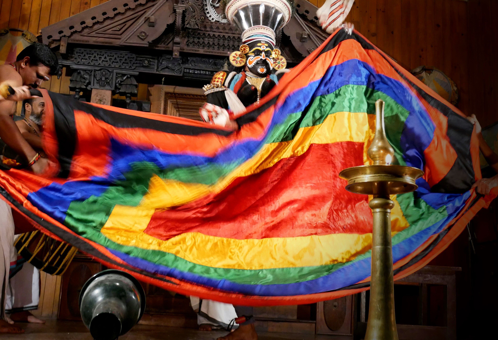

The show was surreal, vibrant and educational, and we thoroughly enjoyed it. Not a bad day to start our trip!

| | |
| --- | --- |
|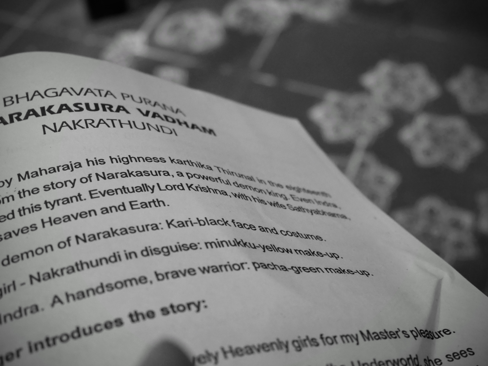 | 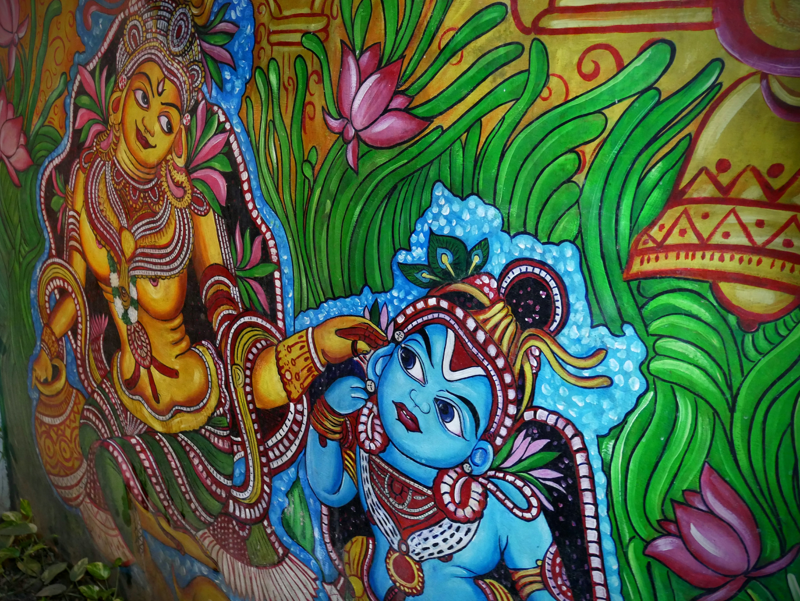|

###The useful bits:###

- On arrival to Kochi airport, we immediately bought SIM cards. For 30 days of unlimited calls and 1GB of data daily, we splurged a whole £5.
- We got to our homestay in Fort Kochi using Uber rather than braving the queue of airport taxis.
- [Jojie's Homestay](https://www.booking.com/hotel/in/jojies-homestay-fortkochi.en-gb.html?aid=311076;label=jojies-homestay-fortkochi-1FQkYCVfvCSw9Mq7J80Y4gS162189374156%3Apl%3Ata%3Ap1%3Ap2%3Aac%3Aap1t1%3Aneg%3Afi%3Atiaud-285284111686%3Akwd-327388356694%3Alp9045909%3Ali%3Adec%3Adm;sid=faa00bda9a6d3fc5659e3e84e07ac007;dest_id=-2093645;dest_type=city;dist=0;hapos=1;hpos=1;room1=A%2CA;sb_price_type=total;sr_order=popularity;srepoch=1549807724;srpvid=452e637577240363;type=total;ucfs=1&#hotelTmpl) was the perfect base for our time in Kochi and our lovely hosts, Doyal and Sophia, could not have been more welcoming.
- We ate dinner at [Febina Restaurant](https://www.tripadvisor.co.uk/Restaurant_Review-g297633-d2243982-Reviews-Febina_Restaurant-Kochi_Cochin_Ernakulam_District_Kerala.html) at the recommendation of our hosts. My meal cost around 90 rupees (just under £1). Pleasing for my tummy and bank balance!
- There are numerous places for a Kathakali show: we chose [The Kerala Kathakali Centre](https://www.tripadvisor.co.za/Attraction_Review-g297633-d1776022-Reviews-Kerala_Kathakali_Centre-Kochi_Cochin_Ernakulam_District_Kerala.html), again on the advice of our hosts.
- Kochi is also referred to as Cochin: The British named it Cochin whereas locals called it Kochi. The name Kochi was declared official in 1996, but both versions persist.