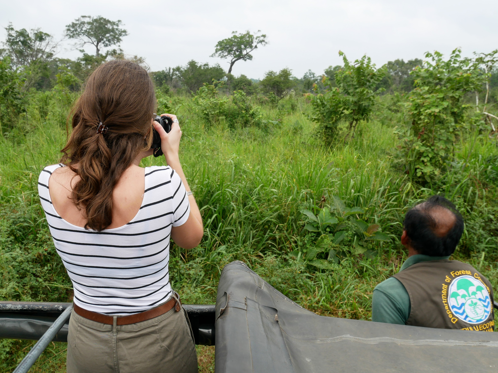
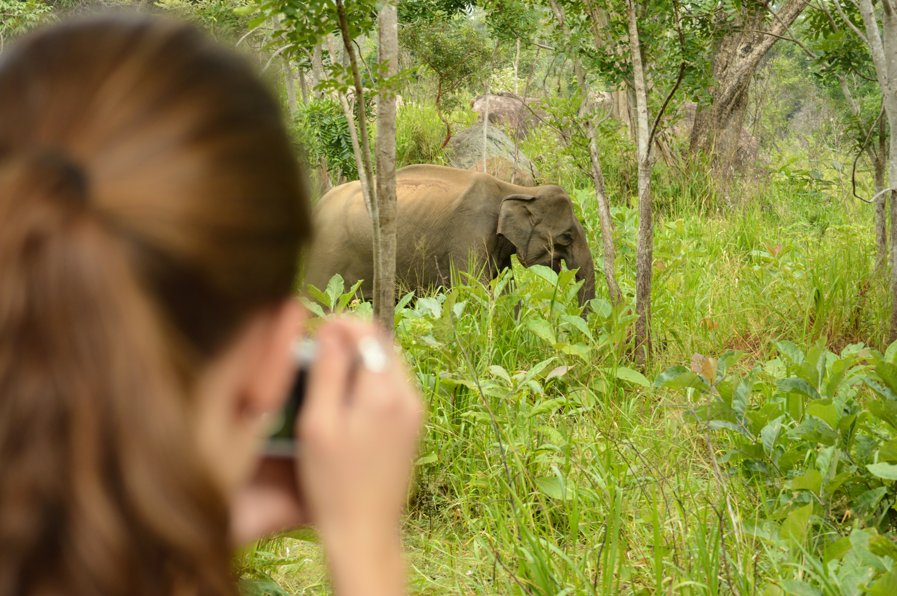
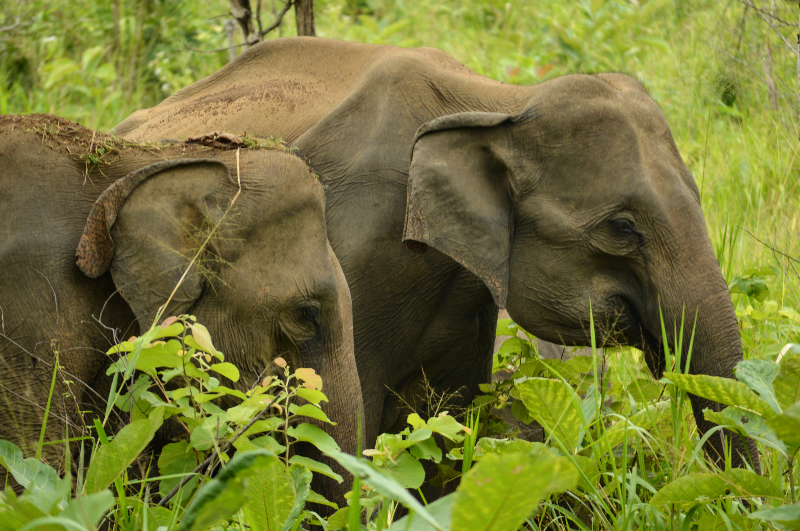
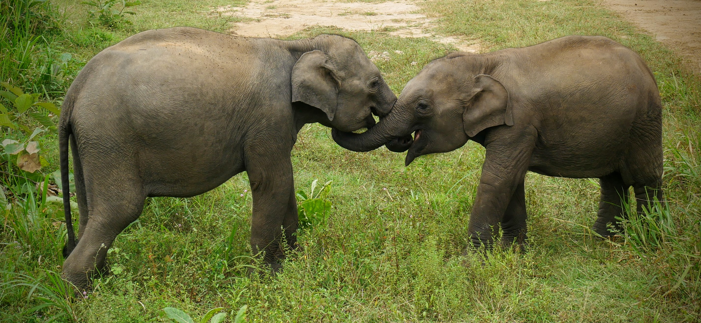
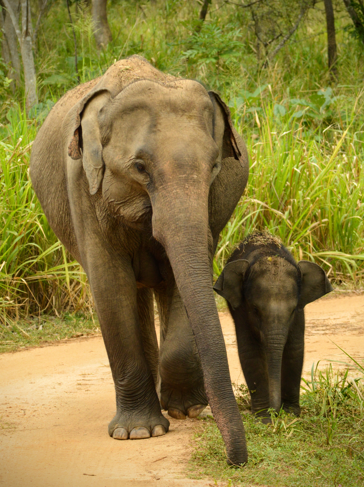
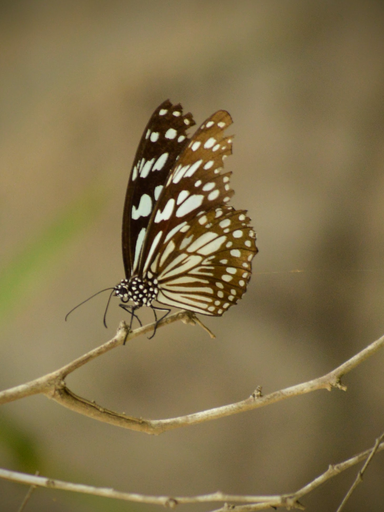
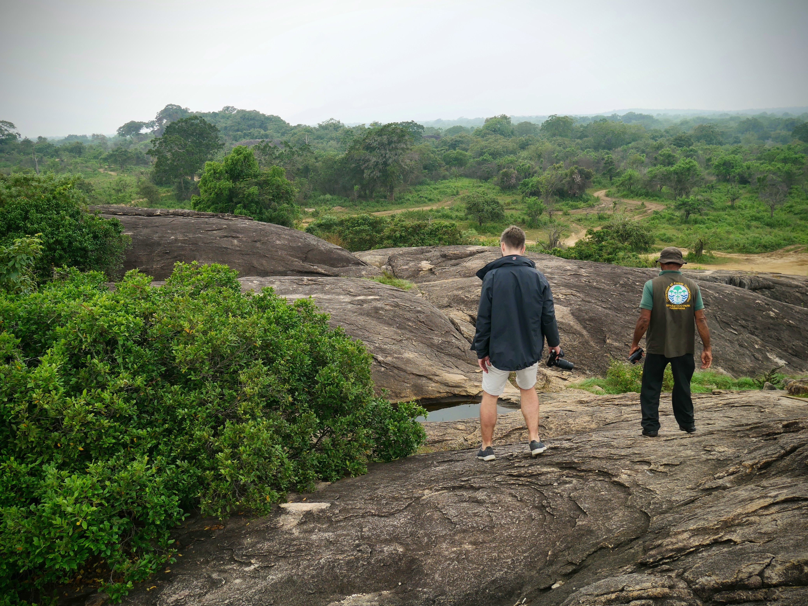
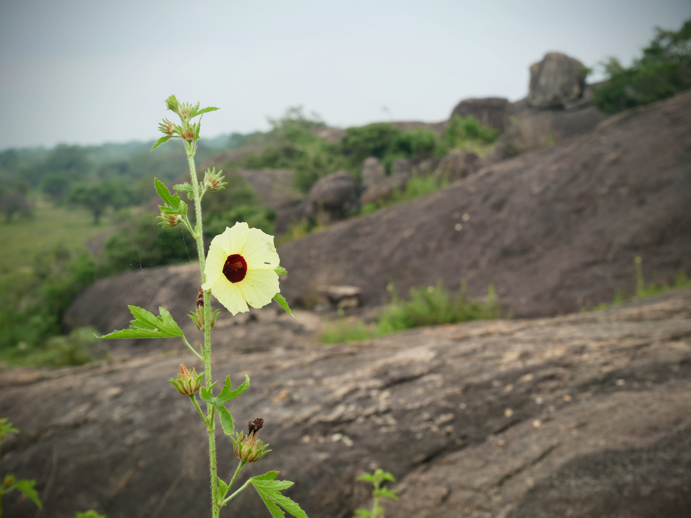
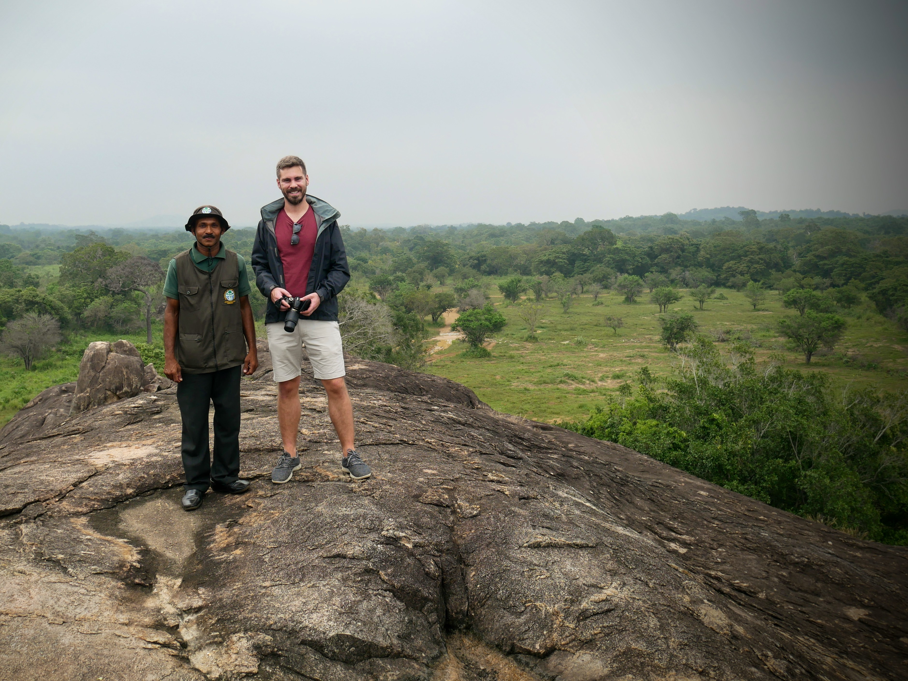

Suffice to say, seeing elephants was HIGH on our Sri Lanka to-do list! Staying in Sigiriya, we had a few choices of parks to visit. Minneriya was rated very highly, but the staff in our hotel recommended Hurulu Eco Park instead, as the prevalence of elephants would likely be higher.

We headed off in our jeep around 9am and after about 40 minutes, we were in the park and ready to see everything on offer.

We'd been warned that the elephants are wild (of course), so there's no guarantee you'll see them - even with the best will in the world.

We drove for a while, seeing beautiful birds and butterflies along the way, but still no elephants, until...

|                                  |                                  |
| -------------------------------- | -------------------------------- |
|  |  |

There might have been some tears! It was truly a magical moment.

As we rounded another corner, we came across the whole troupe - including babies! My heart.

|                                  |                                  |
| -------------------------------- | -------------------------------- |
|  |  |

The weather was a little mixed, but it was ideal for a safari trip. Else it would have become unbearable approaching lunchtime.

Milton, our guide, was fantastic: incredibly dedicated, knowledgeable and professional. He plied us with wildlife trivia and pointed out animals we'd never have seen otherwise.

|                                  |                                  |
| -------------------------------- | -------------------------------- |
|  |  |

The post and pictures might be heavily weighted to the gentle giants, but we also saw:

- A couple of golden orioles
- Chameleons
- Eagles
- Peacocks
- Green bee-eaters
- Jackals
- Jungle fowl (the national bird of Sri Lanka)
- Hordes of butterflies!

How people see these beautiful creatures and decide to shoot and kill them, is just beyond my comprehension. I've never felt more humbled than when surrounded by these intelligent, elegant animals. A truly wonderful day!

###The useful bits:###

- We paid 5,000 rupees for the jeep for the morning - around £25. Bargain!
- Park entry was just under 4,000 rupees + tips.
- Sadly, I can't remember the company we chose for the jeep hire. Bad blogger!
- The best park will depend on the time of year as the elephants move around. Be sure to ask the locals for their recommendation.
