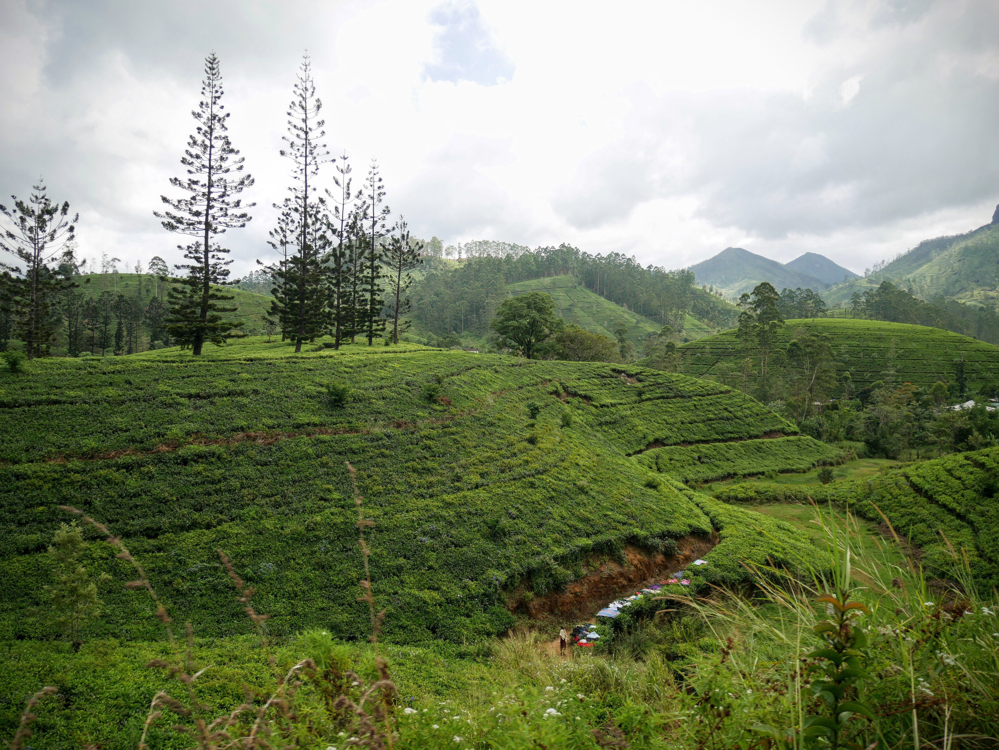

After our whistle-stop tour of Kandy, we were up and at 'em ready to travel to Ella by train.

Booking tickets for this infamous journey can be a bit tricky. You can risk showing up on the day if you're happy to stand. It's a 6 and a half hour journey though, so understandably, we weren't too keen!

|                                             |                                             |
| ------------------------------------------- | ------------------------------------------- |
|  |  |

Luckily, our friends in Kandy used their contacts and bought us 2nd class tickets. Little did we know, there are two types of 2nd class tickets... reserved and unreserved. Upon boarding the train, we spent a tense 5 minutes squashed into the doorway of an unreserved carriage, strongly questioning our life choices. Fortunately, after inspecting our tickets, a burly train conductor showed us to our seats, and we've never been quite so relieved!

And so, with little time to spare, we were off!

The stunning journey finds the train winding and weaving through tea plantations, misty fields and forests, revealing stunning views around every corner.

|                                                                   |                                           |
| ----------------------------------------------------------------- | ----------------------------------------- |
|  |  |

Although first class has air conditioning, it seems few people choose it. One of the novelties of train travel in Sri Lanka is being able to stand in the doorway, train in motion, while leaning over the side.

Terrifying and exhilirating in equal measure!

|                                |                                |
| ------------------------------ | ------------------------------ |
|  |  |

We'd read that various food vendors will travel the length of the train with their offerings, and we weren't disappointed: samosas, egg rolls, chickpea patties (definitely not the official name) and chai to wash it all down.

The time passed quickly, and before we knew it, we'd arrived in Ella.

Our hotel was a 10 minute walk from the station, so after finding our bearings, we headed straight back into the town in search of an early dinner.

|                                                                         |                                                                         |
| ----------------------------------------------------------------------- | ----------------------------------------------------------------------- |
|  |  |

And just before bed? A long diary entry to make sure we wouldn't forget this day!

###The useful bits:###

- Our train left Kandy at 8.47am and arrived in Ella just gone 3pm. There's another departure mid-morning if you'd prefer a little lie-in.
- I won't pretend to be an expert on the ticket logistics as we cheated. Instead, check out [this informative post](https://www.thecommonwanderer.com/blog/kandy-to-ella-train-guide) for timetables and costs.
- On our first night in Ella, we ate at [Dream Cafe](https://www.tripadvisor.co.uk/Restaurant_Review-g616035-d1146348-Reviews-Dream_Cafe-Ella_Uva_Province.html).
- We stayed at [Rowinrich Cottages](https://www.booking.com/hotel/lk/rowinrich-cottages.en-gb.html?aid=311076;label=rowinrich-cottages-b04XQ6GC6hzO3aE1Cf7bigS168710257188%3Apl%3Ata%3Ap1%3Ap2%3Aac%3Aap%3Aneg%3Afi%3Atiaud-285284111486%3Akwd-274349904121%3Alp9045912%3Ali%3Adec%3Adm%3Appccp%3DUmFuZG9tSVYkc2RlIyh9YdbYVqXDN8zp4gKDP9r5yHI;sid=892d1c545030dcda35843bab5b0ce701;dest_id=-2216722;dest_type=city;dist=0;group_adults=2;group_children=0;hapos=1;hpos=1;no_rooms=1;room1=A%2CA;sb_price_type=total;sr_order=popularity;srepoch=1589361988;srpvid=af254261bb5a002f;type=total;ucfs=1&#hotelTmpl). Our room cost around £25 a night and had wonderful views of Ella Rock from the terrace. Our only small complaint was that it was rather chilly at night!
