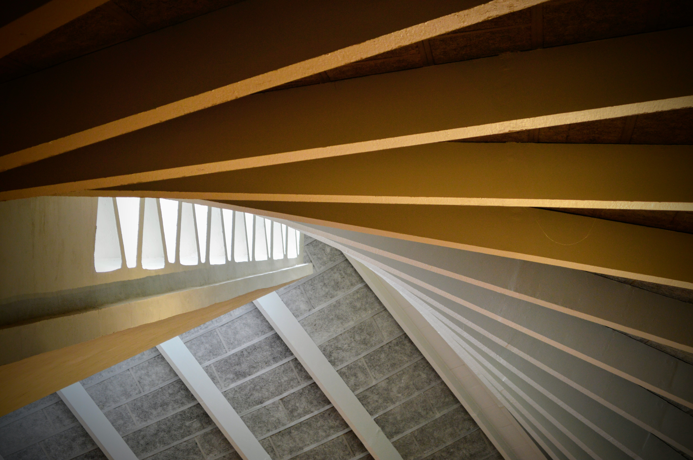
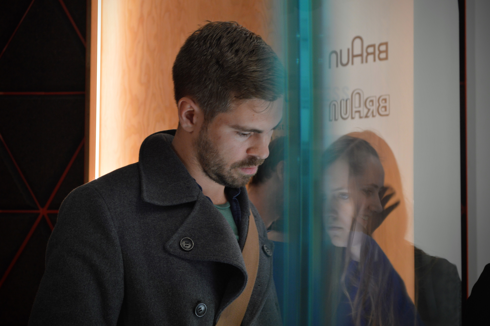
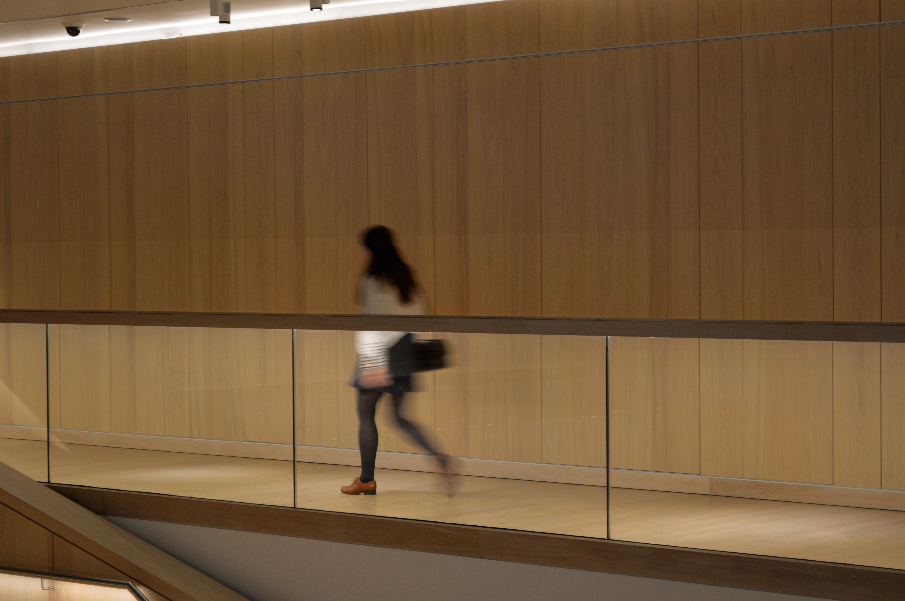
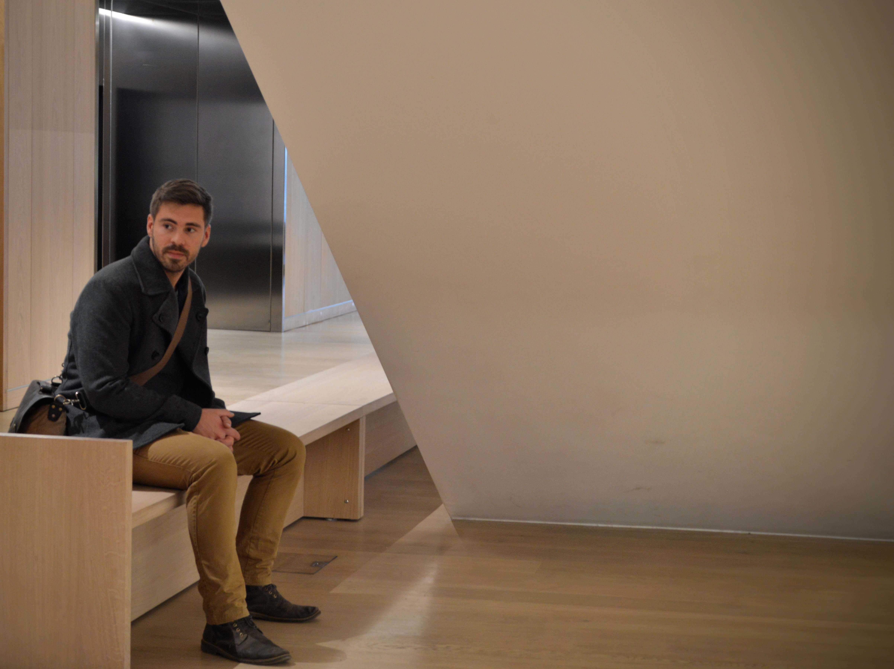
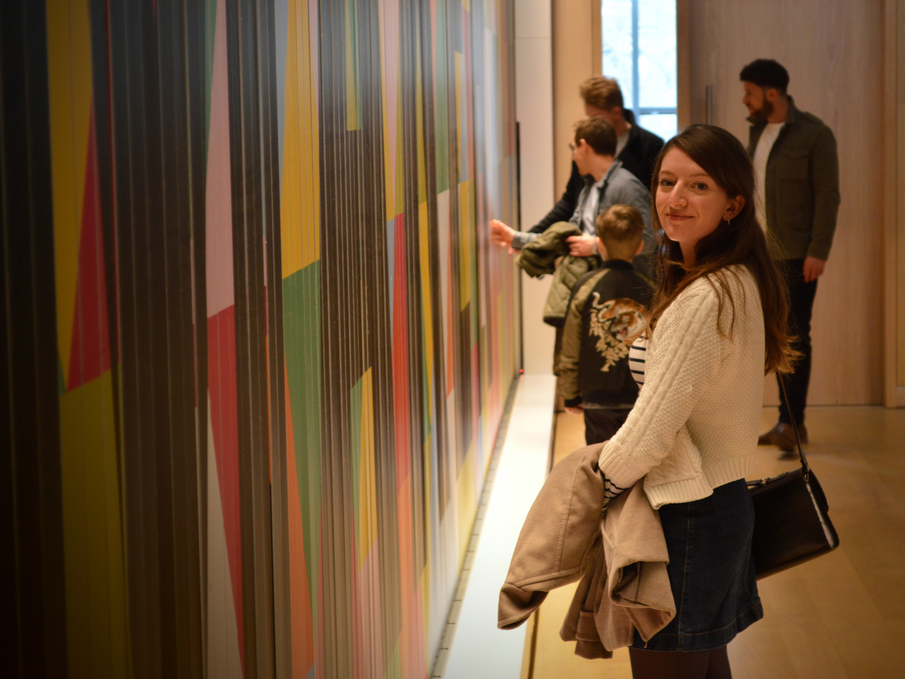
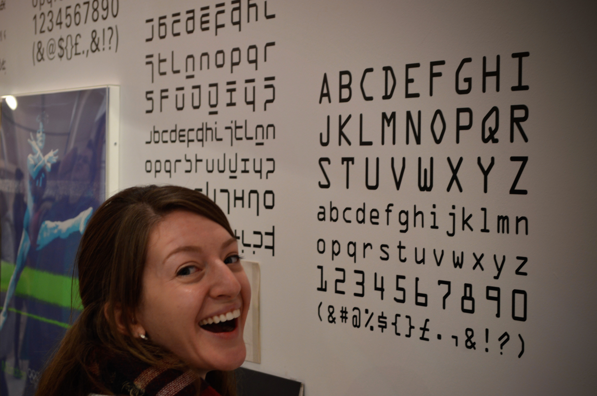
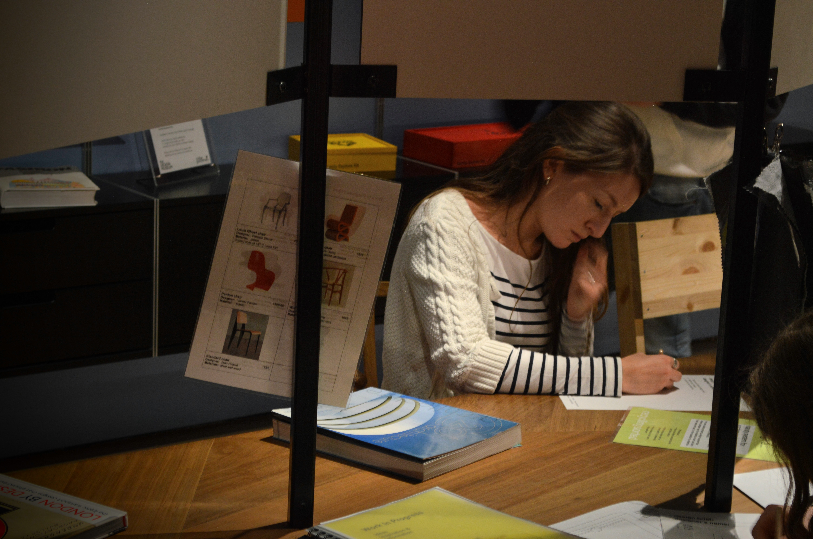
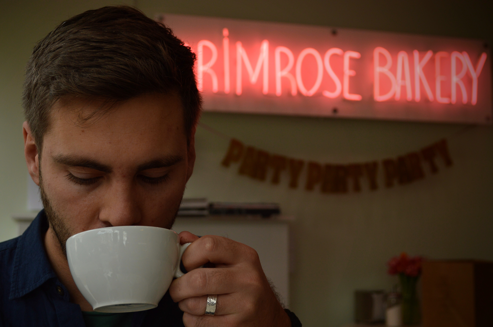
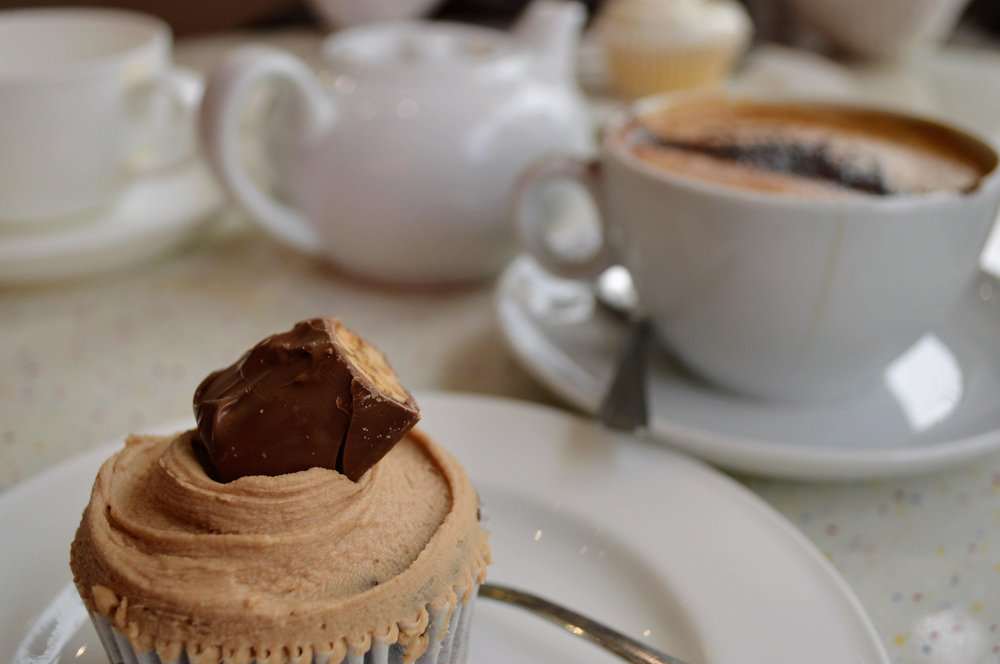
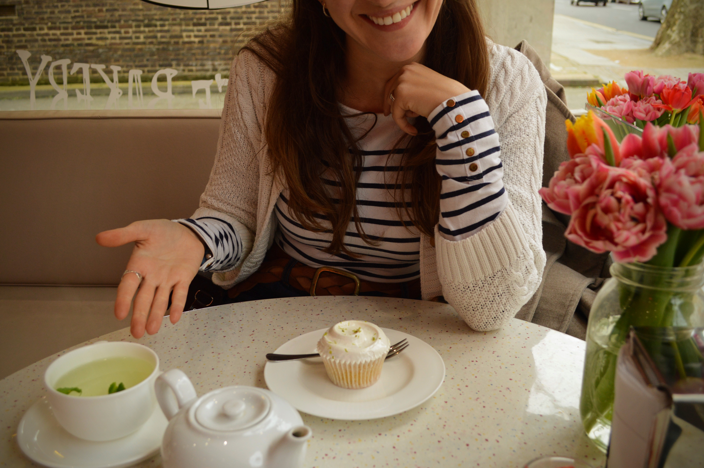

If you've ever been to our house, you'll know that Aidan and I have a mild obsession with Pantone. We both quite fancy ourselves as budding designers, so when planning a Saturday date day, where better than the [Design Museum](https://designmuseum.org/)?

Relocated from its previous site in November 2016 after a 6 year renovation, the Museum definitely doesn't disappoint. We headed out early, keen to make the most of the day. A hop, skip, Thameslink, tube and a jump later and we were strolling down Kensington High Street.

From the outside the Design Museum is imposing, but not particularly spectacular (at least from the entrance). An inch over the threshold though, and that hastily-formed opinion evaporated as quickly as it had formed.

|                                                        |                                                          |
| ------------------------------------------------------ | -------------------------------------------------------- |
|  |  |

The parabolic ceiling, palatial entrance hall with mezzanine, and the stage-like stepped seating: all a feast for the eyes. And we hadn't even started on the exhibitions.

As it was our first visit, we decided to stick to the main collection rather than the paid exhibitions. For these, we promised ourselves a return trip soon.

|                                                                         |                                                                                |
| ----------------------------------------------------------------------- | ------------------------------------------------------------------------------ |
|  |  |

The main collection is entitled 'Design Maker User' and showcases around 1,000 items from the twentieth and twenty-first centuries: a real lesson in the evolution of design.

A memorable quote from Raymond Loewy (the 'designer of American Dreams'): "Between two products equal in price, function and quality, the one with the most attractive exterior will win." So much for beauty being in the eye of the beholder, eh?

|                                                                                |                                                                      |
| ------------------------------------------------------------------------------ | -------------------------------------------------------------------- |
|  |  |

My 2 most favourite sections were about signage, specifically the London Underground and TfL, and the parts dedicated to typography. I've said it once, I'll say it again - I love fonts! Ashamed as I am to admit it - this face isn't even posed...

We also particularly enjoyed the interactive section where we were invited to invent and design an attractive, light-weight (suitable for those with mobility issues) and functional recycling bin. Yes, this activity may have been aimed at children, but we enjoyed it nonetheless.

|                                                             |                                                                           |
| ----------------------------------------------------------- | ------------------------------------------------------------------------- |
|  |  |

Once we'd had our fill of the Museum and the gift shop (mandatory), we took a stroll across Holland Park to see the daffodils, tulips and hyacinths. Little did we know that our feet would lead us to [Primrose Bakery](https://www.primrose-bakery.co.uk/shop/kensington-high-street).

|                                                             |                                                   |
| ----------------------------------------------------------- | ------------------------------------------------- |
|  |  |

Our Snickers and Key Lime Pie cupcakes were an excellent, sugary way to round off an educational, enjoyable and unexpectedly cheap date day.

|                                                                                        |                                                                                        |
| -------------------------------------------------------------------------------------- | -------------------------------------------------------------------------------------- |
|  |  |

###The useful bits:###

- The Design Museum is just off Kensington High Street, so this is the closest tube station.
- Kensington High Street is on the District and Circle lines. Paddington and Victoria are a mere 10 minutes away, and coming from Waterloo will only take 20 minutes. Easy peasy!
- The permanent exhibits in the Museum are free.
