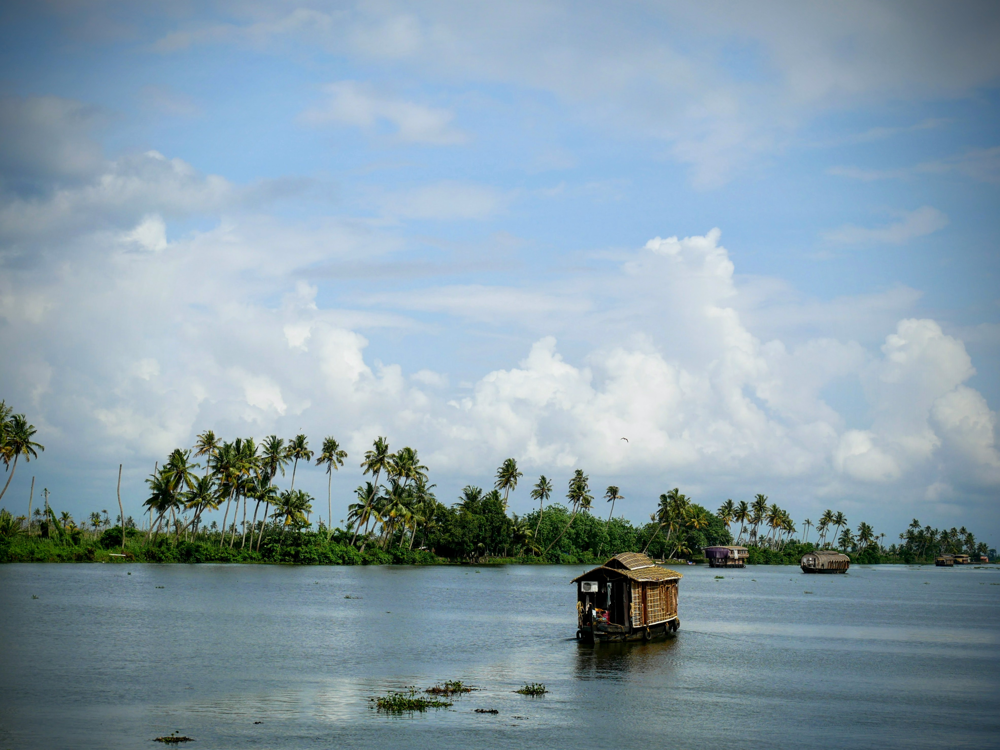

Next after Kochi was a trip to the Kerala backwaters: a network of interconnected freshwater lakes and rivers, renowned for their lush vegetation and highly important for trade, farming and irrigation in the area.

First up, we tuk-tuked from Kochi city to our start point of Alleppey. From Alleppey we'd have a houseboat to ourselves for a night - quite the extravagance.

|                                     |                                     |
| ----------------------------------- | ----------------------------------- |
|  |  |

Our driver took us on a delightfully scenic route with plenty of photo stops. The unexpectedly grand church, [St. Andrew's Basilica](https://en.wikipedia.org/wiki/St._Andrew%27s_Basilica,_Arthunkal), and Arthunkal beach (and its swirling brahminy kites) were particular highlights.

|                                     |                                     |
| ----------------------------------- | ----------------------------------- |
|  |  |

Labyrinthine is a word often used to describe the backwaters, and as soon as we set off in our houseboat, we could easily see why.

A quick internet search tells me that the network is comprised of more than 500 miles of waterways, that it's fed by 38 rivers and that it stretches almost half the length of the state.

|                                     |                                     |
| ----------------------------------- | ----------------------------------- |
|  |  |

Used for both trade and tourism, the backwaters were surprisingly quiet and calm. The sunny weather was an unexpected perk, especially as we visited in monsoon season. In the midday 30-degree heat the ice cream boat was most welcome!

|                                     |                                     |
| ----------------------------------- | ----------------------------------- |
|  |  |

Even more welcome was the fantastic feast presented to us by the excellent staff on board. Suffice it to say, I will never tire of Indian food.

|                                     |                                     |
| ----------------------------------- | ----------------------------------- |
|  |  |

As the day drew to a close, we moored up and went to explore our neighborhood for the night. Then, sitting on the roof of the boat, we watched the sky turn from blue, to purple, to pink. Just stunning (although we could have done without the mosquito bites...).

|                                     |                                     |
| ----------------------------------- | ----------------------------------- |
|  |  |

###The useful bits:###

- Not too many useful bits to share, as I failed to record the cost of the trip. Rookie error!
- We spent 1 night on the boat - booked through our hotel in Kochi. The tuk tuk transfer was included, as were all meals, snacks and copious servings of sugary masala chai.
- We departed from and returned to Alleppey. The next morning, we jumped in a tuk tuk to the bus station and had no trouble finding a coach to our next stop, Munnar.
