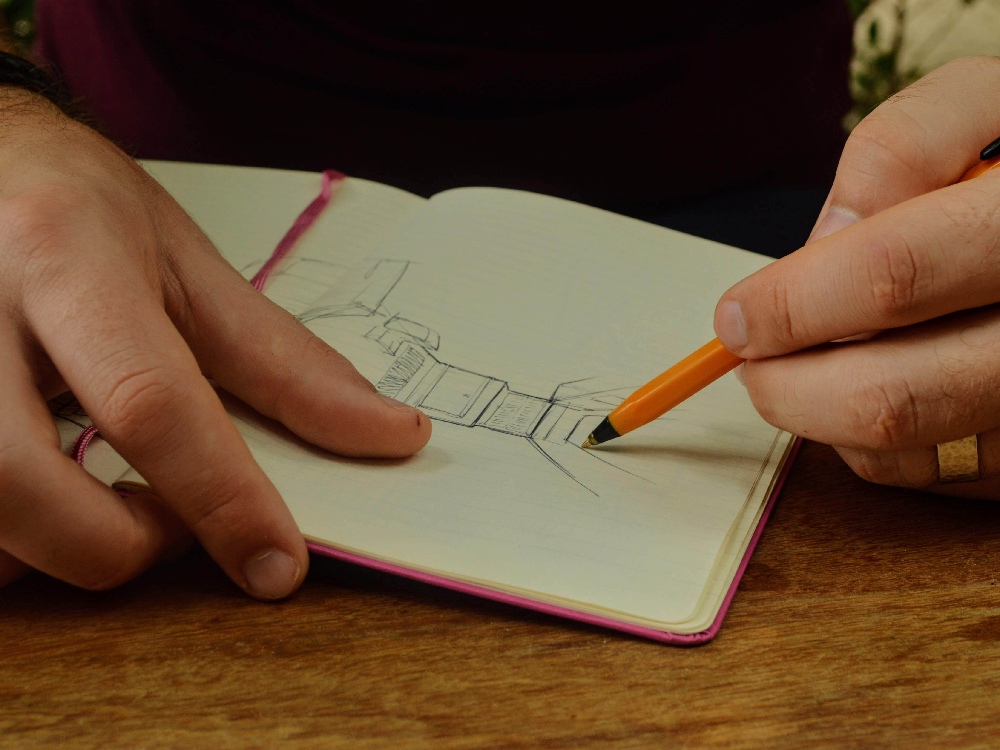
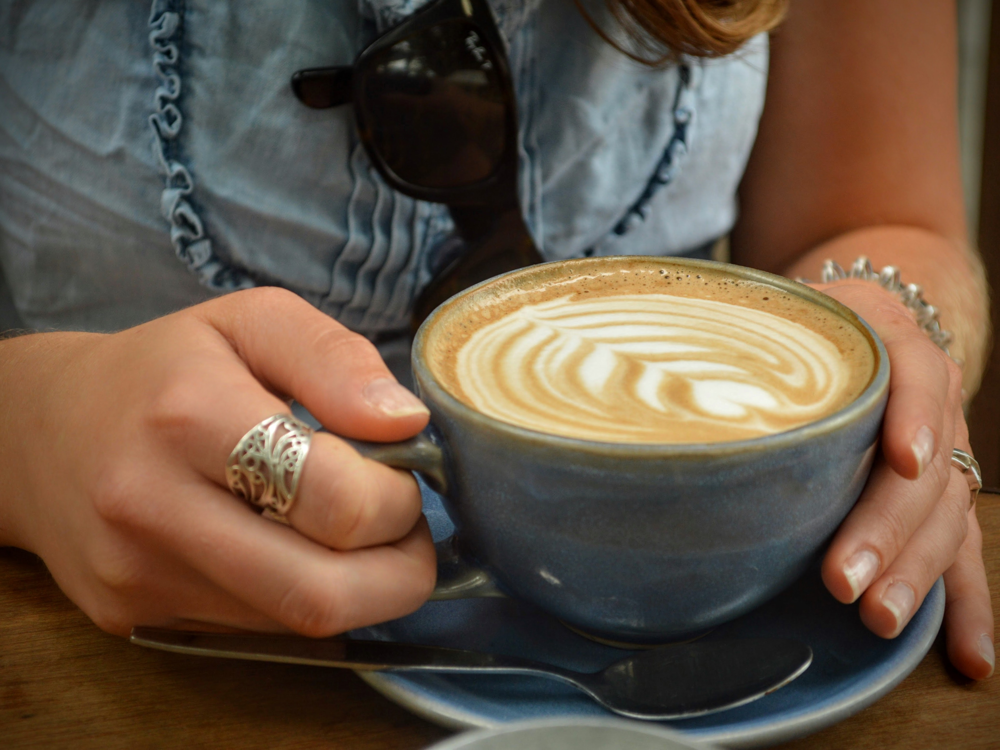
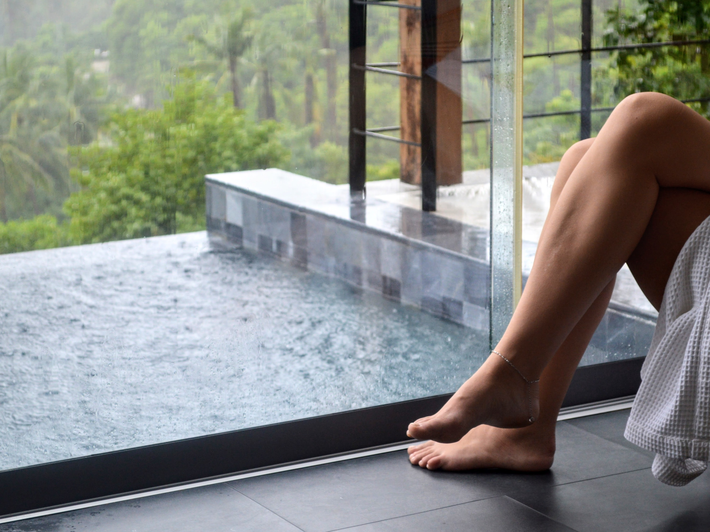
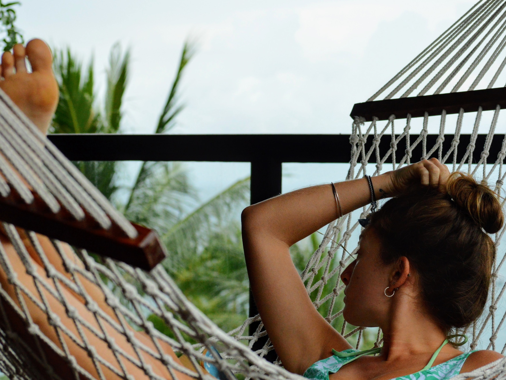
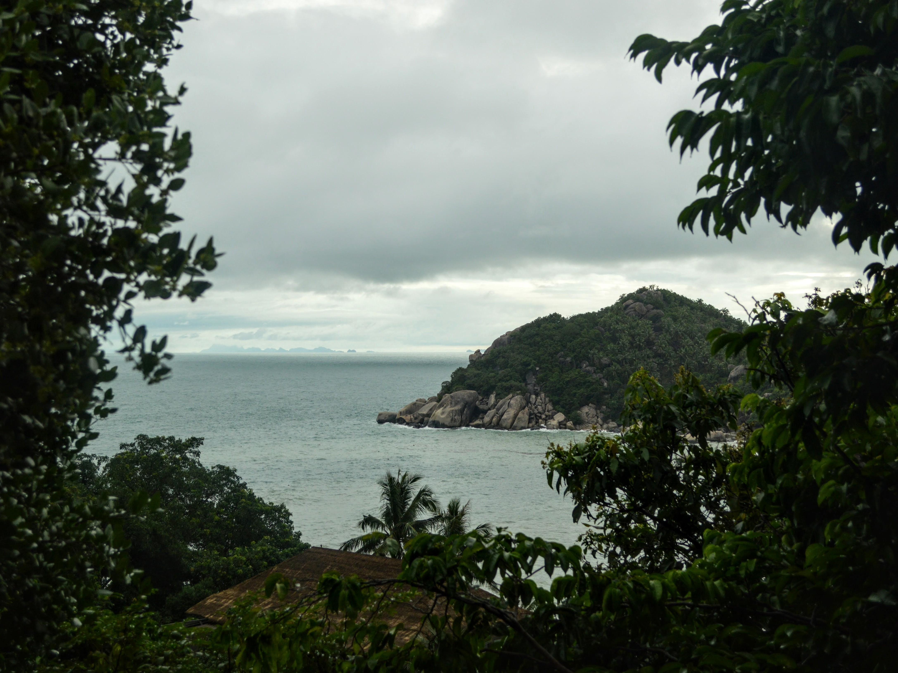
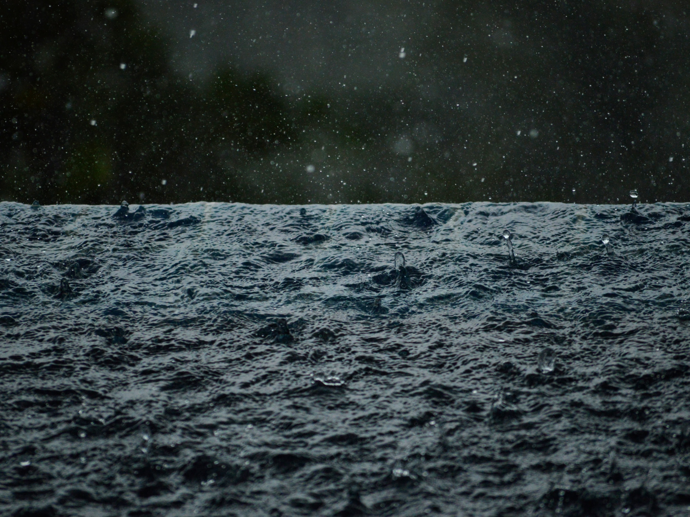

Full disclosure: I'm a planner. I live and love to plan - considering all options, visualising the end result and writing numerous lists along the way. When planning our trips I relish in online reviews, scour Instagram for fellow travellers and try to predict the weather by analysing data from years gone by.

All this said (and shock horror), life isn't controllable. Things happen and life gets in the way of perfectly constructed plans; our honeymoon was no different. 

January in Thailand is the start of peak season, and naturally we expected beaming sun and balmy temperatures. Instead we experienced the destructive tail-end of a typhoon, resulting in hour upon hour and day upon day of unceasing torrential rain, flash flooding and dramatic thunderstorms.

| | |
| --- | --- |
| |  |

After days of unrelenting rain, each drop falling from the sky like a miniature swollen water-bomb, we had exhausted our good nature. Even Aidan's usually unshakeable positivity took a battering when faced with an inexplicably emptied hard-drive. Our best laid plan B of hunkering down with a box-set clearly wasn't to be! 

All this got me to thinking one afternoon - what lessons could be had here? Of course I realise that not every life experience requires a moral, and really, how self-centred am I to complain about the weather on a luxury tropical holiday?! Nevertheless, with time on my hands I got to thinking of a couple of questions...

Questions: What did we want from our honeymoon, and is the rain stopping us from doing these things?

Answers: We wanted to relax, read and enjoy each other's easy company, spending time outside and bronzing our skin and sharing adventures to tell our children about in years to come. And was the rain stopping us? Not wholly.

Relaxing? Check! Rain is the perfect excuse to extend those spa treatments, and there was no shortage of massages to be had in Sairee Beach.

Reading? Check! Especially in the swinging hammock or squashy beanbag.

Enjoying each other's company? Of course!

| | |
| --- | --- |
| |  |

Spending time outside? Less so, but we still adventured out, waded along roads that resembled rivers, visited the beach, swam in the pool and watched the stars from our deck.

Bronzing? Somehow Aidan managed to burn his shoulders on one of the cloudier days, so clearly this one is a (surprising) check!

Finally, sharing adventures? Definitely. This is the real crux of it all. Sharing adventures and experiences, both good and bad, is what life, relationships and friendships are all about. These times bond you together and weave wonderful memories like golden threads which will stay with you for years: silly moments of tickle fights, smooches, endless games of 'rummy' and monsoon ambles.

Maybe we didn't plan for days of rain, but the real lesson I've learned is that whatever happens, wherever I am, there's nowhere I'd rather be than with my best friend and life partner. We have a whole life ahead of us, an open book with pages ready to be filled with travel, adventure and challenge. So if all I can find to moan about is precipitation...well, then I'm a lucky lady.

###The useful bits:###

- We stayed at [Koh Tao Heights Pool Villas](https://www.booking.com/hotel/th/koh-tao-heights-pool-villas.en-gb.html) for a week, followed by a week at [Villas Del Sol](https://www.booking.com/hotel/th/villas-del-sol-koh-tao.en-gb.html). Both were private villas and were just stunning (albeit we'd have preferred lounging next to the pool in the sun...).
- Koh Tao is one of the smaller islands in Thailand. Its larger neighbours Koh Samui and Koh Phangan are more resort heavy, if that's your thing. Koh Phangan is also famed for the Full Moon Party (great fun but we didn't go on this trip).
- Our favourite meals were at the [Gallery Restaurant](https://www.tripadvisor.co.uk/Restaurant_Review-g303910-d3606433-Reviews-The_Gallery_Restaurant-Koh_Tao_Surat_Thani_Province.html). A bit of a special one and definitely worth booking if you're in the area. Be sure to try the Thai wine!
