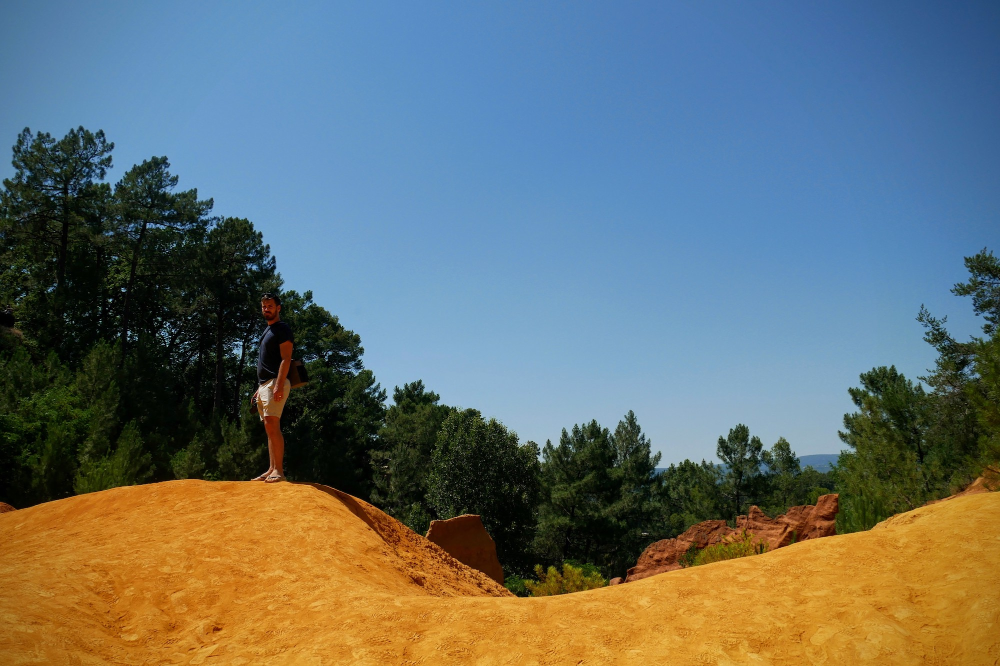

We're here!

Our beautiful [Airbnb](https://www.airbnb.co.uk/rooms/13588587?guests=1&adults=1) in Cabrières D'Avignon was the perfect base for the first part of our trip: a mere 15 minutes by car to Gordes and Roussillon, both of which were high on our list of day trip destinations.

| | |
| --- | --- |
| | |

First agenda item of the day: food. We devoured a champion's breakfast of Nutella and framboise pastries (when in Rome) from the local and absolutely charmant boulangerie, then jumped into the car and drove straight to Roussillon. Or so we thought...

Our first lavender field! The excitement was palpable, as was the sound of hundreds of buzzing bees whizzing from flower to flower in the mid-morning sun. Not quite the winding and archetypal Provence fields we had envisioned, but the perfect taster. A few other snap happy tourists had stopped on this road too - we were clearly in good company.

| | |
| --- | --- |
| | |

Our lavender lust sated for a while, we finally made it to Roussillon and enjoyed walking the ochre streets, ice cream in hand. Some reviews I'd read had described Roussillon as overly touristic; we didn't agree.

| | |
| --- | --- |
| | |

Granted, we visited in shoulder season, and yes the shops are largely catered to tourists but it's not just plastic tat. There were some beautiful art galleries nestled in the warm orange walls, too.

 

| | |
| --- | --- |
| | |

Next up, the gorge. A striking, vibrant fire-toned chasm struck into the hillside. It was a little busier here as a coach had just arrived, but we still had the chance to imagine we were alone, walking amongst the Mars-like red dust.

| | |
| --- | --- |
| | |

| | |
| --- | --- |
| | |

Sadly picnics weren't allowed along the woodland walk, so we headed home to feast on the spoils we'd bought earlier: cheese (of course), more cheese (yup), salami (for Aidan), and a baguette. A picnic next to the pool, you say? Well, that's me satisfied for the rest of the day.

| | |
| --- | --- |
| | |

| | |
| --- | --- |
| | |

Over and out.

###The useful bits:###

- Parking in Roussillon is 3 euros for the day. Try to find a kindly car that's leaving and ask to have their ticket. Pay the kindness forward if you're successful.
- The gorge ([Les Sentier des Ocres](https://www.tripadvisor.co.uk/Attraction_Review-g635587-d2224811-Reviews-Le_Sentier_des_Ocres-Roussillon_Gordes_Luberon_Vaucluse_Provence_Alpes_Cote_d_Azu.html)) costs 2.5 euros for an adult ticket. Ignore the walking times if you're used to a London pace!
- The toilets were a free for all. Don't be typically English as I was, and expect a queue. Plus point, no regard was given to the hommes and femmes signs. Progress!
- The lavender field I've mentioned was located [here](https://goo.gl/maps/KNQ2TfoFpe62). Definitely worth a look if it's en route.

