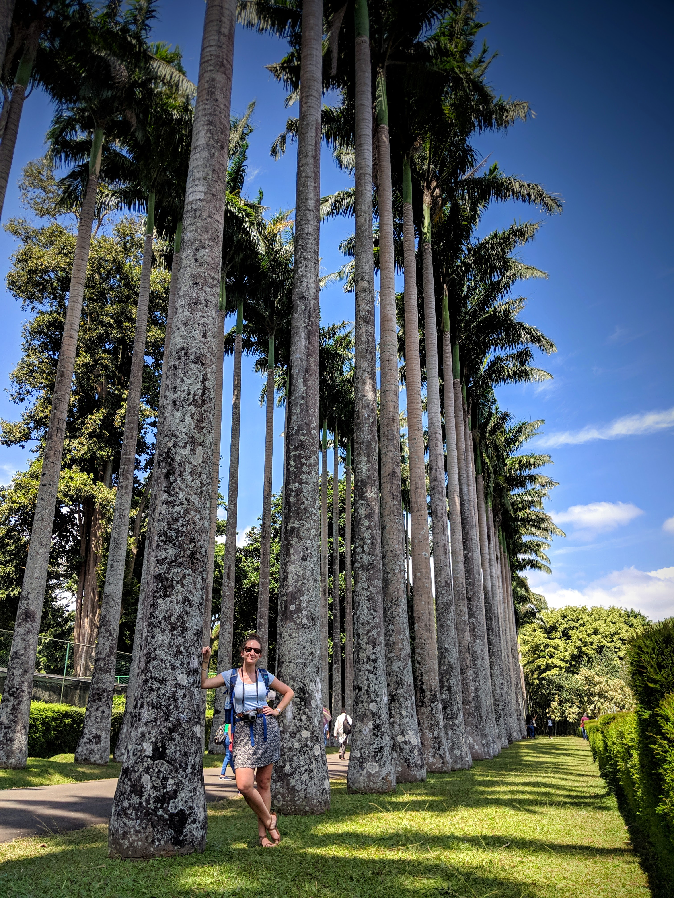
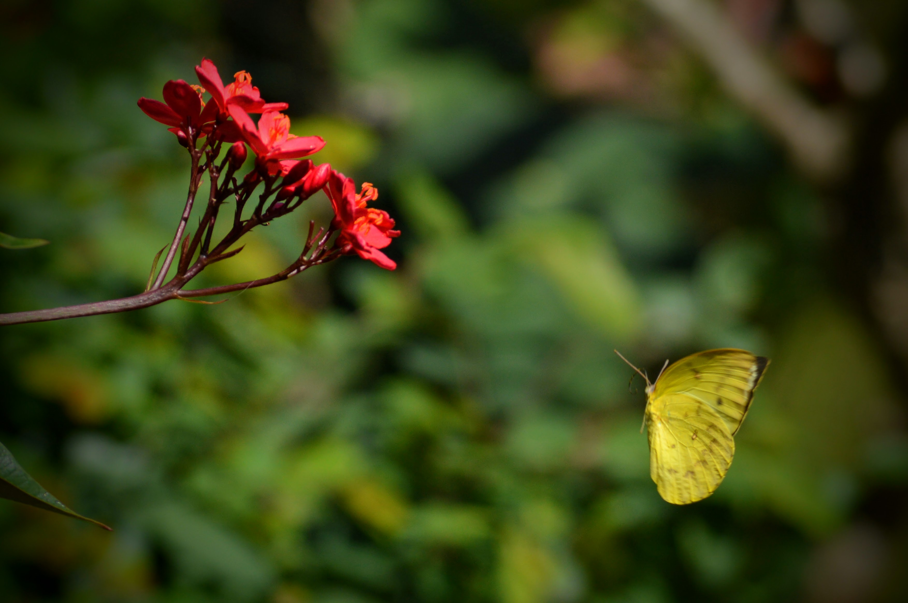

Kandy was next up on our Sri Lanka itinerary, and as we'd only left ourselves one full day there, we planned to pack in as much sightseeing as possible.
We hired a driver for the 100km (2 hour) drive, and arrived in the dark, just in time for dinner and an early night.

We woke early to a wonderful breakfast (our first of many curry breakfasts this trip), and we were blown away by the view from our terrace. And to top it off? The sun was finally shining for us!

|                                            |                                              |
| ------------------------------------------ | -------------------------------------------- |
|  |  |

After breakfast, and a short tour of the hotel's beautiful garden, we jumped into a 3 wheeler to the [Royal Botanic Gardens](https://www.tripadvisor.co.uk/Attraction_Review-g1194819-d523519-Reviews-Royal_Botanical_Gardens-Peradeniya_Kandy_District_Central_Province.html). Thanks to a tip from our host, Viper, we asked to be taken to the back entrance, and got to enter the gardens over a charming suspension bridge.

You know how I love a botanic garden, and this was no different. Famed for its palm avenues and orchids, we were keen to scratch the surface and see some of the 4,000 plant species on offer.

|                                            |                                                                          |
| ------------------------------------------ | ------------------------------------------------------------------------ |
|  |  |

And of course, with flowers and sun, come butterflies!

|                                 |                                 |
| ------------------------------- | ------------------------------- |
|  |  |

And how could we forget the monkeys?! From the old to the young...

|                                 |                                 |
| ------------------------------- | ------------------------------- |
|  |  |

...to the downright greedy!

Before moving on from the gardens, we sat on the great lawn for a while and took in the views. We were soon approached by a group of school boys who wanted to practice their English, and politely asked us some questions: "how many brothers and sisters do you have?", "where are you from?", "what is your country's main cultivation?". I have to say, the last question stumped us somewhat!

Our next stop was the [Ceylon Tea Museum](https://www.ceylonteamuseum.com/), where we enjoyed a self-guided tour from floor to floor. Definitely a must visit in order to appreciate the cultural history of tea, James Taylor and Thomas Lipton (not to mention British imperialism...) in Sri Lanka.

|                                 |                                 |
| ------------------------------- | ------------------------------- |
|  |  |

Our final stop before dinner with friends was the famed 'Temple of the Sacred Tooth Relic' or [Sri Dalada Maligawa](https://www.lonelyplanet.com/sri-lanka/the-hill-country/kandy/attractions/temple-of-the-sacred-tooth-relic/a/poi-sig/450797/357477). The crowded complex is home to the fabled tooth relic of Buddha, heavily guarded (but not visible) in the main temple.

|                                 |                                 |
| ------------------------------- | ------------------------------- |
|  |  |

We visited the temple at evening prayers (_puja_), and the whole experience was quite memorable. Hundreds of worshippers dressed in holy white, intricate golden carvings, flickering candles, and a smattering of curious tourists.

|                                            |                                              |
| ------------------------------------------ | -------------------------------------------- |
|  |  |

A full, educational, enjoyable day. In my opinion, just what holidaying should be.

###The useful bits:###

- The drive to Kandy cost 7,000 rupees: around £30. Quite expensive when compared with public transport, but very convenient.
- We stayed at [The Tenthola](https://www.booking.com/hotel/lk/the-tenthola.en-gb.html) hotel, hosted by 'Viper', a locally famous Sri Lankan ex-rugby player, now coach. Viper was a real character, who was supremely helpful and full of local advice and stories: a most excellent host!
- The 3 wheeler from our hotel to the Royal Botanic Gardens in Peradeniya cost 700 rupees (£3) and the park entrance was 1,500 rupees (£6.50) each.
- The Ceylon Tea Museum cost 800 rupees each, and the return 3 wheeler was 1,500.
- Although not pictured, we had dinner with friends at [Empire Cafe](https://www.empirecafekandy.com/) (just outside the temple), and the bill for all 4 of us, drinks, dinner and dessert, came to around £27. Not too shabby!

A final note to say thank you, Viper!

