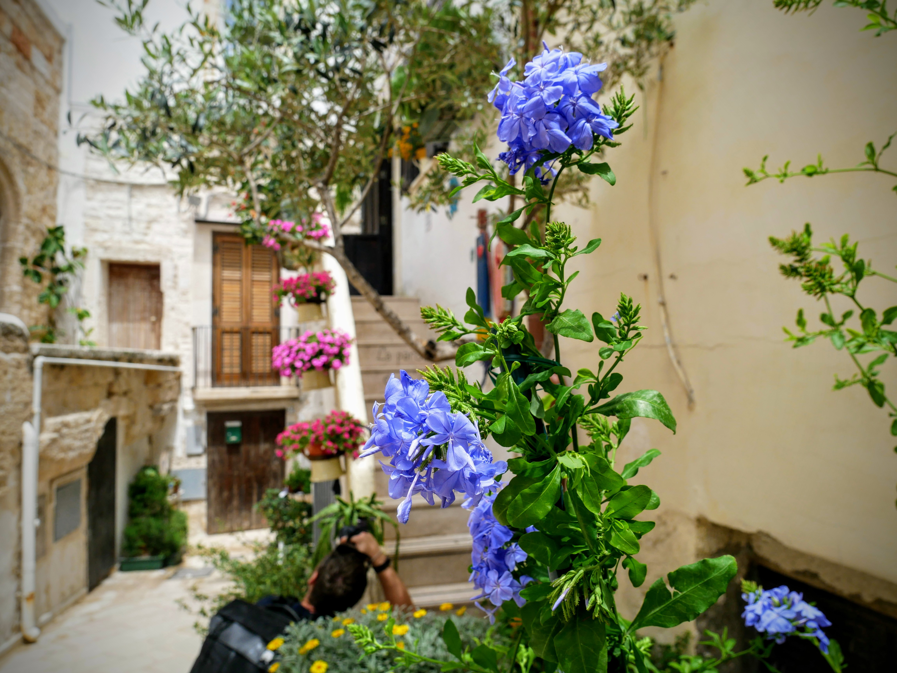

This summer we took a trip to the Puglia region of Southern Italy. We'd heard about the beautiful beaches, good weather and great food, along with low prices and fewer tourists than the north.

Keen to explore, we split our trip between 2 hotels: the first was just outside of Putignano and our hostess was the warmest we've ever come across.

We woke early on our first morning and had our first taste of Apulian food. As you can see, the breakfast was SENSATIONAL.

Each morning we were treated to a range of local fruits, pastries and cheeses. Aidan tried his first burrata and hasn't looked back since!

|                                     |                                     |
| ----------------------------------- | ----------------------------------- |
|  |  |

On our first day, we decided to drive straight to Polignano a Mare, a clifftop town famed for its picture perfect beach, caves and white-washed streets.

|                                     |                                     |
| ----------------------------------- | ----------------------------------- |
|  |  |

With no plans and no schedule to keep to, we ambled the lanes, enjoying the heat and the prevalence of cactuses.

|                                     |                                     |
| ----------------------------------- | ----------------------------------- |
|  |  |

Before long, we reached the viewpoint for _that_ beach, [Cala Porto](https://goo.gl/maps/3s2ii6SbDY2hXG7Q8), also known as Lama Monachile.

Famed across Italy, the beach features crystal clear waters, cliff jumping and CROWDS. Said to date back to the fourth century BC, the beach was once an ancient port and boasts a beautiful arched bridge and the remains of an old Roman road.

|                                     |                                     |
| ----------------------------------- | ----------------------------------- |
|  |  |

Before braving the hordes, we decided that some ice cream was more than overdue. If you've never tried Italian gelato, you need to...immediately!

Sated and ready for a sit down, we picked our way across the pebbles and laid down our towels amongst the Italians. The beautiful blue water was colder than it looked though, so I paddled while Aidan watched.

After a good stint of people watching, chatting and enjoying our surroundings, we decided that our hotel's sunbeds were calling.

Back to the deserted pool for a snooze, read and swim. The bump clearly wanted to get involved and made an early appearance, though I can't promise it wasn't mostly pasta and gelato...

|                                     |                                     |
| ----------------------------------- | ----------------------------------- |
|  |  |

###The useful bits:###

- We booked our hotel, [Una Perla Nel Verde](https://www.booking.com/hotel/it/una-perla-nel-verde.en-gb.html?label=gen173nr-1DCAEoggI46AdIM1gEaFCIAQGYAQm4AQfIAQzYAQPoAQGIAgGoAgO4ArjuuewFwAIB;sid=ad2fadfb8f3996c9372103798d41ed9e), on booking.com and couldn't recommend it more highly. We were lucky to have the whole place to ourselves and enjoyed this gem in the Italian countryside.
- Polignano a Mare was around a 30 minute (25km) drive away.
- We paid for parking on a side street, but had some difficulty with our Monzo cards - something to be aware of.
