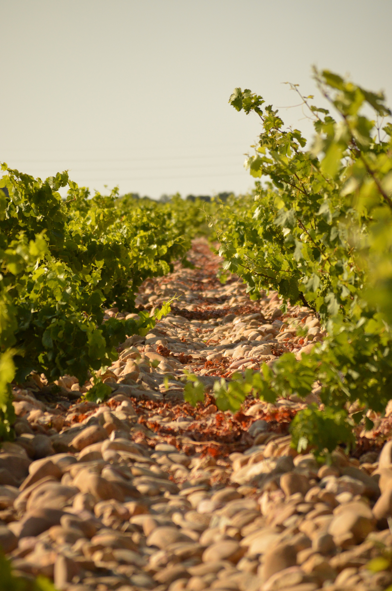

If you're spending time in the Provence region of France, it would be quite improper to omit a wine-tasting. So taste (and buy) we did...but first, a stroll around historic Avignon.

Friends recommended the company [Time 4 Provence](www.time4provence.com/wine) and as soon as we met Gordana, it was easy to see why. She greeted us like old friends and her infectious enthusiasm for wine, the Provence and France soon rubbed off on every member of our group.

|  |  |
| --- | --- |
|  | 

We visited 3 vineyards: Chateauneuf du Pape, Gigondas and Vacqueyras, all the while expanding our tasting horizons. Not usually fans of red, we were soon re-educated and promptly agreed that contemporary (rather than traditional) red is quite delightful.

We left with 3 bottles: 2 red and 1 white. Unexpected in an area famed for its rose! 

| | |
| --- | --- |
|  | 

Gordana was an excellent guide and driver who plied us with as many jokes as facts. Did you know that Chateauneuf du Pape is famous for its use of the hot stones under the vines? And, did you know the difference between table wine and... I did, but an afternoon of wine-tasting has left my memory a little patchy!

After our tour and feeling a little giggly (evidence above), we found a sweet pavement side restaurant for dinner.

Watching the sun go down, hand in hand, walking the city walls was the perfect way to end a wonderful day.

|  |  |
| --- | --- |
|  |  |

###The useful bits:###

- We couldn't recommend Gordana and [Time 4 Provence](www.time4provence.com/wine) more highly. We did the half day wine tour starting at 2.30pm. This gave us the perfect amount of time for some Avignon exploring and a light lunch beforehand.
- We parked the car at ['Parking des Italiens'](https://goo.gl/maps/kK1VCzEhMXR2), a useful and free park and ride a couple of bus stops out of the city centre.