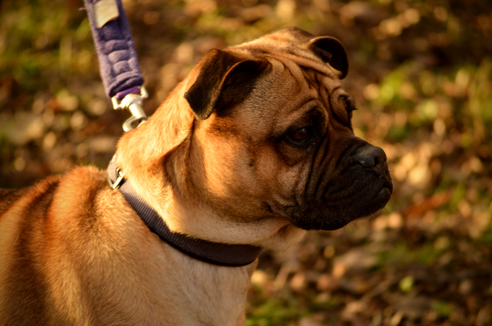
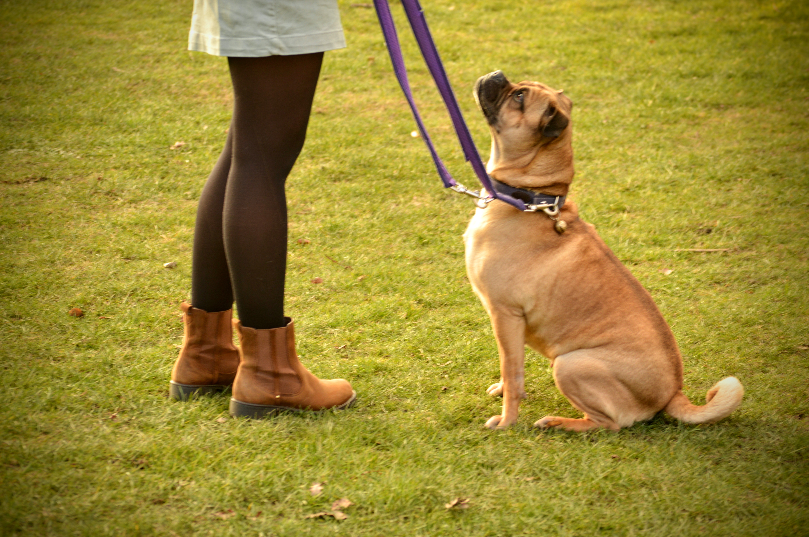
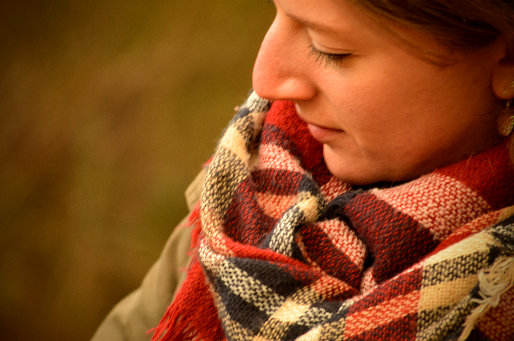
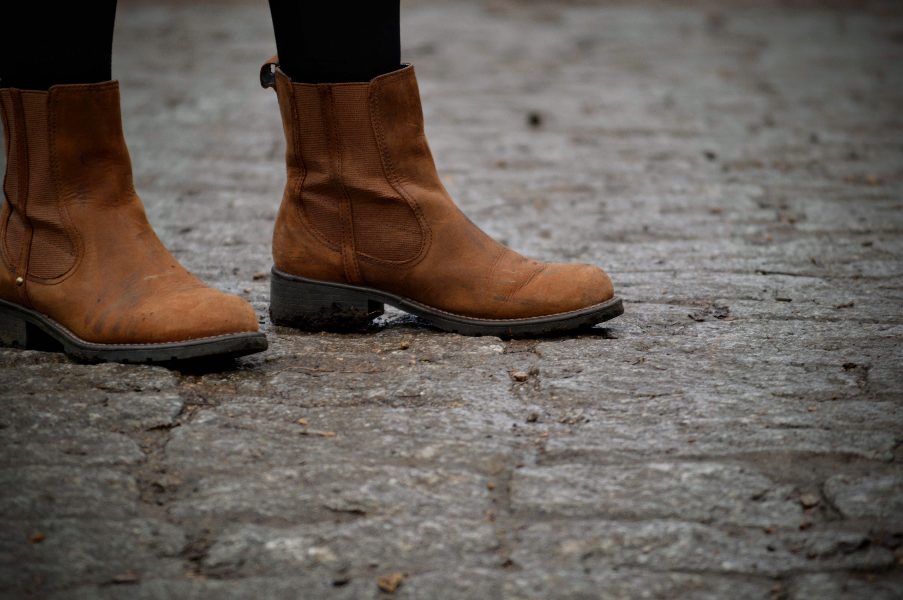
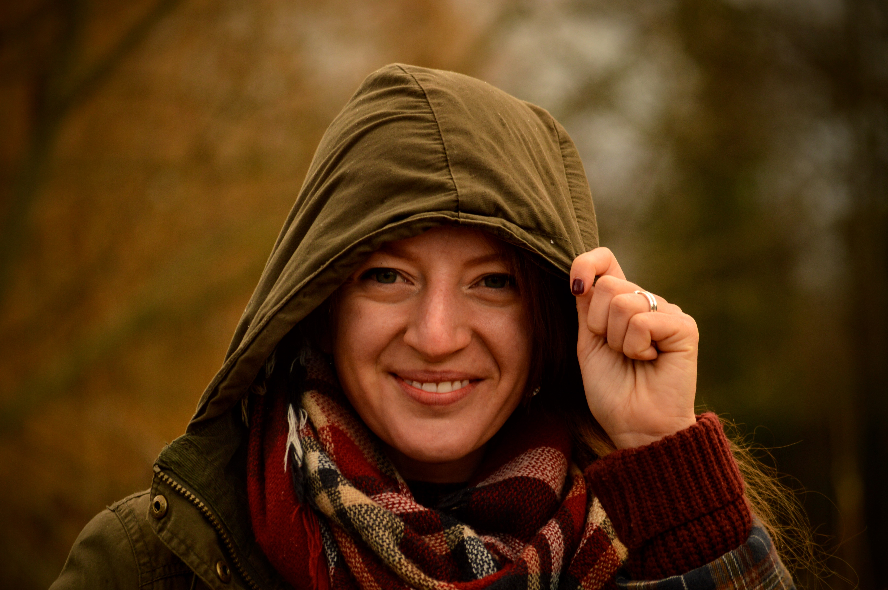

I love Saturday afternoons. I'll have had my weekly luxurious lie-in, vanilla latte in bed and poached eggs courtesy of a very lovely husband, and I'm ready to seize (what's left of) the day. The working week ahead hasn't yet cast its gloomy cloud of fear over the weekend and leisure time feels endless. And if the sun is shining? Even better.

One day, hopefully in the not too distant future, our couple will become a three. Until then, I've found a perfect companion to fill that dog-sized hole: a spectacular pooch called Margaret.

| | |
| --- | --- |
| | 

Margaret is a pug crossed with a shar pei; a shar-pug or and ori pei as they're known in the US. She's hilarious, feisty, bouncy, ambivalent and stubborn, and her favourite things are squirrels and squirty cream. Fortunately London's parks provide the former in abundance!

| | |
| --- | --- |
| | 

Wandsworth Common was the park of choice; perfect for Saturday strolling - offering the best of both people and dog-watching. Made all the more entertaining by a sudden and unexpected downpour halfway around the pond...

| | |
| --- | --- |
| | 

Hilarious, feisty, bouncy, ambivalent & stubborn...

After working up quite the appetite, Aidan and I popped to [Bertie and Boo](http://www.bertieandboo.com/coffee-shop/), a quaint coffee shop in Balham. The service could have been better, but the cake was excellent. By the time we made our way home, we were happy and satisfied.

| | |
| --- | --- |
| | 

###The useful bits:###
- You might be wondering how I walk Margaret? I've volunteered for the [Cinnamon Trust](http://www.cinnamon.org.uk/) for a few years now, starting when we lived on the Isle of Wight. 
- The Cinnamon Trust is a great, small charity which provides assistance to those who may not be able to care for their animals anymore - be they elderly, ill or otherwise. 
- As a dog-walker, you're partnered with a fur baby close to where you live. Frequency of volunteering is flexible; I try to take Margaret out twice a week - one weekday evening and one weekend day for a longer walk.
- If you're an animal lover, please do take a look at the work of the Cinnamon Trust. If you're able to support in any way - thank you!
