Sri Lanka has long been on our travel wishlist, so it was the perfect way to kick off 2019.

Thanks to the kind advice received from friends, we were pretty confident with our itinerary and were raring to go. Our first stop was [Sigiriya](https://sigiriyatourism.com/). But before exploring? Sleep!

|                                        |                                        |
| -------------------------------------- | -------------------------------------- |
| 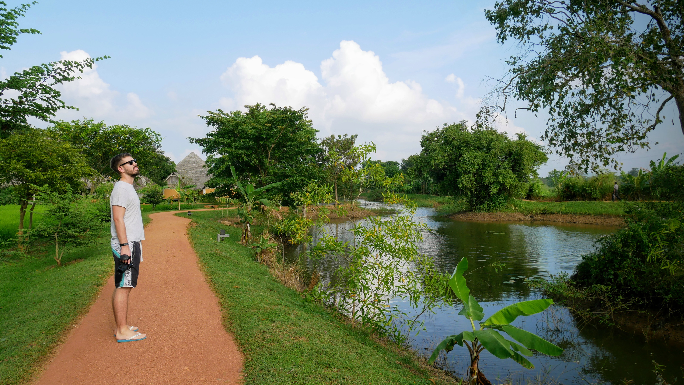 | 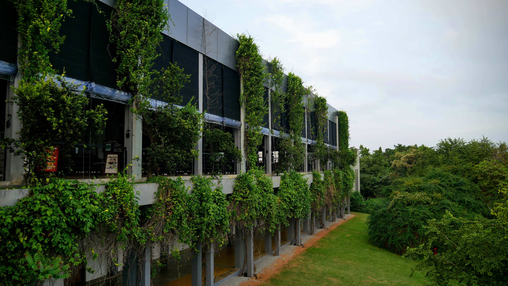 |

Where better for the first 2 nights of our trip than the [Aliya Resort and Spa](https://www.booking.com/hotel/lk/aliya-resort-and-spa.en-gb.html)? Along with the enormous infinity pool overlooking the Lion Rock and Pidurangala, the service and facilities were excellent.

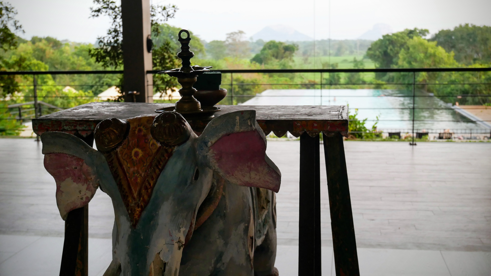

After an early start (an invigorating 6.30am yoga class, no less) and a sensational breakfast, we were off to the Lion Rock and in our first tuk tuk of the trip.

|                                        |                                        |
| -------------------------------------- | -------------------------------------- |
|  | 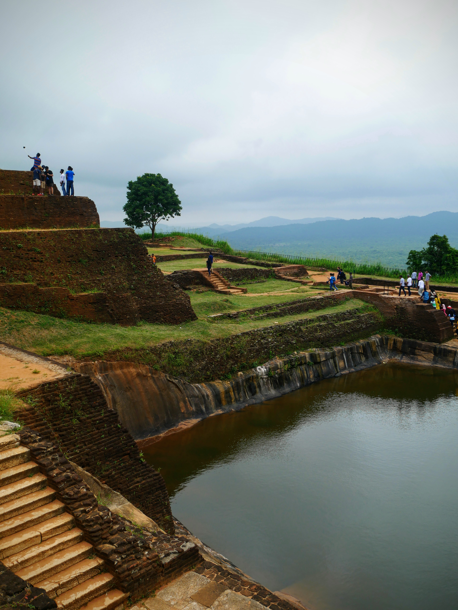 |

Sigiriya is a listed UNESCO World Heritage Site and dates back to the 3rd Century BC. Comprising gardens, a fortress, pools and most impressively a 200 metre tall rock column, the whole place is worth the visit.

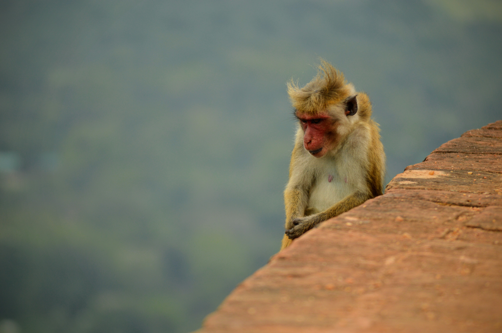

The Mirror Wall and wall paintings are some of the key attractions, but I have to confess... we didn't really 'get' the wall. We did enjoy the numerous monkeys though!

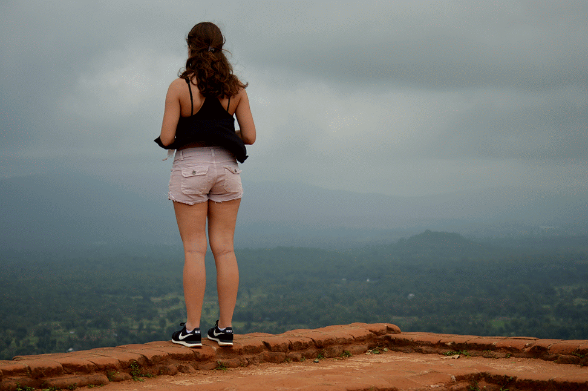

|                                        |                                        |
| -------------------------------------- | -------------------------------------- |
|  | 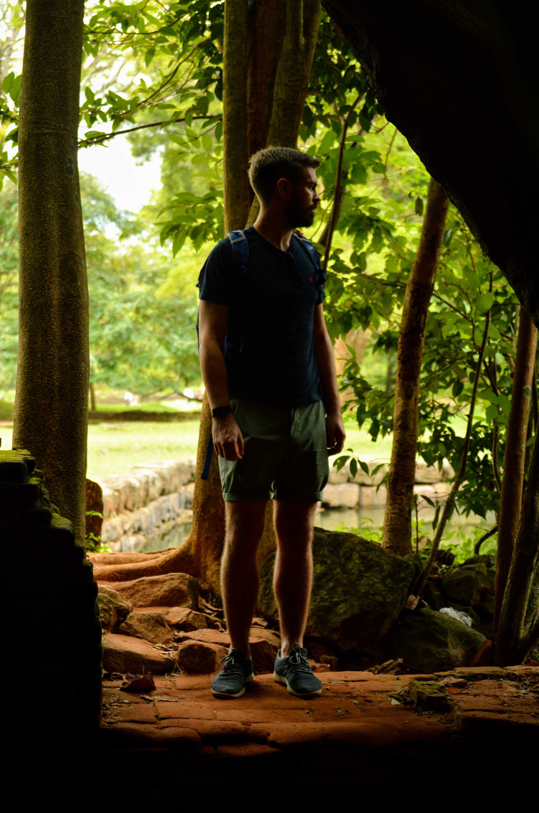 |

We'd also been recommended [Pidurangula rock](https://www.tripadvisor.co.uk/Attraction_Review-g304141-d3220900-Reviews-Pidurangala_Rock-Sigiriya_Central_Province.html) - the neighbouring mound and quite noticeable in an otherwise flat landscape. The entry price was a lot cheaper than Sigiriya, and we preferred the view and the quiet.

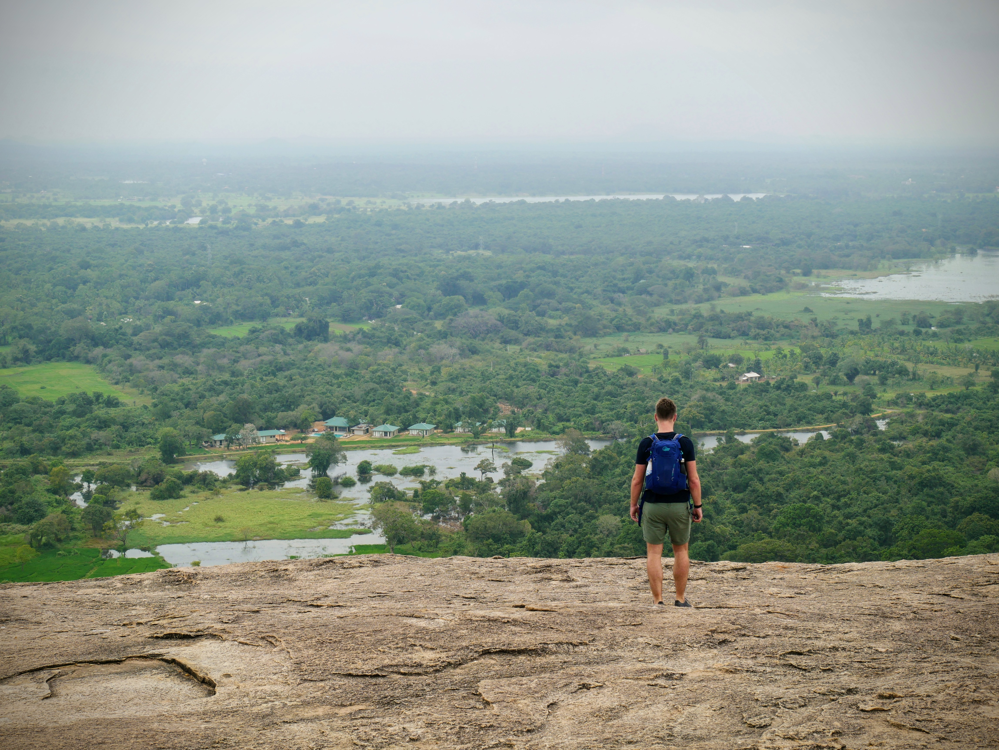

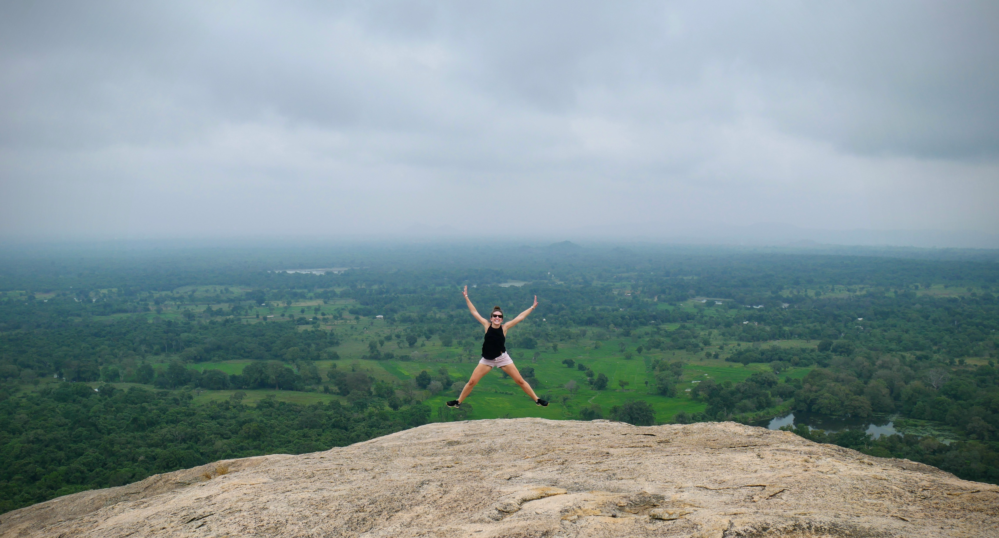

We sat (and posed) for some time, looking at the view and chatting about our future. Even a little rain didn't hamper our little slice of tranquility. A kindly stranger took the following wonderful photo of us - thank you again, Abdul!

|                                        |                                        |
| -------------------------------------- | -------------------------------------- |
| 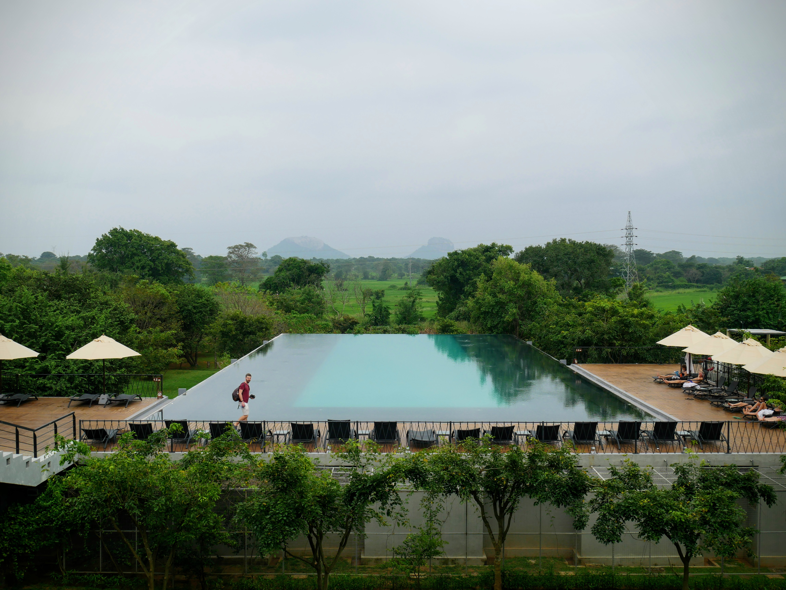 | 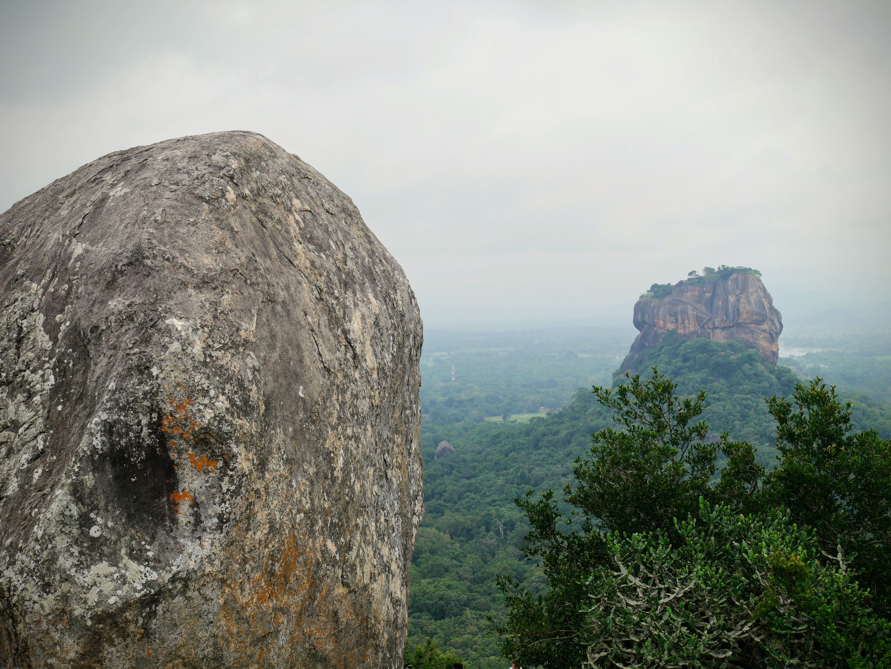 |

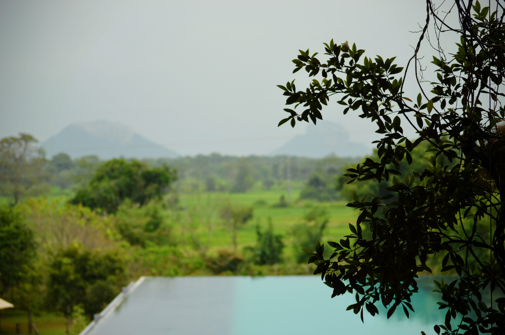

After an educational chinwag with a Kandian who gave us some tips for the rest of our trip, we trekked back down the hill and into the waiting pool.

|                                        |                                        |
| -------------------------------------- | -------------------------------------- |
| 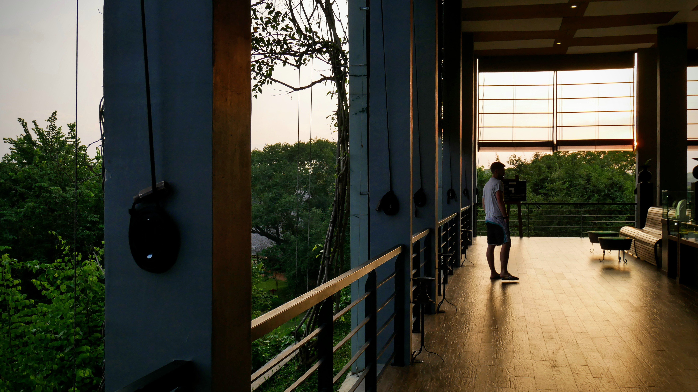 | 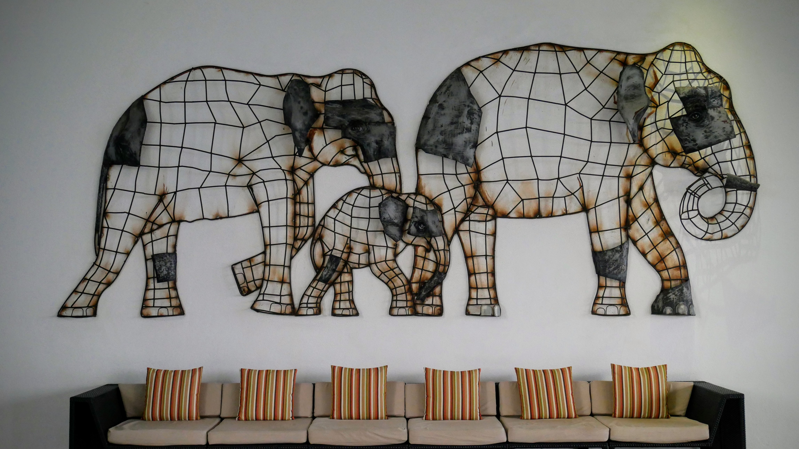 |

In spite of the grey skies and occasional drizzle, it was the perfect day to start off an amazing trip.

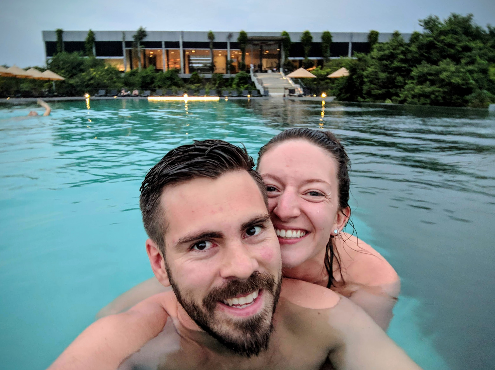

###The useful bits:###

- For our tuk tuk for the day, we paid 3,000 LKR (about £15). Possibly a little steep, but worth it.
- The ticket for the [Lion Rock](https://sigiriyatourism.com/) was quite expensive by Sri Lankan standards: \$25.
- The ticket for Pidurangala was a much more appealing 500 LKR, and arguably the view is better as you're looking onto Sigiriya itself in addition to the surrounding landscape.
- As you can see in the pictures, I wore shorts. Make sure you have some trousers and a scarf to cover up for Pidurangala - the walk takes you past a temple (where you'll also have to remove your shoes).
