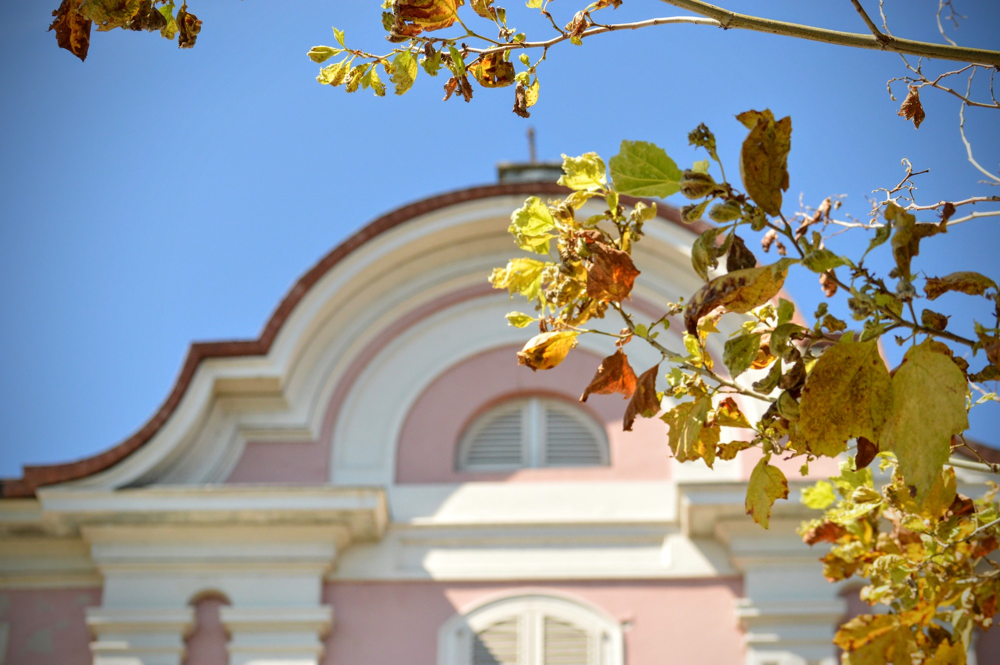
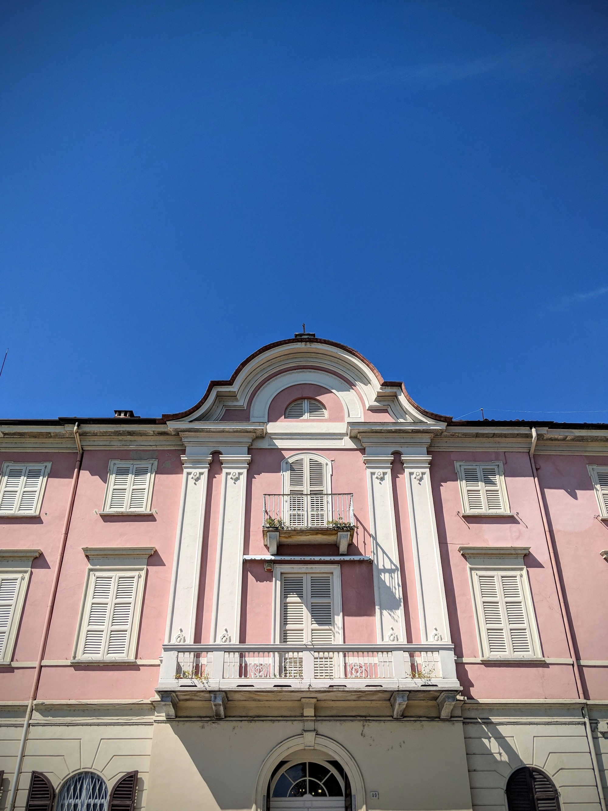
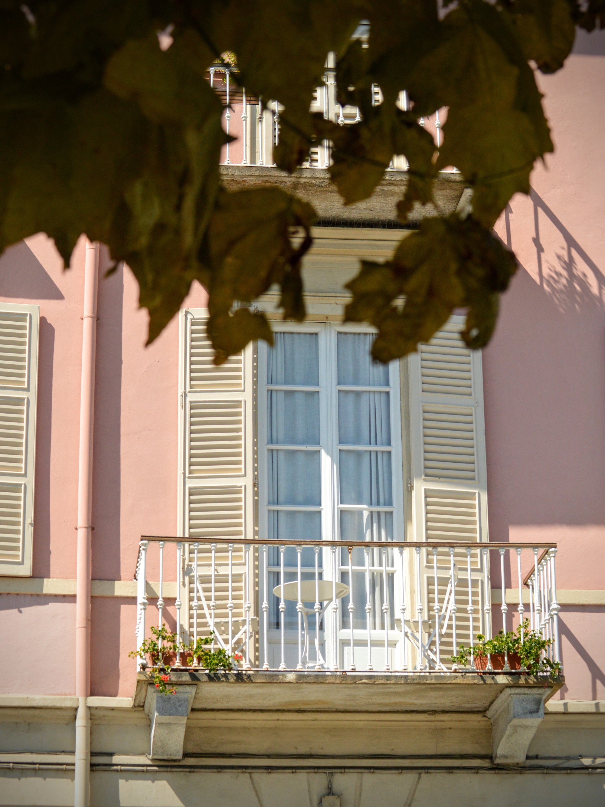
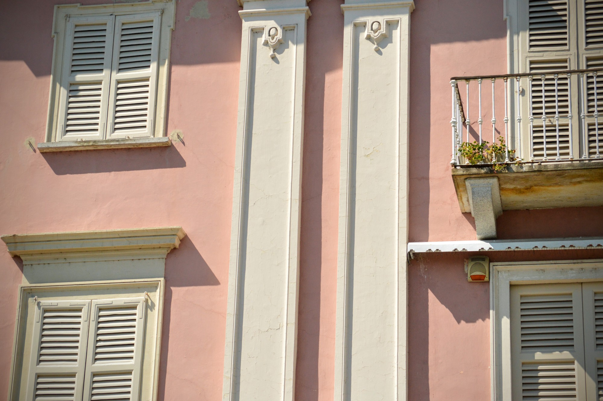
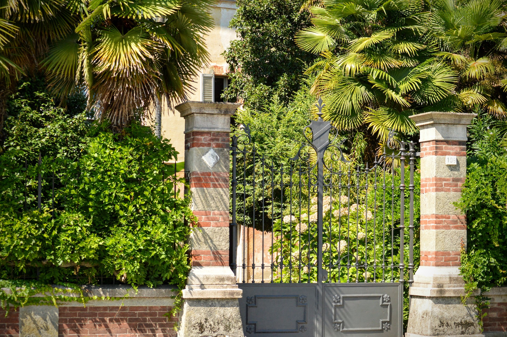
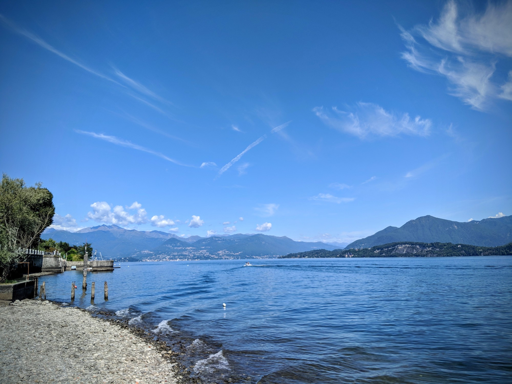
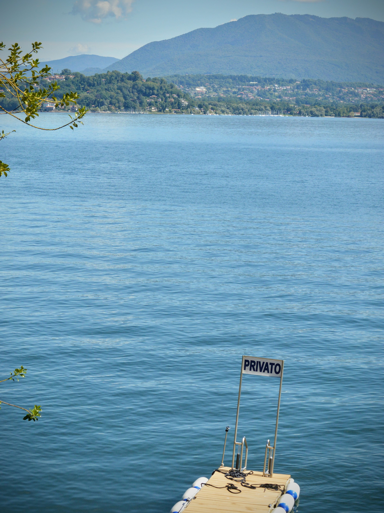
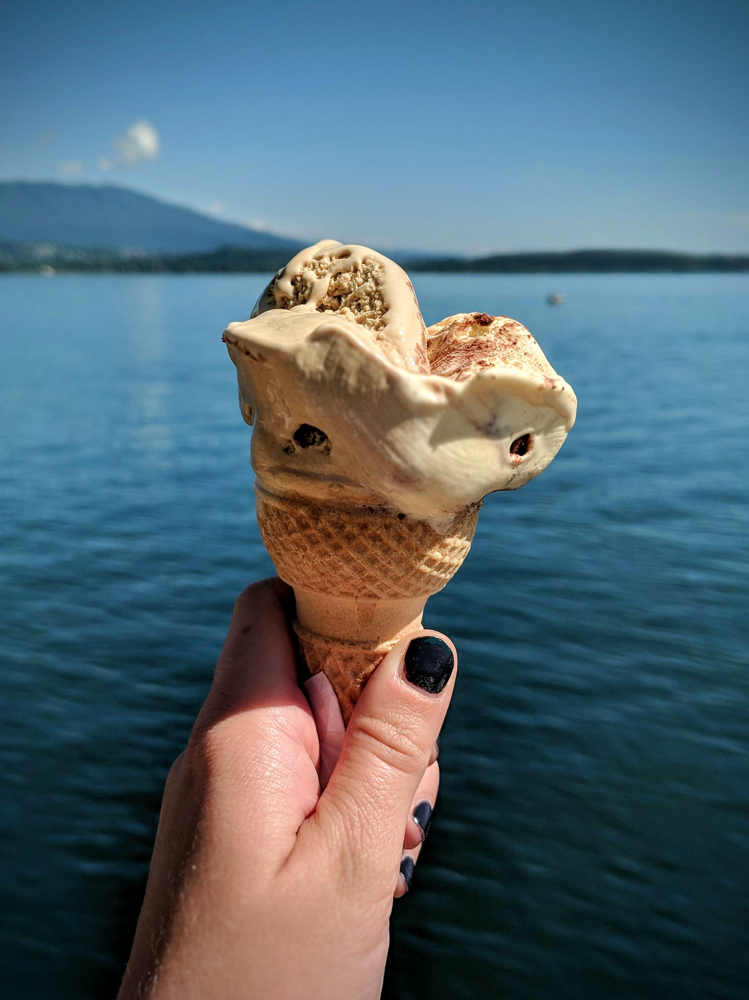
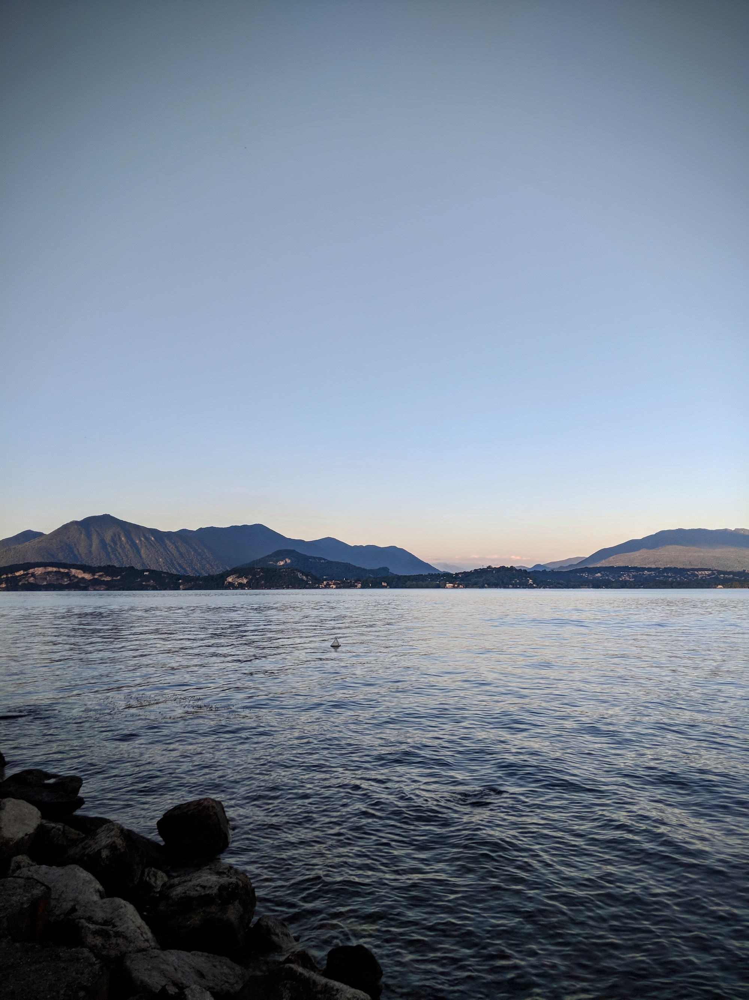

One of my (many!) fears when launching this blog was that we would be more noise and that we'd just add to the ever-growing pressure to lead the 'insta-perfect' life.

Most of you will know that the reality rarely looks like the pictures, but for those of you who don't - this blog post is meant to be a bit of tonic to combat the champagne saturation of travel blogging. (This said, thankfully I don't have any pictures of the event I'm about to describe...)

Of course, the name 'One Day Away' suggests that each and every day has to be a perfect 'curated' adventure - but this couldn't be further from the truth. The very best recent example would be the first day of our trip to Lake Maggiore, Italy.

|                                                |                                     |
| ---------------------------------------------- | ----------------------------------- |
|  |  |

Although I said I didn't, I definitely had some quite concrete ideas of what I wanted us to do on this trip, especially when rain was forecast for 2 of the days. Aidan getting a nasty tummy bug and having to spend the whole day wrapped around a toilet bowl definitely wasn't on the to-do list.

|                                     |                                     |
| ----------------------------------- | ----------------------------------- |
|  |  |

With some encouragement and feeling like a horrible wife, I headed out for a day of solo adventuring. My day went a bit like this...walk, walk, photo, walk, ice cream, walk, sunbathe, read, ice cream, walk, walk, read, watch the ducks, walk.

I don't have any pearls of wisdom to share really, but a few nice photos as a reminder (to myself mostly) that sometimes quiet days are needed, sometimes unavoidable and wholly within our own power to enjoy. Instagram perfect or not.

|                                     |                                                |
| ----------------------------------- | ---------------------------------------------- |
|  |  |

###The useful bits:###

- Our Airbnb is no longer listed, but I'll keep checking back in case it returns. We'd highly recommend the property, it was super well equipped and had the kindest owner (who helped me retrieve a lost piece of jewellery and sent it back to me in the UK).

- I mostly sat [here](https://www.google.co.uk/maps/place/45°50'23.1%22N+8°34'25.2%22E/@45.839747,8.5731298,156m/data=!3m2!1e3!4b1!4m14!1m7!3m6!1s0x47867691d2da2917:0x7f5d44d573eebf72!2s28832+Belgirate+Province+of+Verbano-Cusio-Ossola,+Italy!3b1!8m2!3d45.8384304!4d8.5703743!3m5!1s0x0:0x0!7e2!8m2!3d45.839747!4d8.5736775)
  reading my book and watching the ducks and fishermen. There's also a little 'beach' a few minutes away but with fewer ducks to watch.

- We stayed in a lovely small village called Belgirate, which is located around a 10 minute drive from the larger Stresa.

- Charlie Brown Ice may serve the best ice cream around. We tried quite a few others in Stresa and further afield, but none came close. The tiramisu and chocolate combo at the end of the day was my most favourite. Drool.

