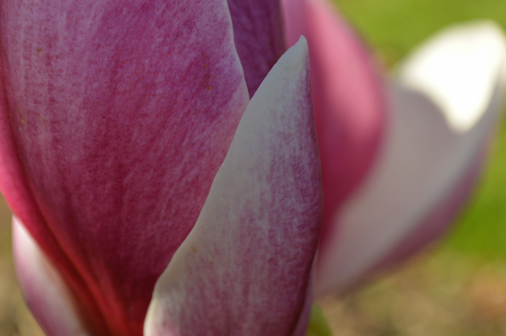
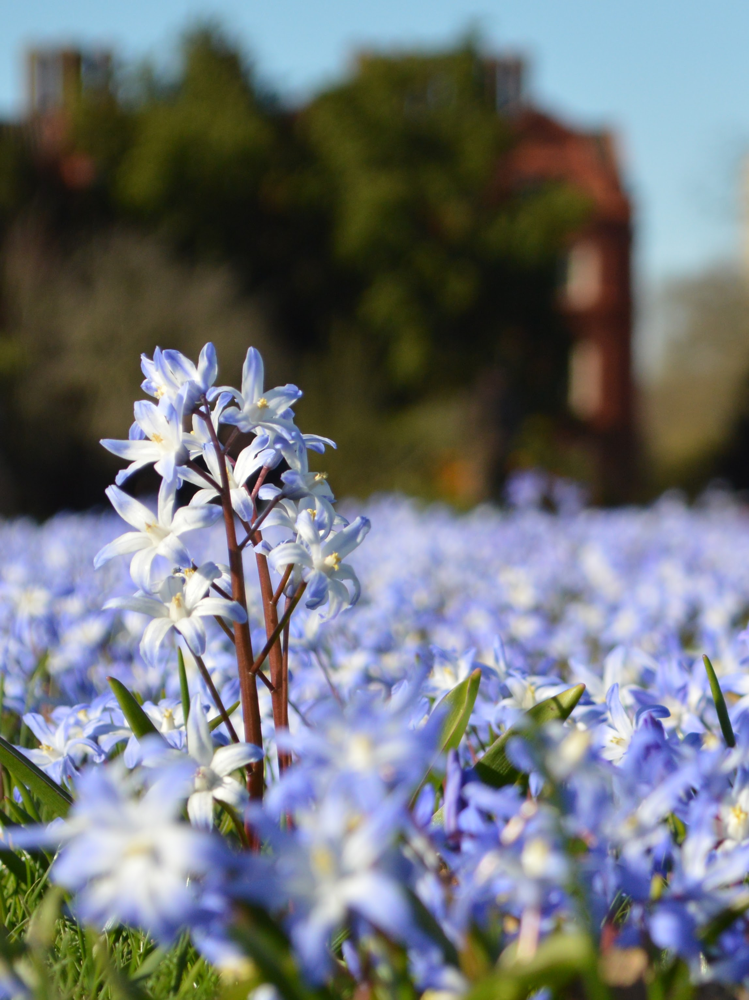
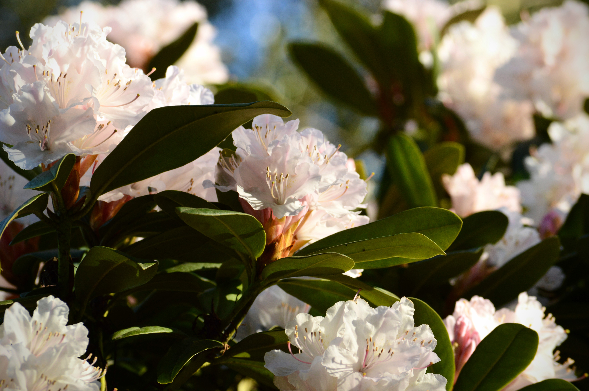
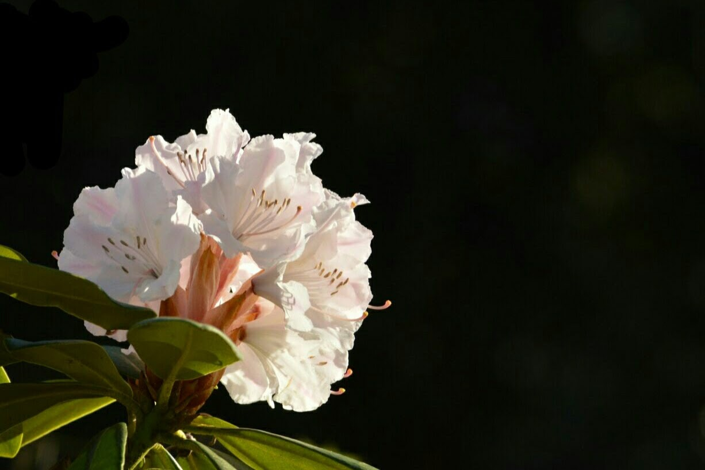
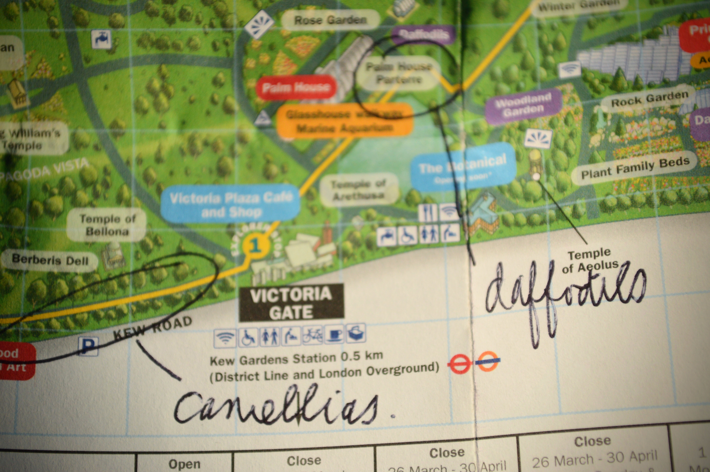
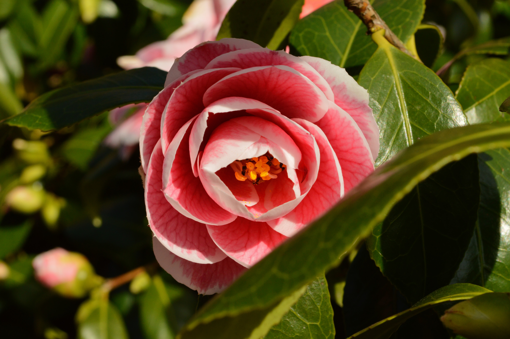
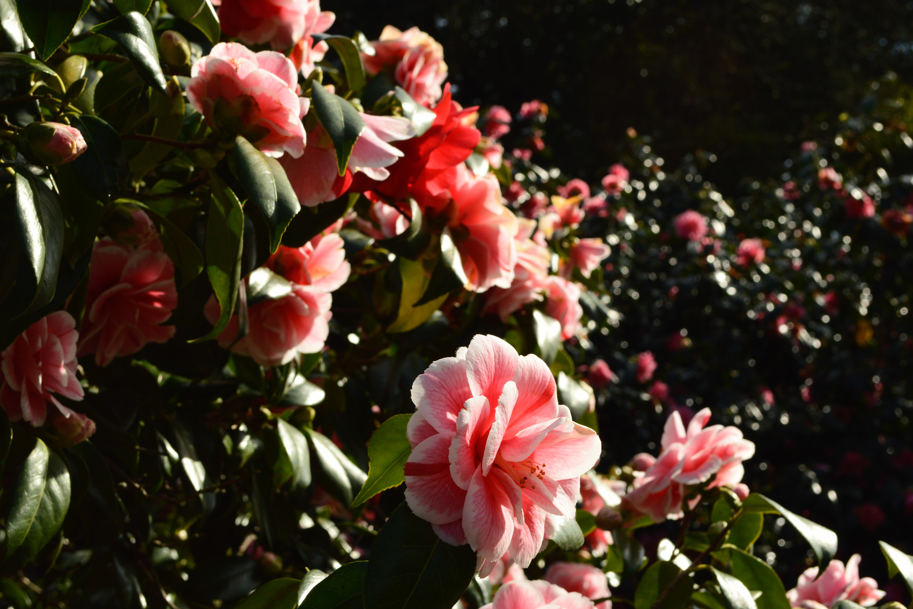
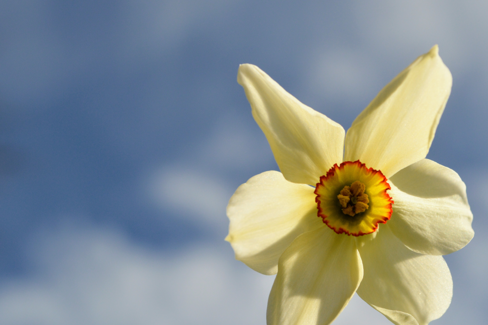

Disclaimer: if you don't like flowers, this post probably isn't for you. Prepare yourself for some blooming, blousy, blossom-filled pictures, full of the joys of Spring.

| | |
| --- | --- |
|||

As you may know, [Kew Gardens](https://www.kew.org/) is one of my very favourite places on Earth. Each and every time I go, I discover something new and wonderful. Season to season, the landscape evolves, the mood shifts and of course, the flora changes. 

Naturally visitors flock to Kew in the Spring - keen to marvel at the magnificent magnolia trees in full bloom. If you're lucky, the cherry blossom will also be ripe for goggling. And don't forget the daffodils, tulips, hellebores, forsythia and camelia too!

| | |
| --- | --- |
|||

Kew Gardens dates back to 1759, and if you've got time on your travels to London, it is really worth a visit. Strolling down the promenade from the Palm House to the banks of the Thames, it's easy to take a step back in time. 

Just imagine yourself as a privileged member of Victorian society, whiling away the hours under your parasol in these royally approved gardens.
 

There are a number of different ways to get to Kew, and different gates to access the Gardens themselves. My preferred route is via Richmond; I convince myself that the journey is quicker that way, but really it's because there's a branch of the incredible [Hummingbird Bakery](https://hummingbirdbakery.com/) nearby... 

Take my word for it, there are few things better than watching the world go by with a soft, moist salted caramel cupcake to nibble (gorge) on.

| | |
| --- | --- |
|||

For this trip, I was lucky enough to have my own personal flower guide in the guise of a handily annotated map from my wonderful Pop. 

Just in case your Dad isn't quite as garden savvy, all of the staff at Kew will be more than happy to point you in the right direction. Better still, just amble around and let the sights surprise you!
 

| | |
| --- | --- |
|||

Right towards the end of my visit, I sat on a bench overlooking the Thames River, lost in my thoughts as the sun dropped lower in the sky. For me, having some time alone in a beautiful place really is great therapy. A bit of respite from the pressures of work, home and the ever enticing technology powerhouse in your pocket is never a bad thing.

Until next time, Kew.
 
 

###The useful bits:###

- [Kew Gardens](https://www.kew.org/kew-gardens/plan-your-visit-to-kew-gardens/getting-here) is south of the river, situated near to Richmond Park. If you're travelling by public transport, you have three stations (and accompanying Kew gates) to choose from: Kew Gardens, Kew Bridge or Richmond.
- If you choose Kew Gardens station, the closest gate is the Victoria Gate - a mere 5 minute walk. Ideal for a first visit, as you're straight in and the Palm House is almost the first thing you see!
- If you choose Kew Bridge, the closest gate is the Elizabeth Gate: about a 7-10 minute walk over the bridge and around Kew Green. From here you can start a park-wide amble, passing the Orangery and Kew Palace first.
- Finally, if you choose Richmond station, the Lion Gate is the closest.
- Tickets are £16-19, but a yearly membership (offering unlimited visits for you and a guest) is about £70. If you plan to return, I'd recommend the membership - it also gives you 10% off in the shop and exclusive access to events.