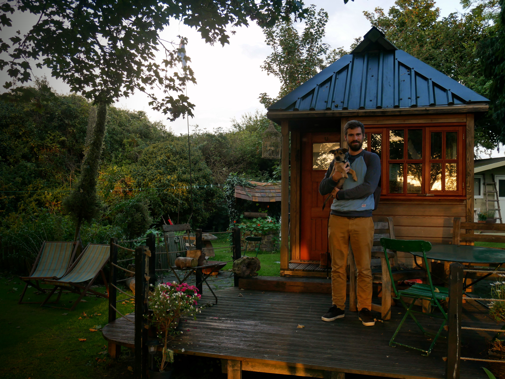

For Aidan's birthday, I took my boys to a Tiny House in Kent. Featured on George's Clarke's Amazing Spaces, our [Airbnb](https://www.airbnb.co.uk/rooms/6720058?guests=1&adults=1) find was a real treasure. Even better, the owners couldn't have been friendlier or more accommodating of a tiny dog and a birthday-ing husband.

The Thanet Coast in Kent had been on our travel wishlist for some time: we picked Ramsgate for our first day of exploring.

|                                      |                                      |
| ------------------------------------ | ------------------------------------ |
|  |  |

Hailing from the Isle of Wight means that Aidan and I have a soft spot in our hearts for the English seaside, and Ramsgate almost felt like home.

|                                      |                                      |
| ------------------------------------ | ------------------------------------ |
|  |  |

We enjoyed walking the streets, Greg in tow, stopping in delightful independent shops and cafes as we pleased. Clearly the exertion was all a bit too much for some of us...

|                                      |                                      |
| ------------------------------------ | ------------------------------------ |
|  |  |

We particularly enjoyed [Vinyl Head Cafe](https://goo.gl/maps/chj9sru1njT2) where we ate surrounded by records and music paraphernalia (and listening to a great soundtrack, but of course).

|                                      |                                      |
| ------------------------------------ | ------------------------------------ |
|  |  |

After our lunch break, we continued our strolling in the sun and the Red Admiral butterflies posed beautifully for our impromptu photoshoot.

As well as Aidan's birthday, this trip was special for another reason... It was Greg's first visit to the beach. As you can see, his feelings about sand were mixed to say the least.

|                                      |                                      |
| ------------------------------------ | ------------------------------------ |
|  |  |

We also introduced the pooch to the sea. It turns out that terriers aren't renowned for loving the water, in spite of multiple attempts to coax him in.

|                                      |                                      |
| ------------------------------------ | ------------------------------------ |
|  |  |

He might not have liked the surf, but I'll treasure these adorable photos of my favourites forever.

More Kent adventuring tomorrow, stay posted.

|                                      |                                      |
| ------------------------------------ | ------------------------------------ |
|  |  |

###The useful bits:###

- You might have noticed that the Tiny House on Airbnb looks a little different from our pictures. It looks like the owners have changed things up a bit, but I'd still expect a warm welcome and an excellent stay!
- The Tiny House itself is in a small village called Minster. There's a great Indian takeaway that we very much enjoyed on our first night: the Minster Tandoori.
- Getting to Ramsgate is extremely easy with a car: it's just under a 15 minute drive.
- There's also a train station in Minster with services to Ramsgate a few times an hour.
