We woke on the second morning in our Tiny House, some earlier than others...

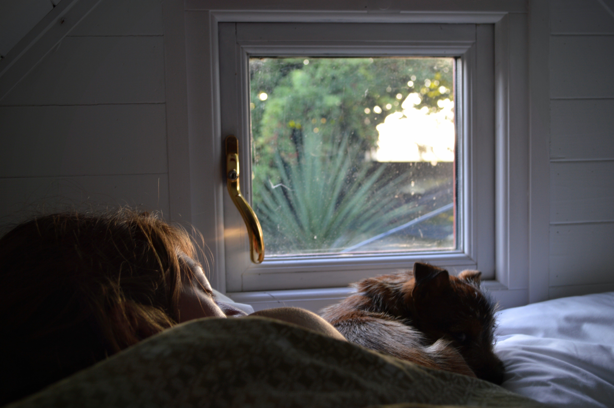

|                                      |                                      |
| ------------------------------------ | ------------------------------------ |
|  | 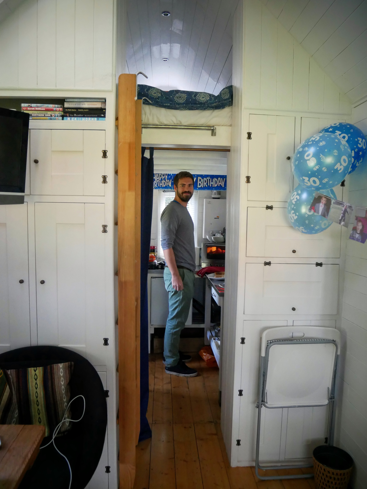 |

On the agenda for the day (after a breakfast fit for a birthday king) was more adventuring on the coast. And so, off to Margate we drove.

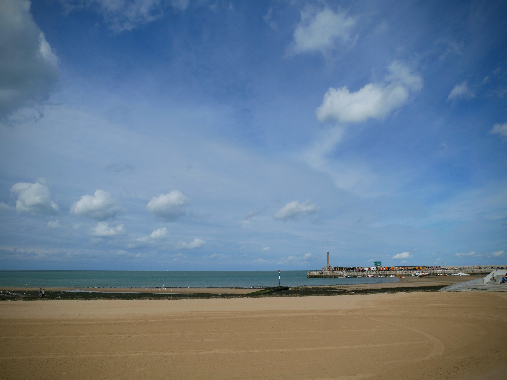

The winds were powerful and buffeted us as we enjoyed a bracing walk along the seafront and through the back streets of this archetypal seaside town.

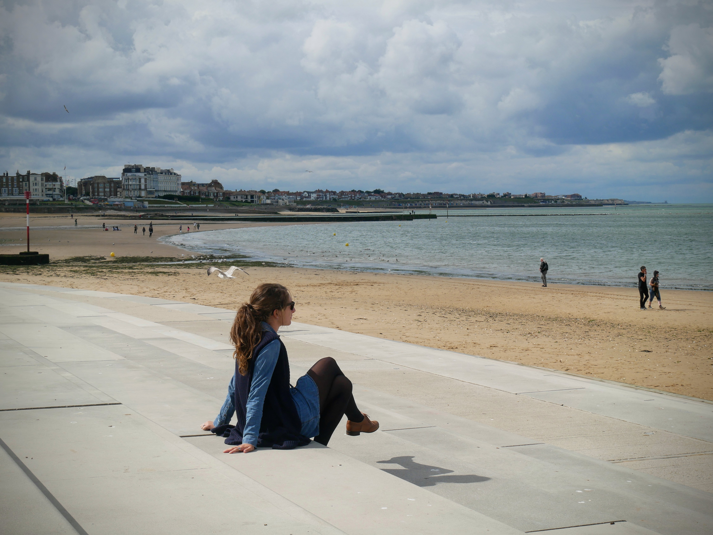

|                                      |                                      |
| ------------------------------------ | ------------------------------------ |
| 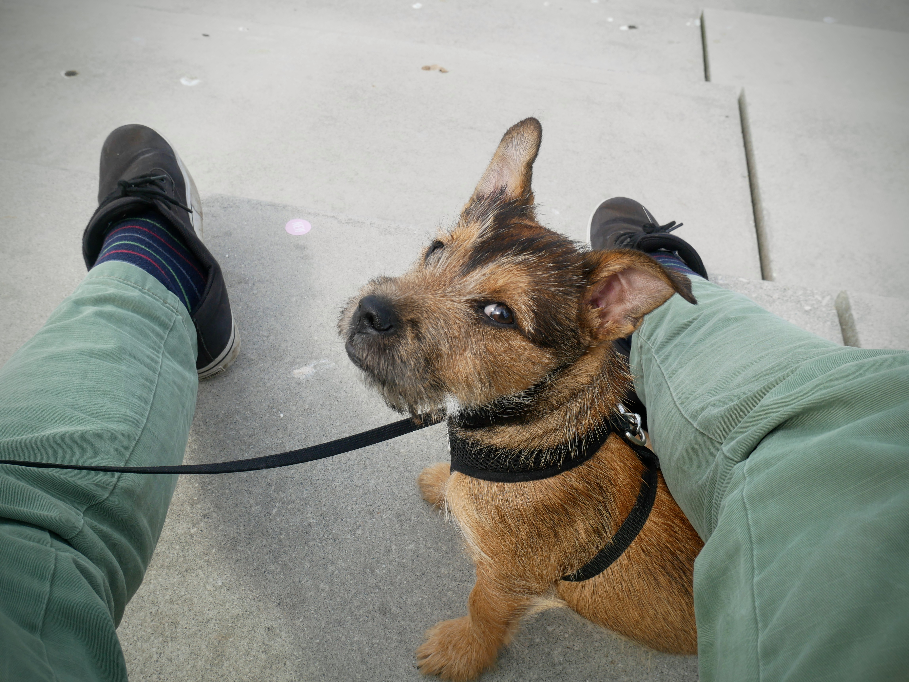 | 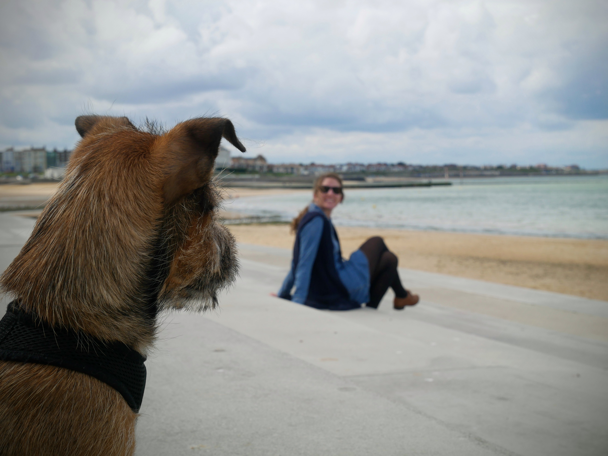 |

Had we been dog-free, we certainly would have paid the [Turner Contemporary](https://www.turnercontemporary.org/) a visit. Regardless, the structure was impressive and imposing from the outside and I revelled in a quick dip into the gift shop. Aren't museum gift shops the best?!

|                                      |                                      |
| ------------------------------------ | ------------------------------------ |
| 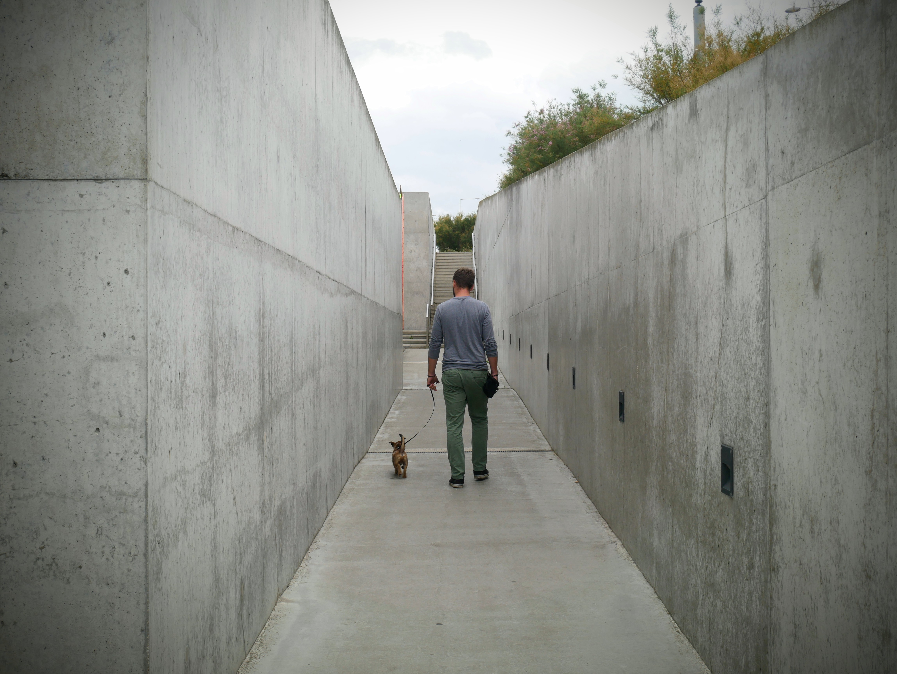 | 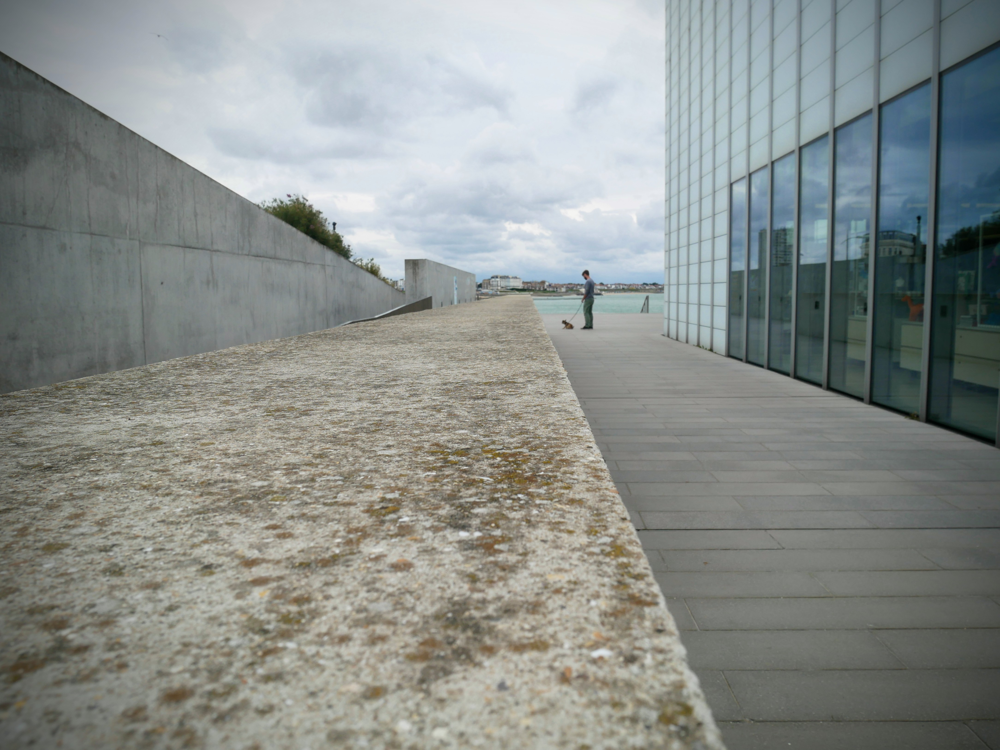 |

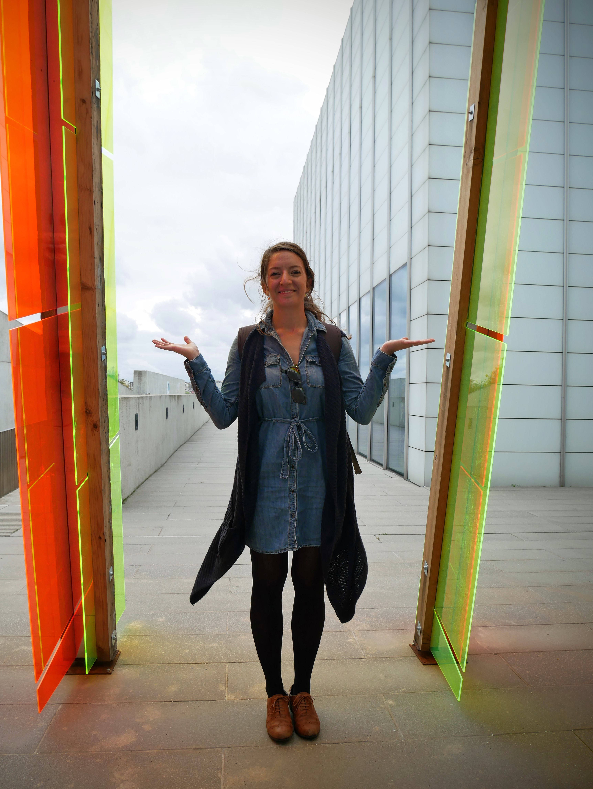

This was one of those days where we didn't really 'do' much, but instead enjoyed lazily ambling around the charming and eclectic independent shops and treasure troves. As the saying goes, 'time you enjoyed wasting was not time wasted'.

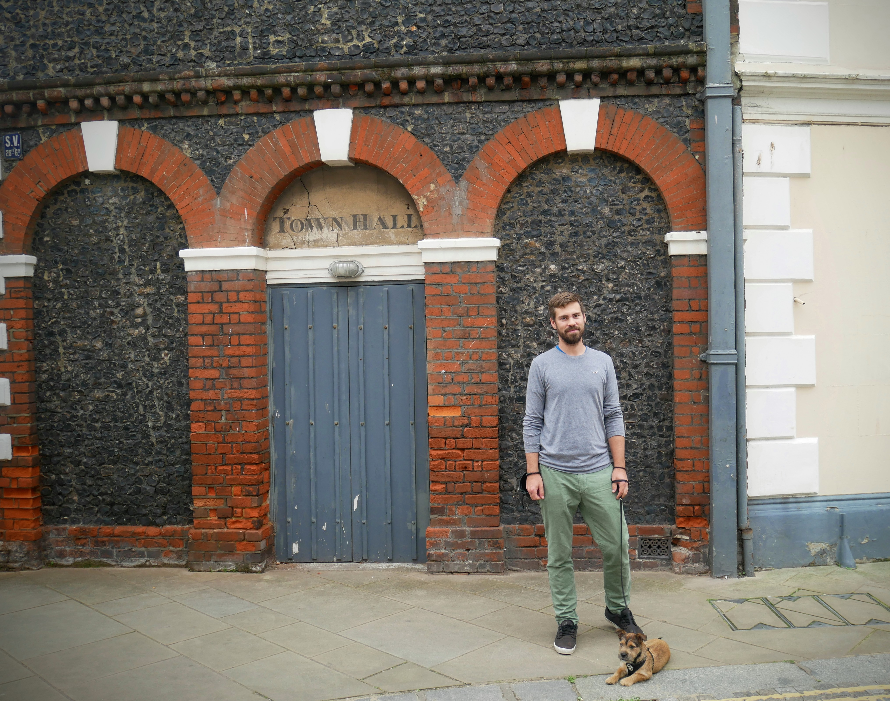

Memorably we were also caught out in a sudden and torrential downpour. As you can see, this resulted in a notably dishevelled pupper!

|                                      |                                      |
| ------------------------------------ | ------------------------------------ |
| 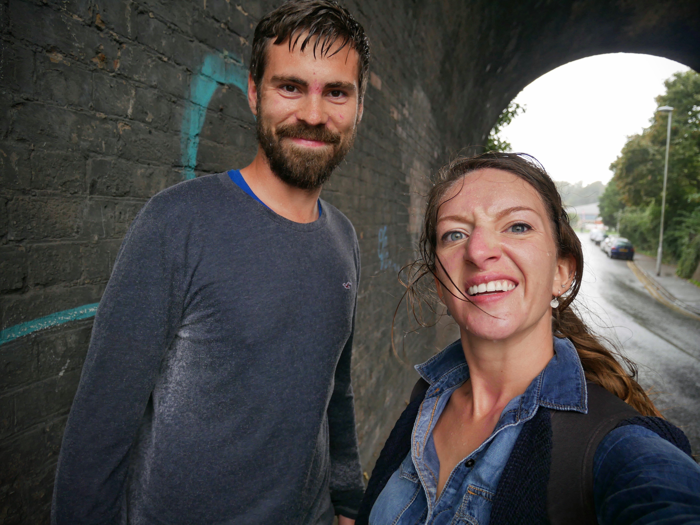 | 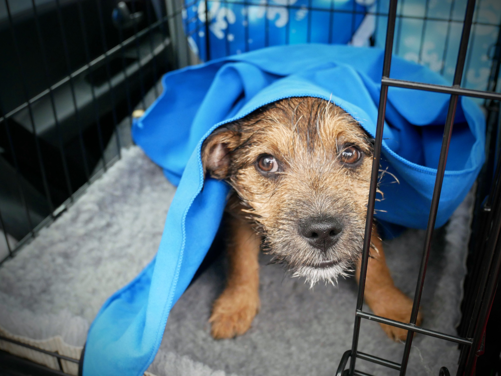 |

In true 30-something style, we dried off and filled our tummies at the local garden centre before making the drive back to London. So if little adventures, seaside towns, good food, dog walks and garden centres are what being 30 is all about... sign me up.

###The useful bits:###

- This was our [Airbnb](https://www.airbnb.co.uk/rooms/6720058?guests=1&adults=1) - the Tiny House (see also the previous post for more pictures and info). We would absolutely highly recommend!
- The [Turner Contemporary](https://www.turnercontemporary.org/) was established in 2011 to commemorate Turner's life and art. In spite of a controversial build, it's hard to remain unimpressed by the structure. I can't comment on the interior or exhibition spaces, but if you find yourself in Margate without a furry companion - do visit!
- Margate is easily accessible from London: just 1hr30 from London St Pancras.
