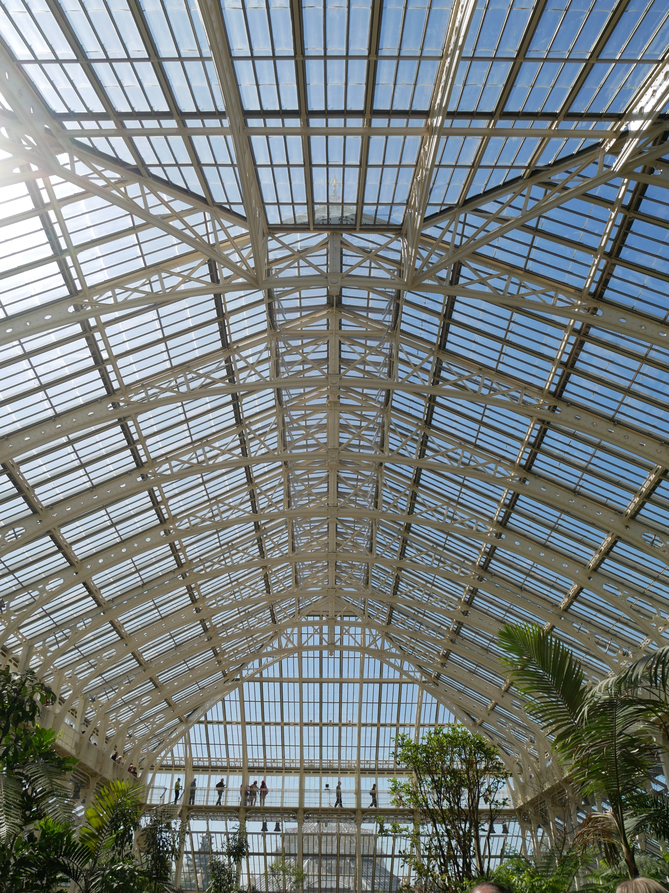

I might have mentioned it a few times already, but bear with me while I harp on. Kew is one of my most favourite places, it really is.

|  |  |
| --- | --- |
|  | 

It's no surprise then, that the long-awaited opening of the grandiose, magnificent Temperate House was legitimate cause for excitement in our household.

|  |  |
| --- | --- |
|  | 

We arranged the dog sitters (thank you again Katrina and Sam), scoped out the weather forecast and had the journey planned to a tee.

And what a day it was. We lucked out with glorious sunshine in May, and remember this was pre-summer heatwave. In retrospect, maybe it was a juicy taster of what was to come. 

Everything came together to create a wonderful Spring day out: Saturday, sun and a long suffering husband to mention but a few!

Some history: the Temperate House originally opened in 1863, but closed again in 2013. Its reopening followed a five-year long restoration project, and the house itself is the largest Victorian glasshouse in the world. The incredible structure is comprised of 15,000 individual glass panes and houses over 10,000 plants of 1,500 species. 

|  |  |
| --- | --- |
|  | 

Not to be outdone by the mammoth greenhouse, a rainbow of multicoloured seemingly floating tulips flanked the path to the side entrance. These blooms alone were worth the trip!

We also took some simple joy in the abundance of daisies pushing up through the grass. A nice picture perhaps, but the smell of hundreds of daisies isn't dissimilar to cat wee... 

Keen to make the most of our date day, we went from Kew to [Petersham Nurseries](https://petershamnurseries.com/), interested to see what all the fuss was about. Unfortunately (for us) a large chunk was closed off for a wedding, but we still enjoyed soaking up the atmosphere and inhaling some delicious cake.

|  |  |
| --- | --- |
|  | 

From Petersham, we took the cycle path back to Richmond: ambling along the river, people, dog and wildlife watching along the way. "One day we'll have a wisteria-fronted house in Richmond, right, Aidan?"

|  |  |
| --- | --- |
|  | 

Walking along the river and it seemed like the world and his wife were out enjoying the sunshine. There were plenty of places to stop for an ice cream (or something stronger), but we just walked and talked, simply enjoying each other's company. Evidence below!

###The useful bits:###
(Recycled tips because we've been so many times!)
- [Kew Gardens](https://www.kew.org/kew-gardens/plan-your-visit-to-kew-gardens/getting-here) is south of the river, situated near to Richmond Park. If you're travelling by public transport, you have three stations (and accompanying Kew gates) to choose from: Kew Gardens, Kew Bridge or Richmond.
- Tickets are £16-19, but a yearly membership (offering unlimited visits for you and a guest) is about £70. If you plan to return, I'd recommend the membership - it also gives you 10% off in the shop and exclusive access to events.
- We got to [Petersham Nurseries](https://petershamnurseries.com/) on the number 65 bus from Kew (the stop to get off at is 'The Dysart'). The walk back to the river took us about 10 minutes.