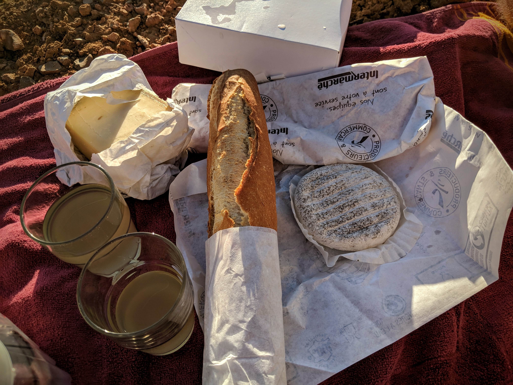

Like so many before us, a huge pull for our visit to Provence was the lavender fields. Our research had shown us picture upon picture of rolling purple hills, and we were keen to see if the reality lived up to the hype.

Although the lavender is visible almost everywhere across the region, we were reliably informed that Valensole was the place to be for those archetypal views. And so, off we set, with a car full of picnic, ready and excited to see the fields at sunset.

|                                     |                                     |
| ----------------------------------- | ----------------------------------- |
|  |  |

Let's talk about the picnic: crunchy French bread, a range of local cheeses, ham, deliciously juicy peaches (oh my word, those peaches), a fresh punnet of cherries, iced tea and of course, some rose wine.

|                                                                              |                                                  |
| ---------------------------------------------------------------------------- | ------------------------------------------------ |
|  |  |

We visited the area in June / July, so just at the tail end of shoulder season. This meant that the roads were quiet, and the drive through the beautiful countryside was part of the day's adventure.

As we drove, we wondered if we'd know when we arrived at the famous fields, and took a couple of premature detours when we saw flashes of purple. One such stop necessitated a comfort break - some reality for you there!

|                                     |                                     |
| ----------------------------------- | ----------------------------------- |
|  |  |

We needn't have worried though. When we arrived, the view blew us away. The hills are seemingly endless, and the purple as vibrant as you can possibly imagine. A few things the pictures didn't show us? The sound! A constant buzz of thousands of bees, listing lazily and happily from flower to flower.

|                                     |                                     |
| ----------------------------------- | ----------------------------------- |
|  |  |

|                                     |                                     |
| ----------------------------------- | ----------------------------------- |
|  |  |

And of course... the other tourists! This said, it was incredibly easy to keep distance, and we found a side road which took us to the back of the main field: perfect for our evening picnic while we watched the sky fade from bright azure blue, to ombre oranges and pinks.

|                                                  |                                                |
| ------------------------------------------------ | ---------------------------------------------- |
|  |  |

We love a countryside picnic, but this was quite possibly the best yet. French food, the views and being enveloped in the heady scent of lavender: perfection.

|                                     |                                     |
| ----------------------------------- | ----------------------------------- |
|  |  |

###The useful bits:###

- [This](https://goo.gl/maps/fYzVqwJH6KcFajhK8) is where we parked up for our picnic. It might have been a private road, so don't take our recommendation as gospel.
- As always, leave nothing behind. These places will only stay beautiful if we behave respectfully and take our rubbish home with us.
- We stayed in Joucas for the second half of our holiday, so the drive to Valensole took around 1hr30 (80km).
- Our hotel, [Le Jas de Joucas](https://www.booking.com/hotel/fr/le-jas-de-joucas.en-gb.html?aid=311076;label=le-jas-de-joucas-kRePyVBbyVcWPHVxZWxAdQS417700211905%3Apl%3Ata%3Ap1%3Ap2%3Aac%3Aap%3Aneg%3Afi%3Atiaud-146342138230%3Akwd-12696230881%3Alp9045912%3Ali%3Adec%3Adm%3Appccp%3DUmFuZG9tSVYkc2RlIyh9YSNxgVPQVI7AT3fx1WXiwSU;sid=892d1c545030dcda35843bab5b0ce701;all_sr_blocks=67447508_179767704_2_0_0;checkin=2020-09-16;checkout=2020-09-18;dest_id=-1433155;dest_type=city;dist=0;group_adults=2;group_children=0;hapos=1;highlighted_blocks=67447508_179767704_2_0_0;hpos=1;no_rooms=1;room1=A%2CA;sb_price_type=total;sr_order=popularity;sr_pri_blocks=67447508_179767704_2_0_0__31660;srepoch=1587901875;srpvid=59205359cd2d0122;type=total;ucfs=1&#hotelTmpl), was sensational: the locally sourced breakfasts, infinity pool and resident dogs were the highlights!
