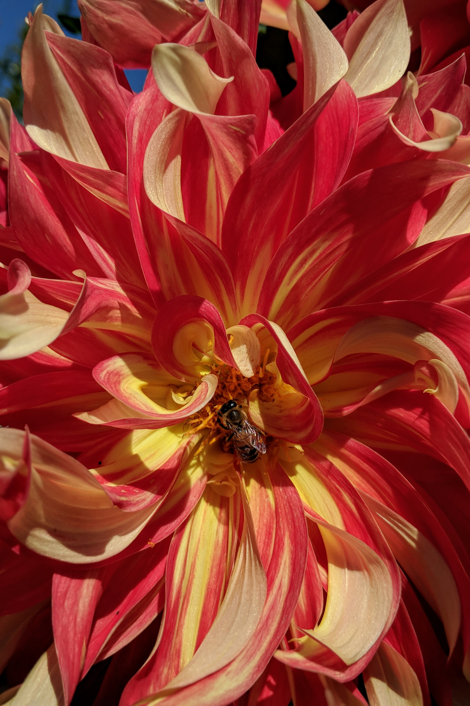
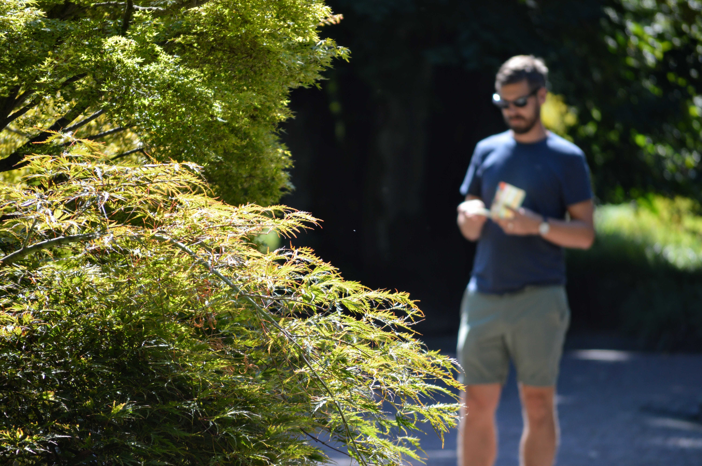
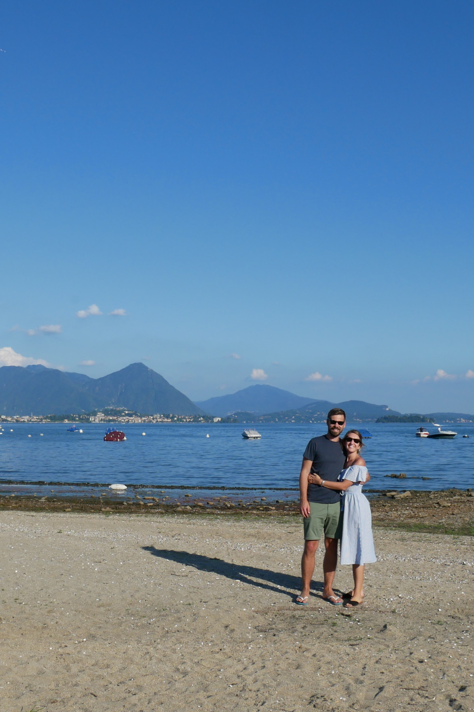

If you asked me to describe my perfect day, it would probably include these components: coffee, sunshine, wandering around a garden, the beach or water, and good food. So, after a [day adventuring solo](https://www.onedayaway.co.uk/solo-in-beligirate/), I was thrilled that Aidan was recovered enough to venture out to 'Giardini Botanici Villa Taranto', a botanic garden situated 30 minutes from Belgirate.

|                                    |                                   |
| ---------------------------------- | --------------------------------- |
|  |  |

Little did we know, our visit perfectly coincided with the garden's annual dahlia exhibition, ['The Dahlia Maze'](https://www.villataranto.it/en/events-bloomings/dahlia-exhibition/). With over 350 different varieties in almost every colour you can imagine, the maze was visually stunning. From huge blousy blooms to perfectly spherical pompoms, we were spoiled for choice.

|                                   |                                   |
| --------------------------------- | --------------------------------- |
|  |  |

We had 'Cafe au Lait' dahlias (above left) front and centre at our wedding, so I always get a pang of happy nostalgia when I see them in 'real life'. The palest of pink with hints of peach: sensational.

As you can see, it wasn't just us enjoying the blooms - but the bees, hoverflies, butterflies and dragonflies flitted around us as we moved from flower to flower.

|                                    |                                     |
| ---------------------------------- | ----------------------------------- |
|  |  |

Although we could have photographed the dahlias for hours, we eventually moved on and strolled around the remainder of this beautiful garden.

|                                   |                                   |
| --------------------------------- | --------------------------------- |
|  |  |

Containing a glasshouse, a mausoleum, a villa, terraced gardens and more - there was plenty to keep us occupied at [Villa Taranto](https://www.villataranto.it/).

|                                              |                                   |
| -------------------------------------------- | --------------------------------- |
|  |  |

Now, a little history: Villa Taranto was bought in 1931 by a Scottish Captain intent on creating a beautiful English garden on the lakes of Maggiore. Enter thousands of rare plants, some heavy landscaping to create valleys and water features, and almost a decade later, the garden was complete.

|                                   |                                    |
| --------------------------------- | ---------------------------------- |
|  |  |

Not the biggest garden we've ever visited, but a great size for a lazy day's ambling in the sun. Throw in a quick swim and sunbathe at the beach on the way home, and you've got yourself a pretty special day.

Oh - and don't forget that coffee. In my case, a coffee-flavoured gelato. Delicious!

###The useful bits:###

- Villa Taranto is open from March to November each year; you can see the Dahlia maze between July and October.
- Its closest, largest town is Stresa - around 15km (a 20 minute drive).
- [Their website](https://www.villataranto.it/it/dove-siamo/) has useful information on how to get there using other forms of transport.
- Tickets cost around £10, and dogs (on leads) are permitted!
