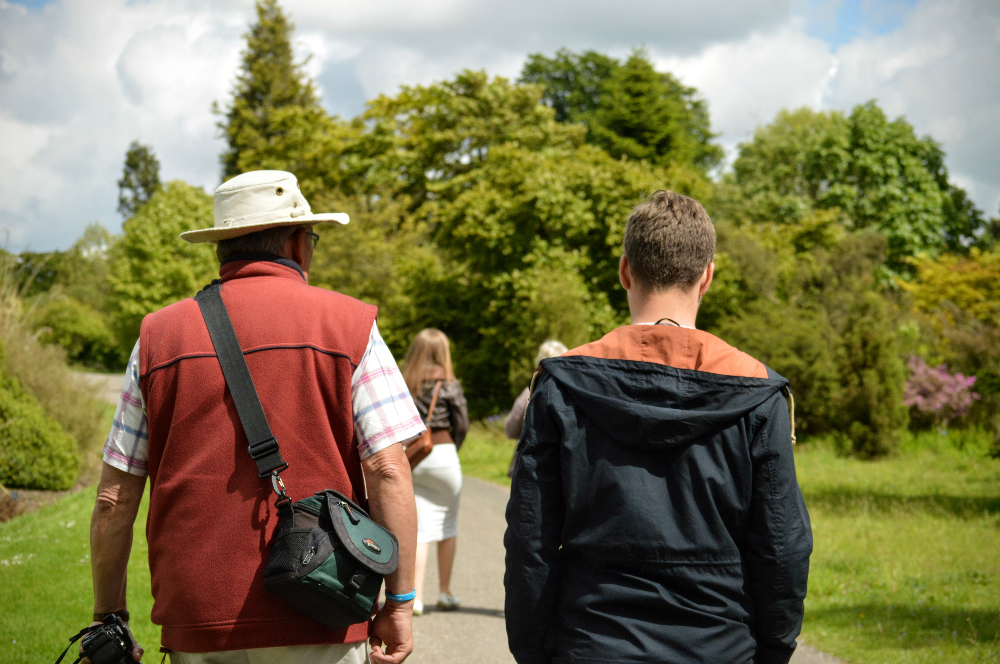
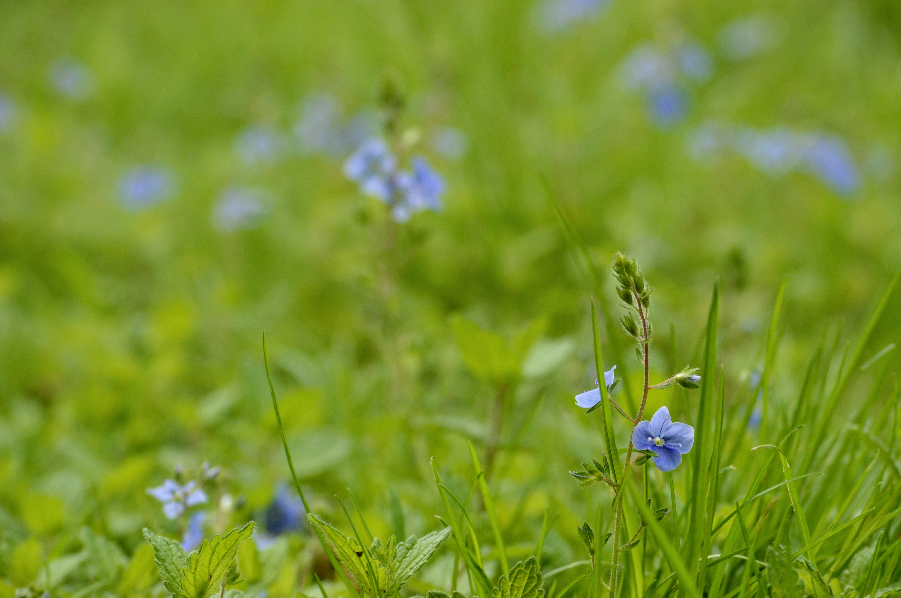
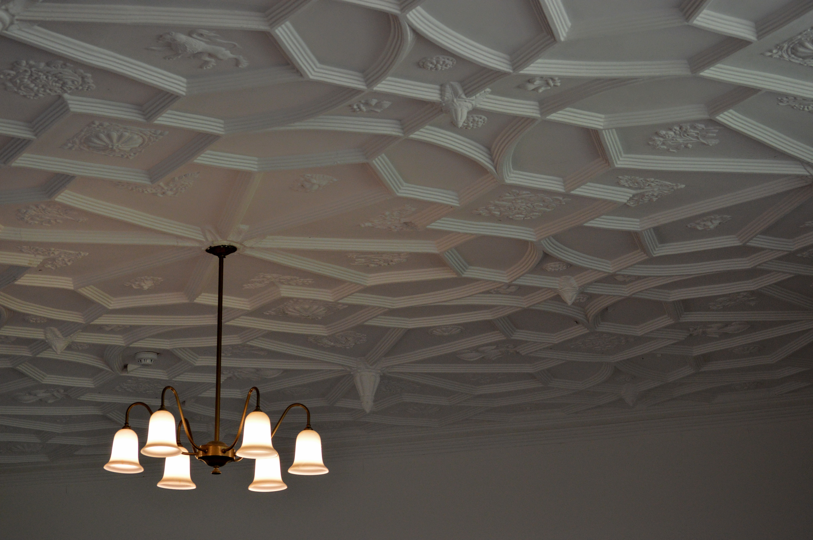
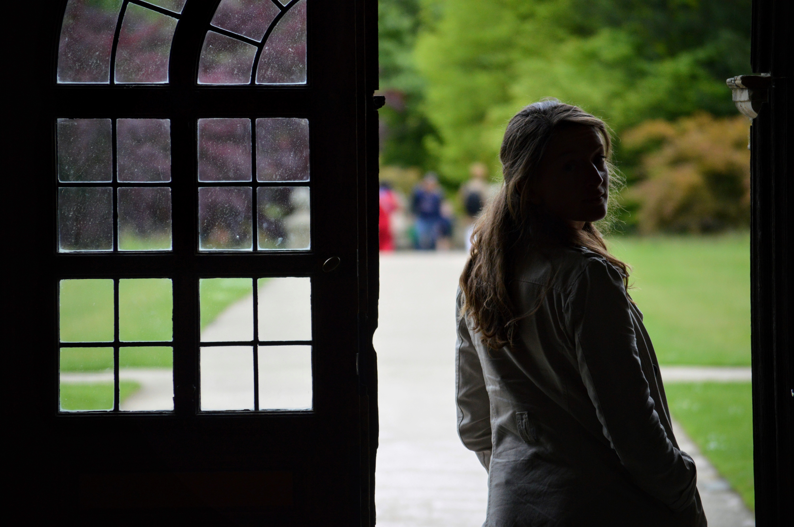
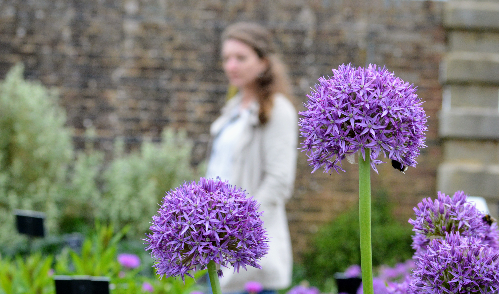
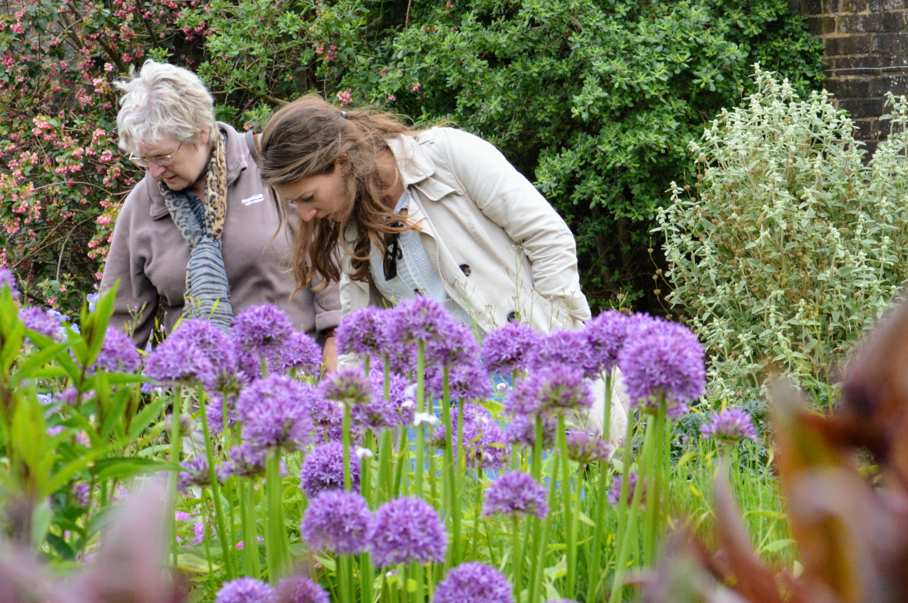
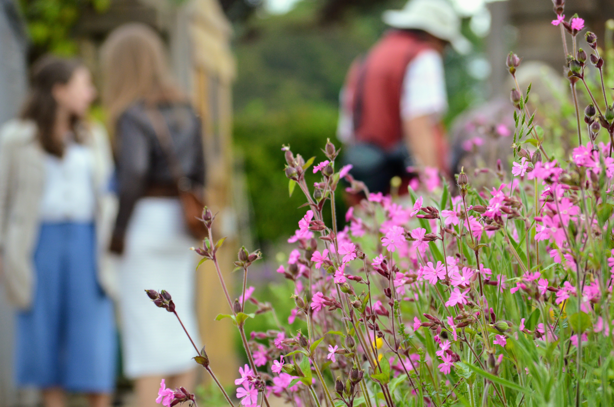
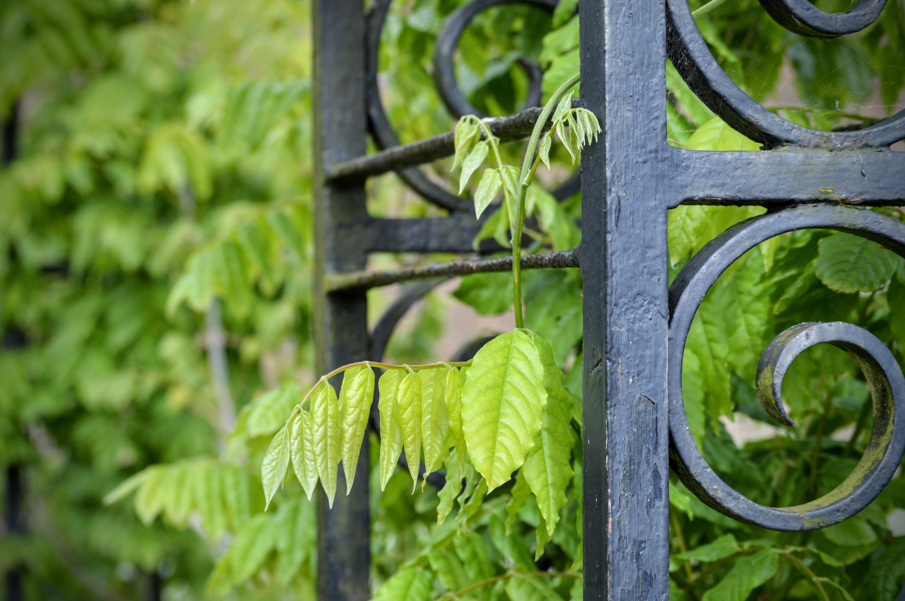
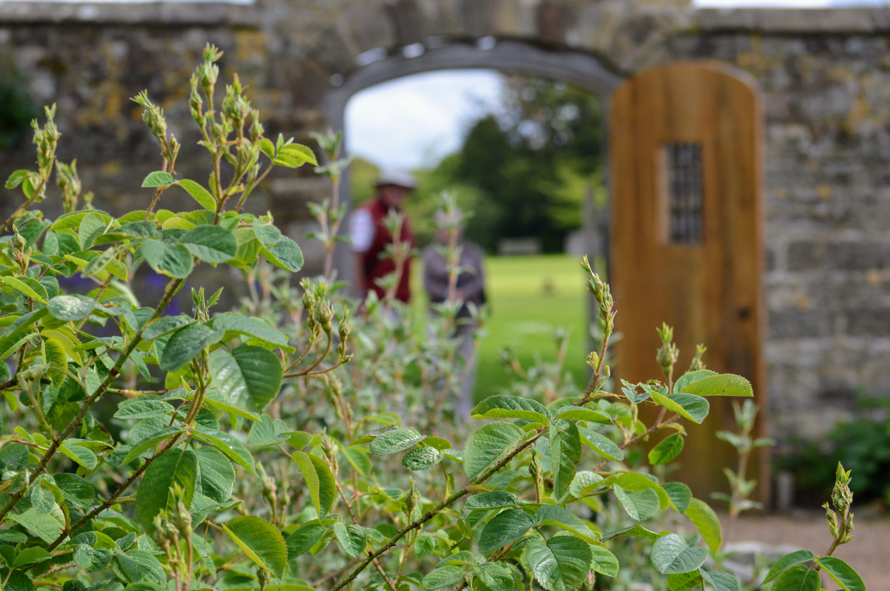
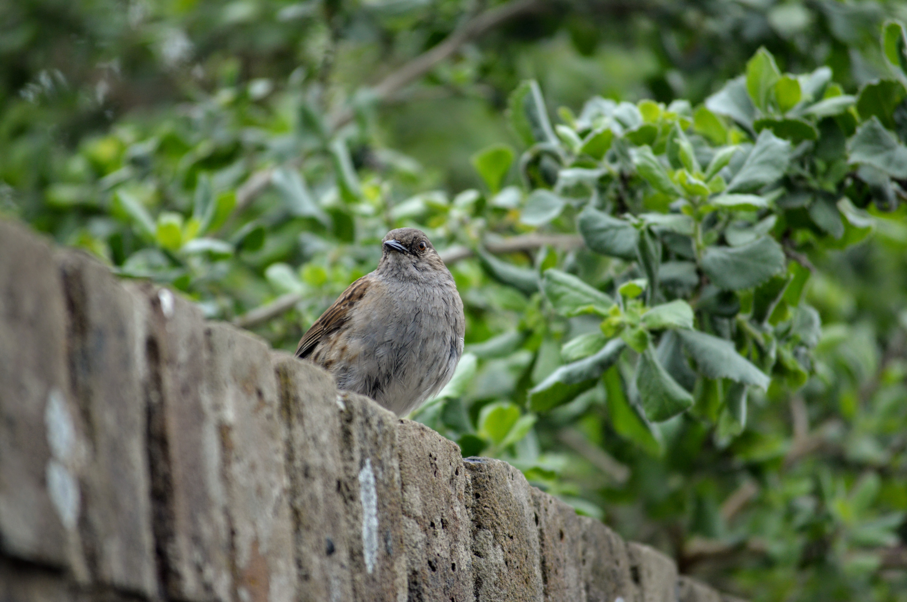

I love surprises. Although I'm generally pretty terrible at keeping secrets, I love the planning involved in a surprise. Knowing that you'll really make that person's day is just magical. So, helping to plan a surprise for my wonderful Mama's birthday was a real joy.

Wakehurst is the little sister garden of Kew, and is based in West Sussex in the South of England. As birthday surprise locations go, this was pretty spectacular.

|                                     |                                     |
| ----------------------------------- | ----------------------------------- |
|  |  |

After the initial shock of seeing 2 of her children and their partners spring out from behind the bushes, Mum had recovered enough to walk the gardens and stop into the impressive Mansion.

|                                     |                                     |
| ----------------------------------- | ----------------------------------- |
|  |  |

The walled garden was a particular highlight for us, especially the elegant alliums, red campions, the buzz of the bees and the insect hotel.

|                                     |                                     |
| ----------------------------------- | ----------------------------------- |
|  |  |

Wakehurst is set in over 500 acres of garden and woodland and includes a nature reserve, meaning there's plenty to occupy you for the day. It also houses the Millennium Seed Bank: "the largest wild seed conservation project in the world".

|                                     |                                     |
| ----------------------------------- | ----------------------------------- |
|  |  |

If you enjoy Kew (and I think this blog is perfect evidence of my ongoing love affair with the Royal Gardens), then Wakehurst should definitely feature on your to-do list soon. And, if you can bring your loved ones together for the visit, even better.

###The useful bits:###

- [Wakehurst](https://www.kew.org/wakehurst/plan-your-visit-to-wakehurst) is around an hour out of London. Take the train from Victoria to Haywards Heath, then a local bus for the final 6 miles to the garden entrance.
- The entry fee is £12.95 or free if you're a Friend of Kew or a National Trust member (both definitely worth looking into if you're planning repeat visits).
- Sadly, no dogs are allowed in the gardens.
