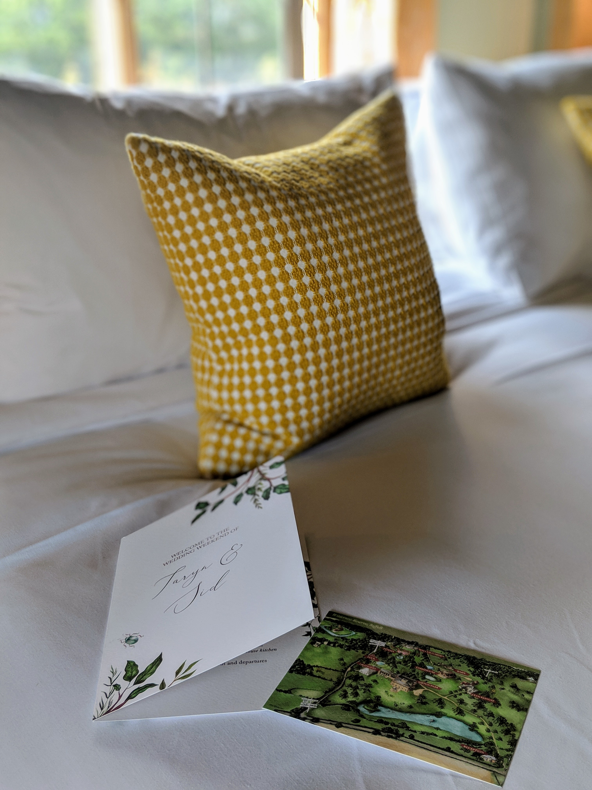
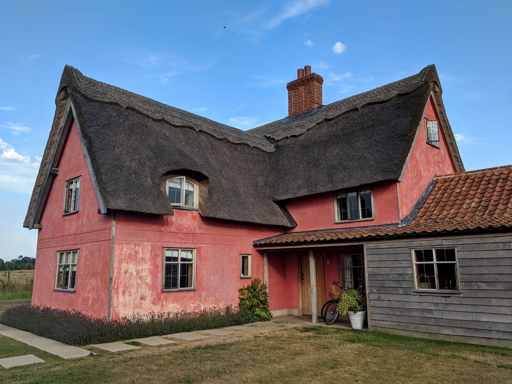
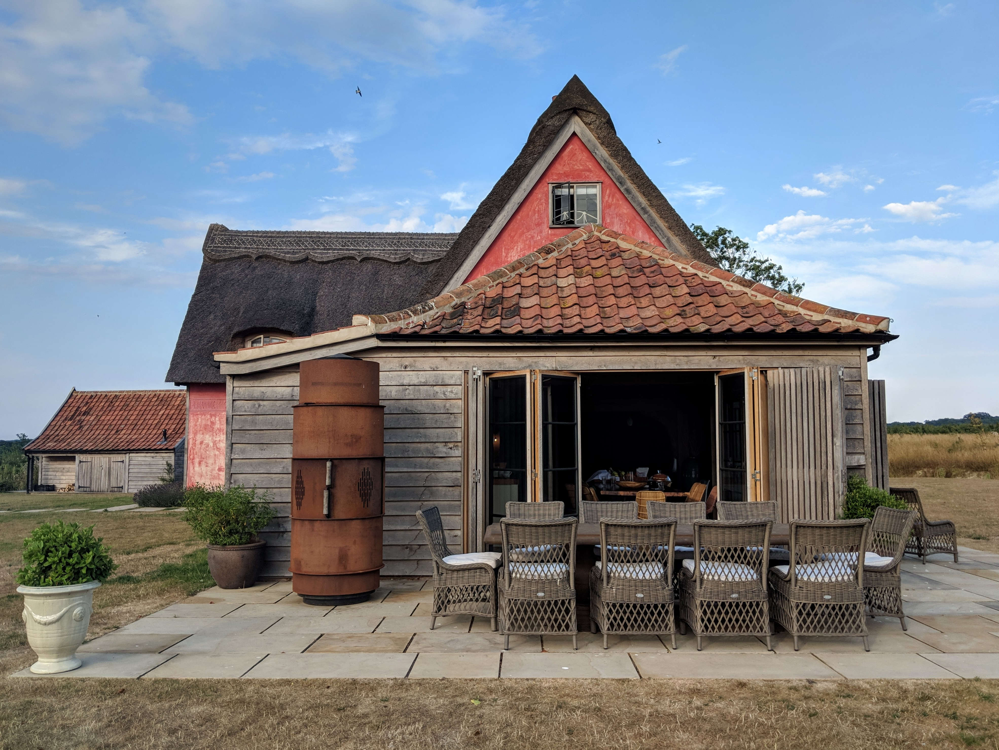
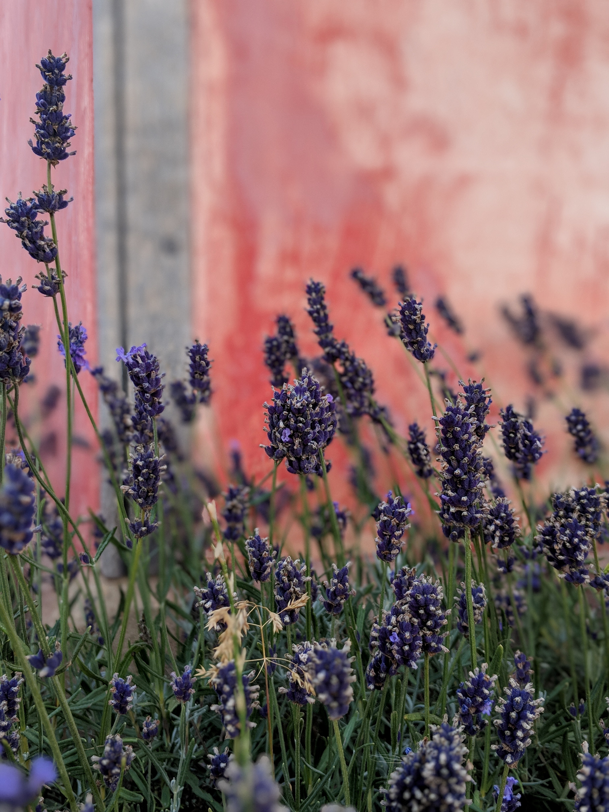
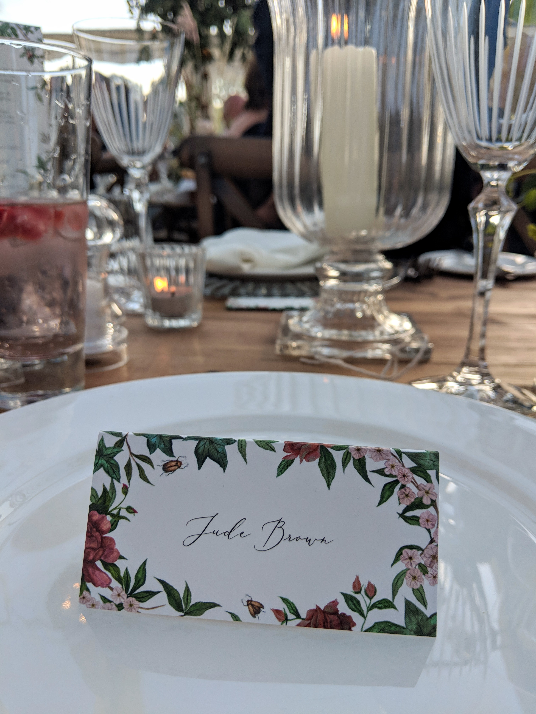
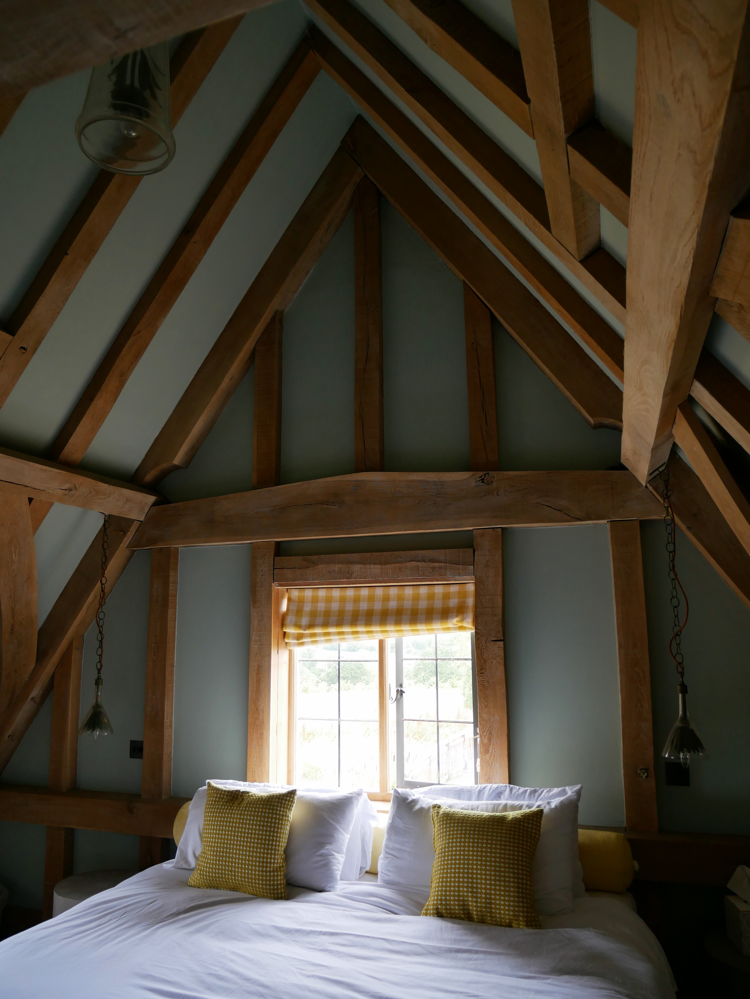
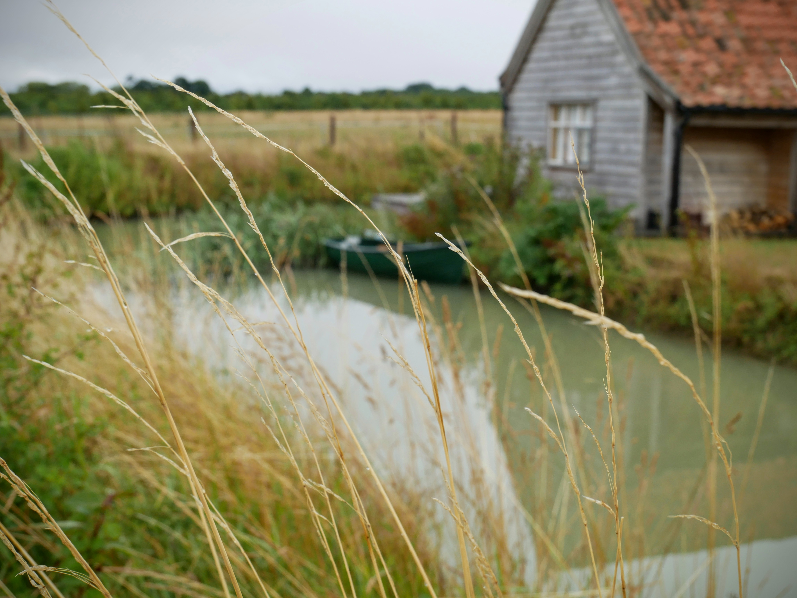
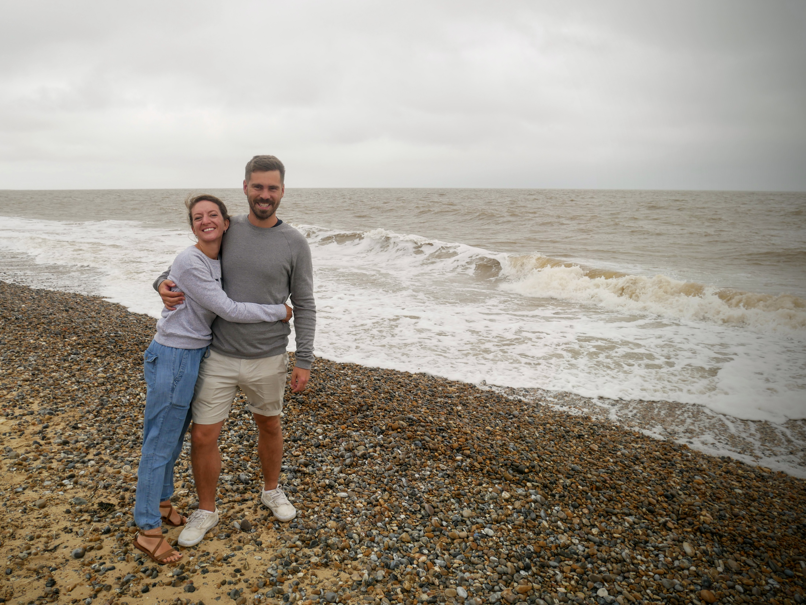

It's really special when two of your most favourite humans choose to celebrate their commitment to each other. Even more special is when the wedding celebration is a 4-day extravaganza in the stunning Wilderness Reserve in beautiful Suffolk.

We were lucky enough (thank you again x 1 trillion, Science Boy and Girl) to stay in the rose pink Moat House, complete with actual moat, boat house, boat and sunken hot tub. The perfect base for any celebration or staycation.

|                                                 |                                                 |
| ----------------------------------------------- | ----------------------------------------------- |
|  |  |

The whole of the Estate is simply breathtaking, and never more so than when filled with hundreds of guests united in joy.

|                                                 |                                                 |
| ----------------------------------------------- | ----------------------------------------------- |
|  |  |

Sadly the weekend had to come to an end, but before our return to the concrete jungle from rural, calming Suffolk, we stopped by Dunwich Beach.

|                                      |                                      |
| ------------------------------------ | ------------------------------------ |
|  |  |

Although normally a sun worshipper, the grey skies almost made the scene more magical. As we're both from the island, beaches hold a special place in our hearts and being near the sea soothed our somewhat hungover heads.

All in all, the most perfect weekend for the most perfect, down to earth, generous couple. One lesson we should all take away: love and laugh.

###The useful bits:###

- The [Wilderness Reserve](https://www.wildernessreserve.com/) is located in Sibton Park, just near to Yoxford and Saxmundham in Suffolk. Definitely forever house territory.
- Dunwich beach was about 7 miles from Wilderness: a 15 minute drive.
- Getting to Suffolk from London by car is pretty easy: a 2hr30 drive mostly on the A12.
- Arriving by train is a bit trickier: you'd likely need to go via Norwich or Ipswich, depending where you're based.
