You might remember that we visited Wisley when the boy was a little babe in arms. Lockdown naturally prevented further visits, until July when the restrictions eased.

We booked our slot online a good few weeks in advance, and hoped for a warm sunny day. We weren't disappointed!

|                                                    |                                             |
| -------------------------------------------------- | ------------------------------------------- |
| 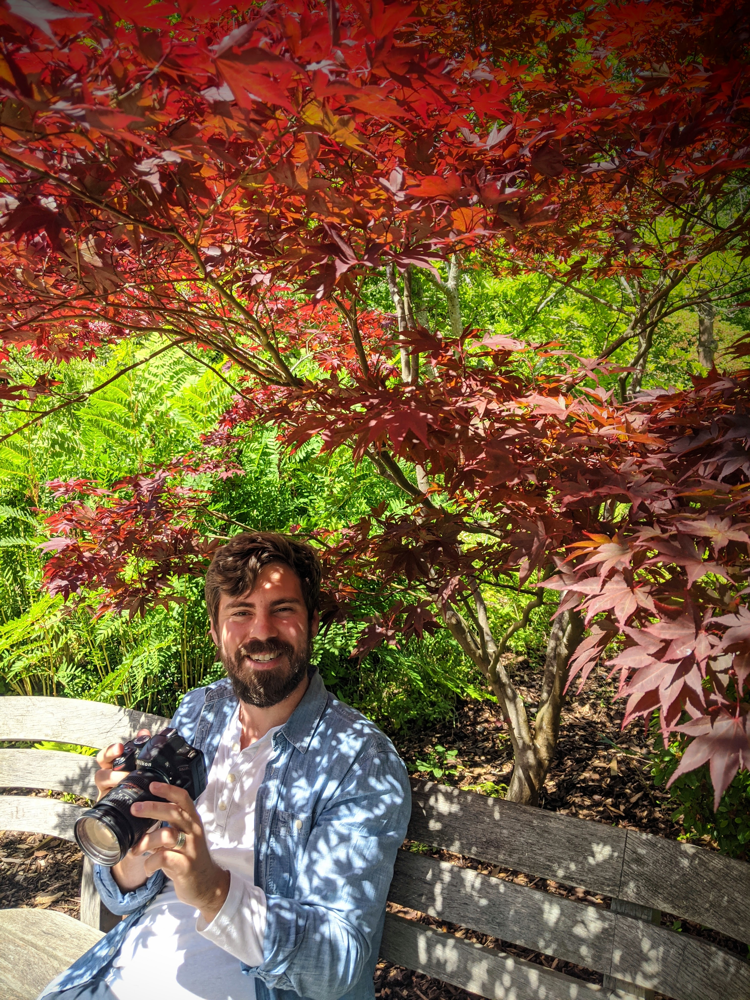 |  |

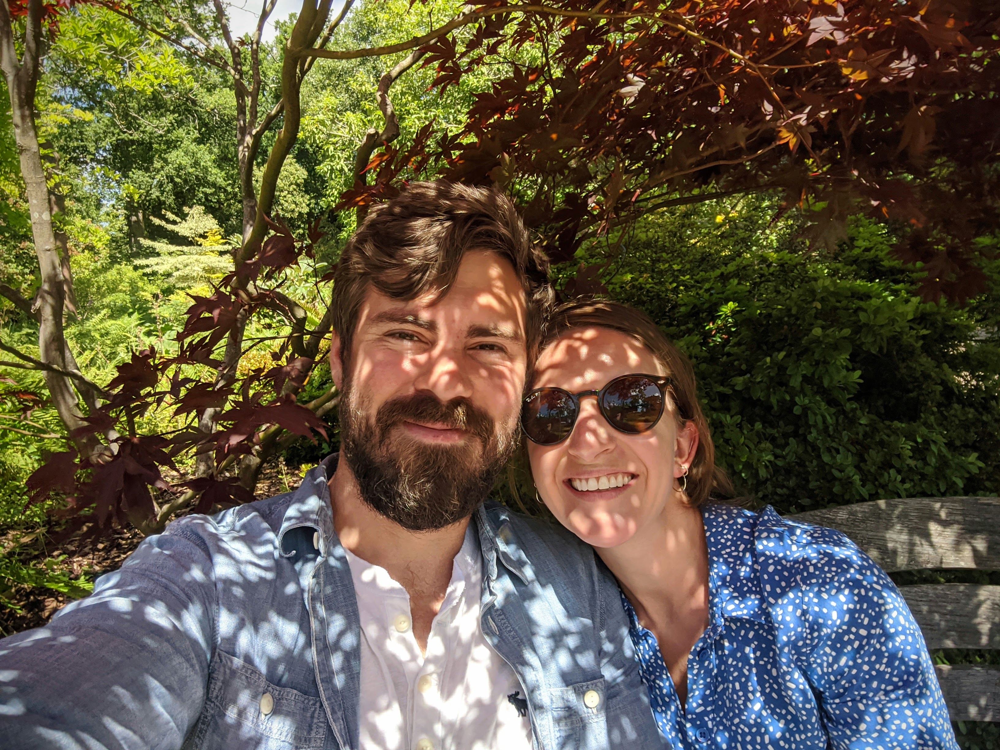

This beautiful ruby acer was the perfect spot for a cheeky Mum and Dad selfie while the baby napped, and we planned our route round the garden.

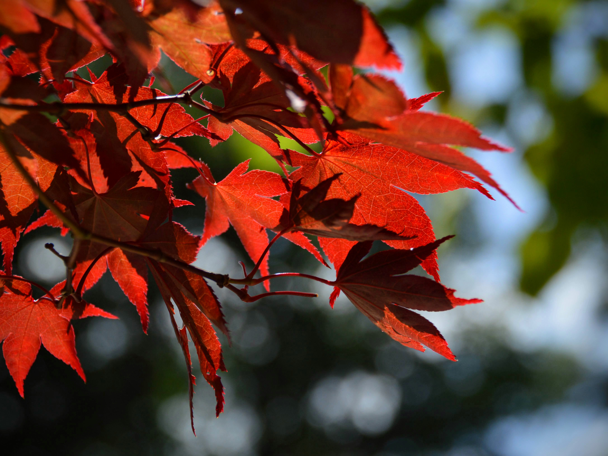

|                                                    |                                  |
| -------------------------------------------------- | -------------------------------- |
| 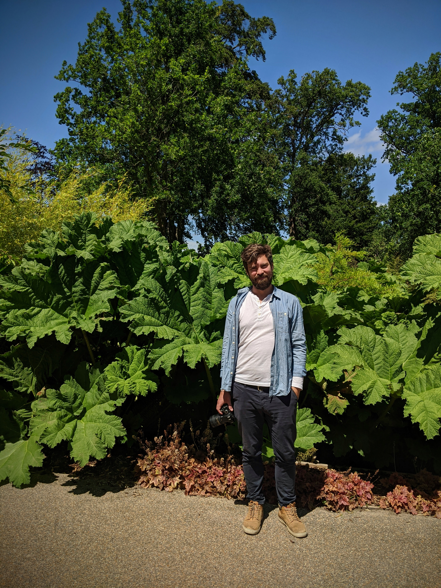 | 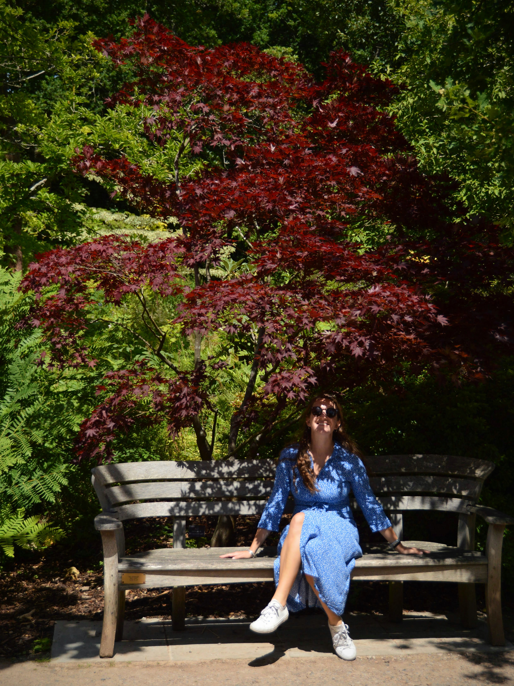 |

It was a shame to have missed spring in full bloom, but summer's flowers put on a stunning display. Accompanied by so many insects flitting around, lazily feasting and gorging on the nectar.

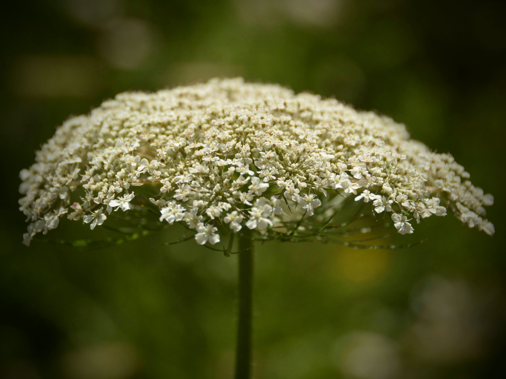

|                                         |                                  |
| --------------------------------------- | -------------------------------- |
| 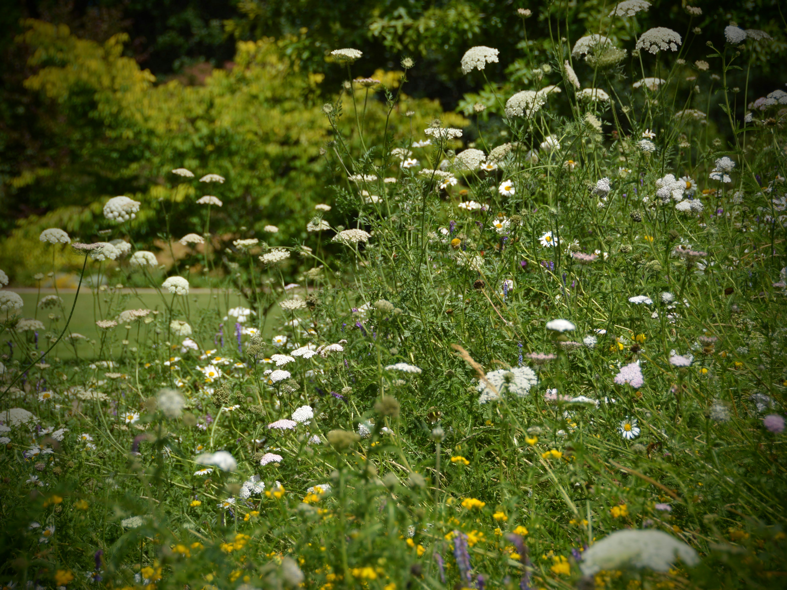 | 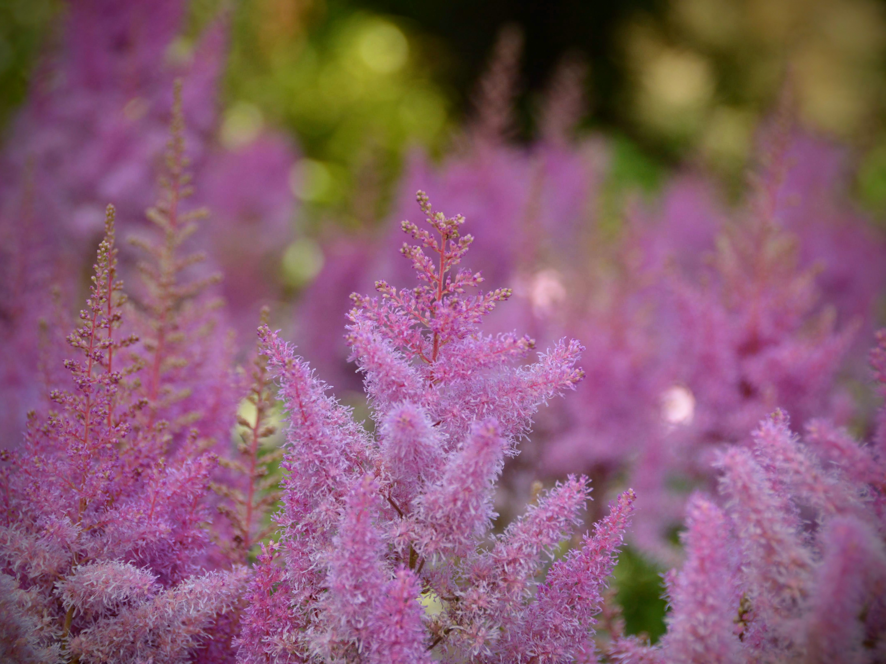 |

Now we're getting that bit older, we've been enjoying taking inspiration from the gardens we visit. We have one shady bed in our garden which we're slowly filling; seeing the candy pink astilbe happily in the shade of a large tree gave us a prompt to visit our local garden centre the next day!

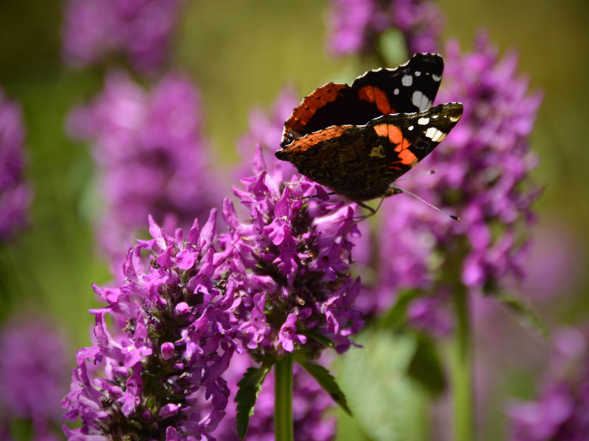

|                                         |                                  |
| --------------------------------------- | -------------------------------- |
| 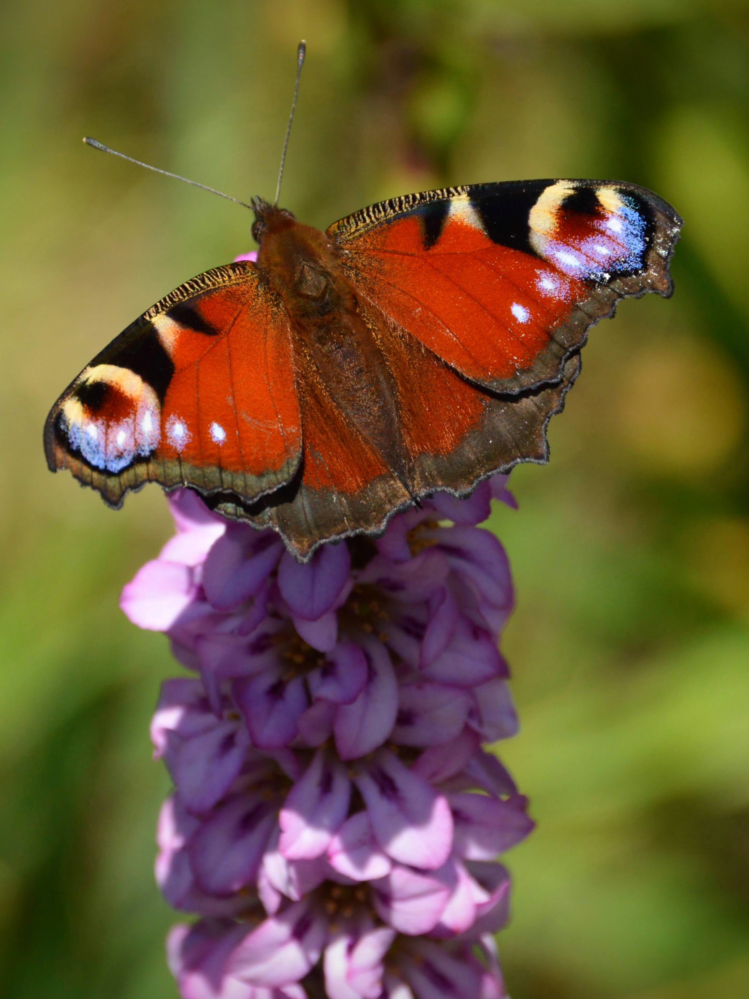 | 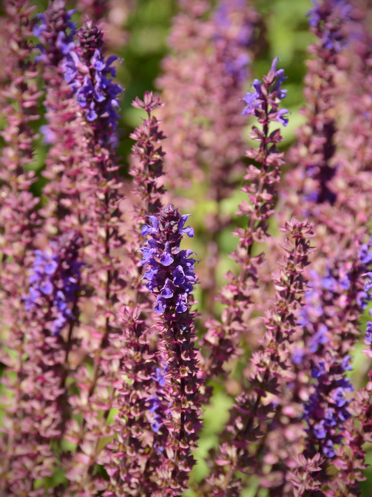 |

The red admiral (above) and peacock (above left) were the most beautiful, pristine specimens. Is there anything more archetypally bucolic than a packed annual and perennial border, buzzing with bees and butterflies?

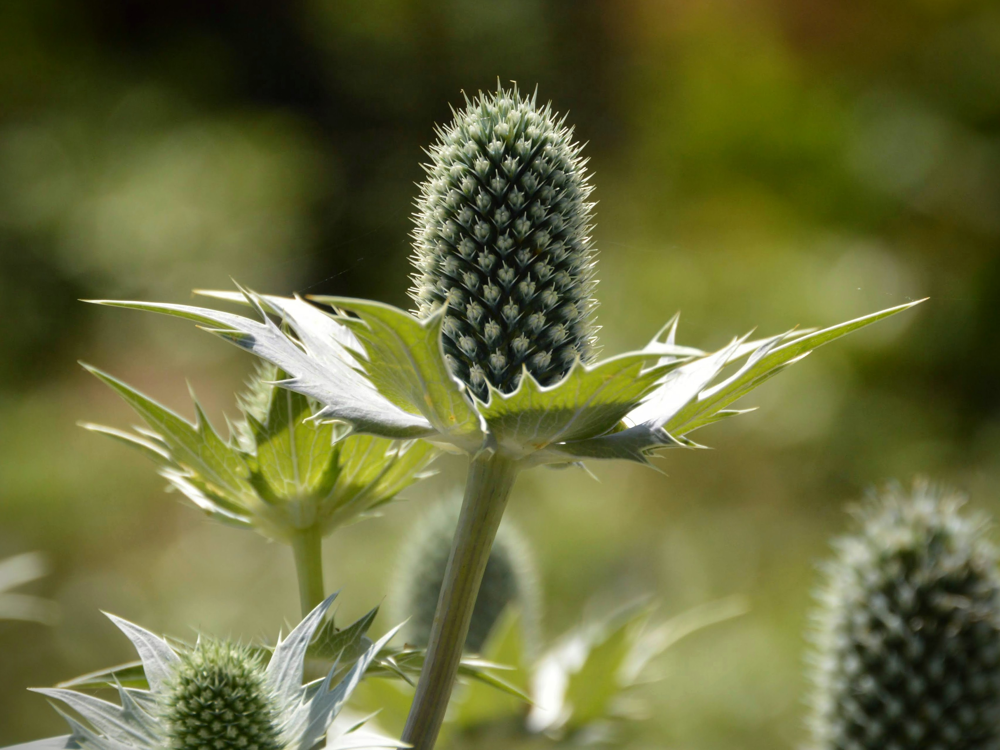

|                                                      |                                  |
| ---------------------------------------------------- | -------------------------------- |
|  |  |

And finally, some pictures of our smiley, stripy boy loving family time and our outside adventure.

|                                         |                                  |
| --------------------------------------- | -------------------------------- |
|  | 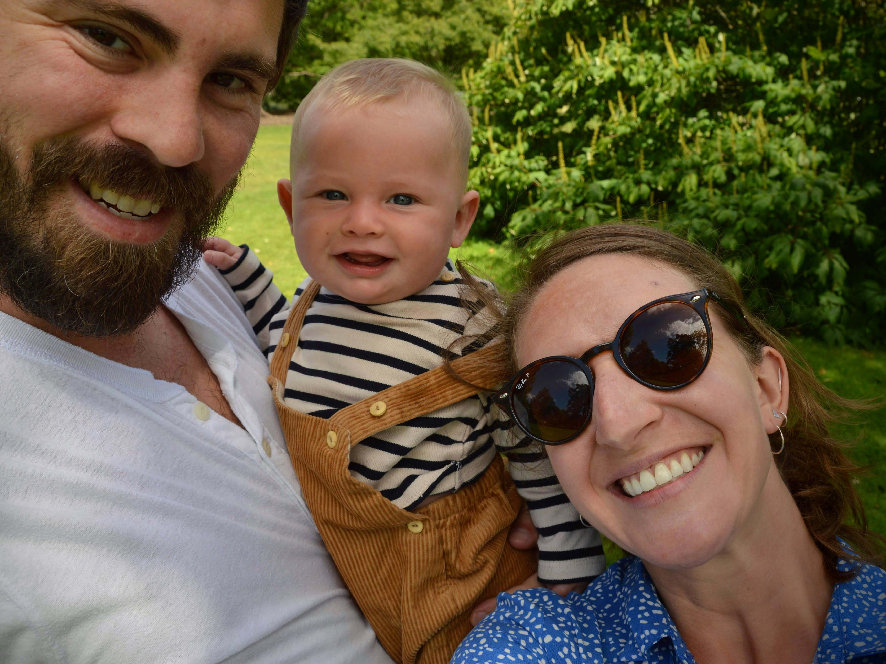 |

###The useful bits:###

- RHS Wisley is near Woking, Surrey, and is located just off the A3 (London to Portsmouth A-road).
- We drove to the Garden (parking is free), but public transport is possible. Plan your visit [here](https://www.rhs.org.uk/gardens/wisley/Plan-your-visit).
- If you do use public transport, your entry ticket is a discounted £12.
- Normal entry costs £16.50; we used our membership. Entry is strictly bookings only - but it's a quick and easy process online.
