This blog has taken a bit of a backseat while I've been growing a human... Now he's here, let's get back to it!

Our first proper family day out was to RHS Garden Wisley. Only a 30 minute drive from our house, we agreed that this would be an achievable day trip. And, with multiple cafes and toilets, we'd have all the required facilities for changes and feeds galore.

|                                    |                                  |
| ---------------------------------- | -------------------------------- |
|  | 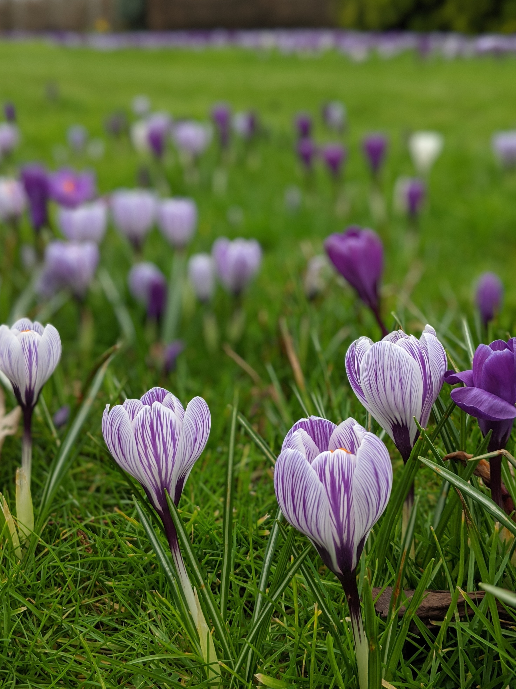 |

After an initial hot chocolate (and milk) pitstop, first up were the beautiful crocuses. The purple and white spotted lawn was an impressive sight - even on the greyest of February days.

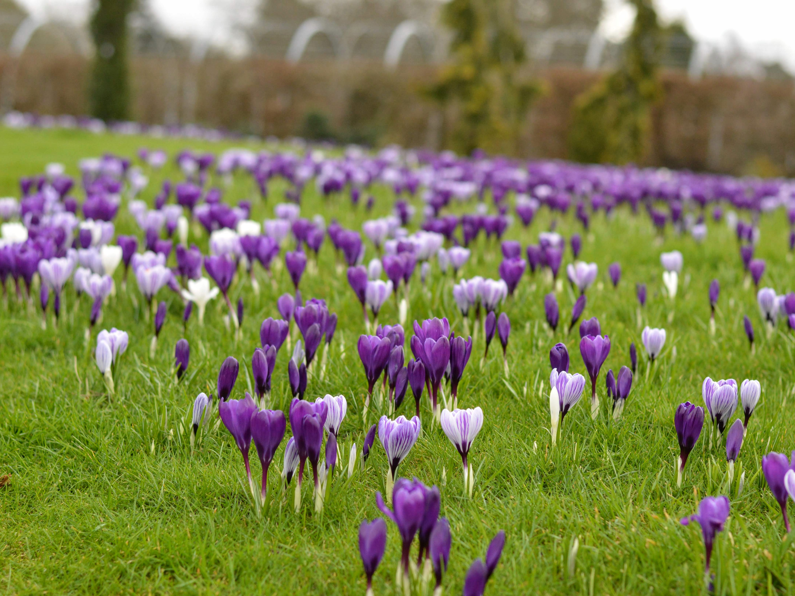

Established back in 1878, Wisley is the Royal Horticultural Society's flagship garden. For our first visit we only scratched the surface, and enjoyed ambling along the winding (and pram-friendly) paths.

|                                  |                                  |
| -------------------------------- | -------------------------------- |
| 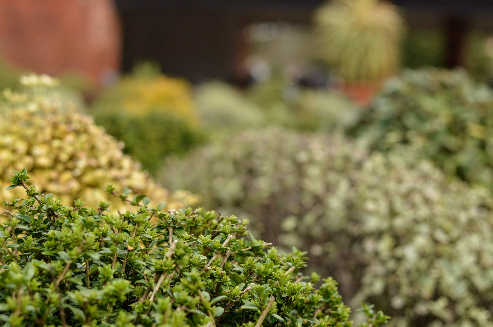 |  |

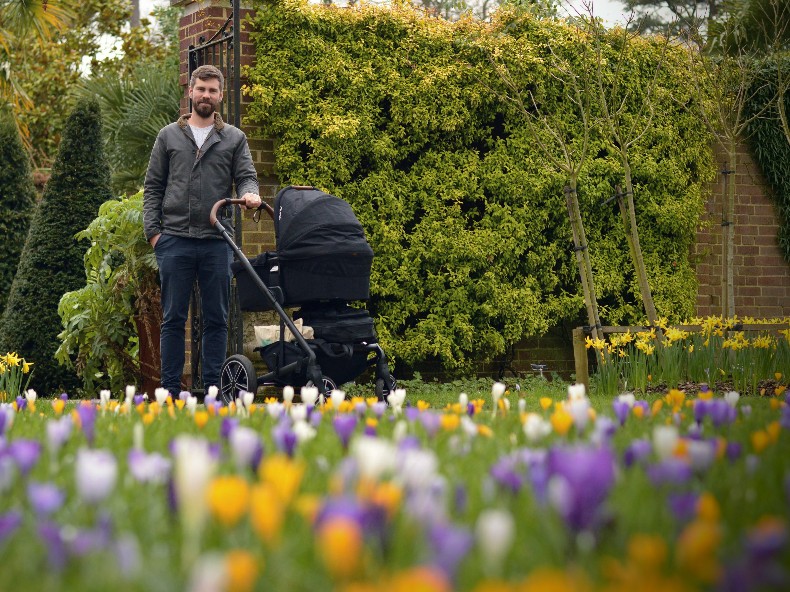

When we arrived and saw the volume of vehicles in the car park, we were initially concerned that the garden would feel crowded. We needn't have worried: boasting 240 acres, Wisley has more than enough space. Even during February half-term!

|                                   |                                  |
| --------------------------------- | -------------------------------- |
|  | 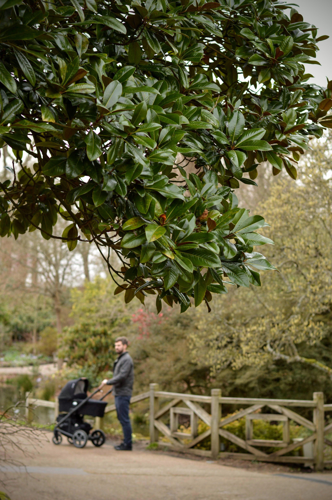 |

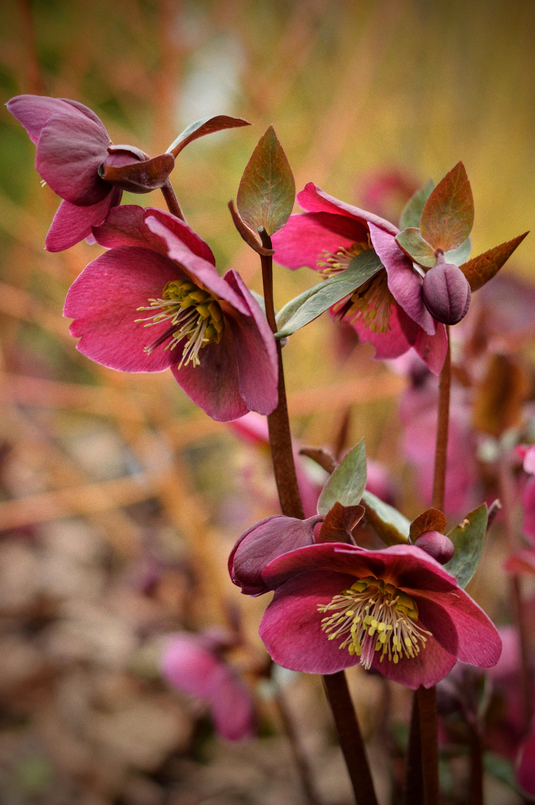

On the cusp of Spring, the garden flaunted some seasonal favourites. My choices were the hellebores - especially this deep pink number. Sadly I didn't record the variety... but there's always next time!

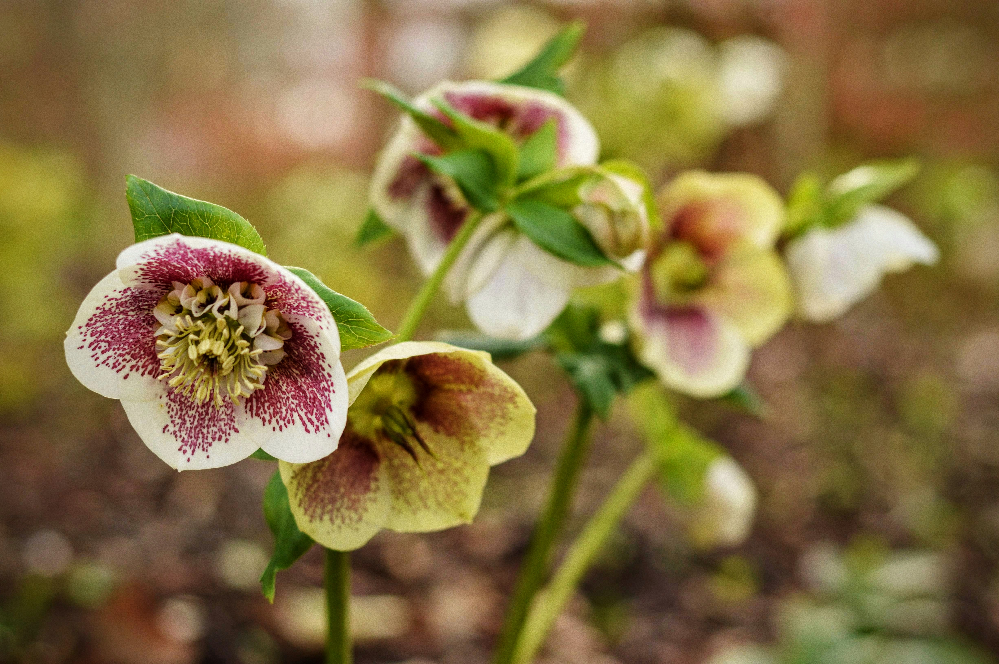

|                                  |                                  |
| -------------------------------- | -------------------------------- |
| 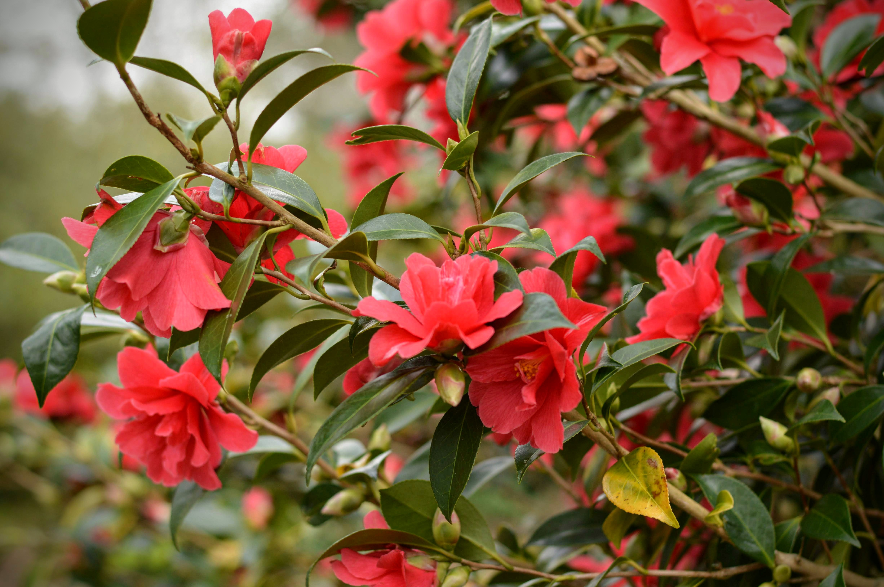 | 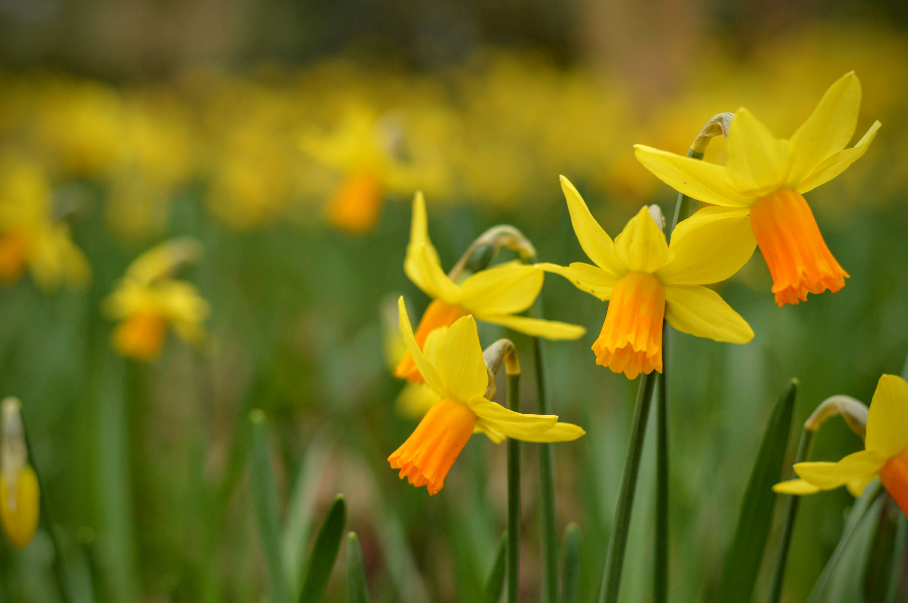 |

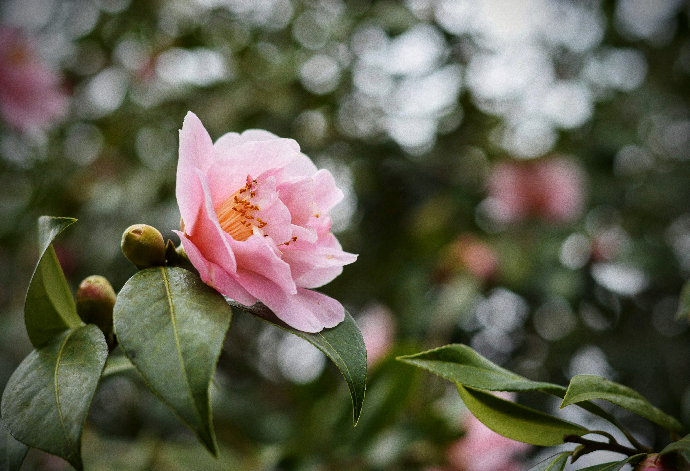

It might have been a short visit, but it was certainly sweet. If nothing else, we proved to ourselves that we can still adventure - albeit needing a far longer buffer to leave the house than ever before!

And to finish? The most sensational gift shop-cum-garden centre. For that reason alone, we'll be back!

|                                  |                                  |
| -------------------------------- | -------------------------------- |
| 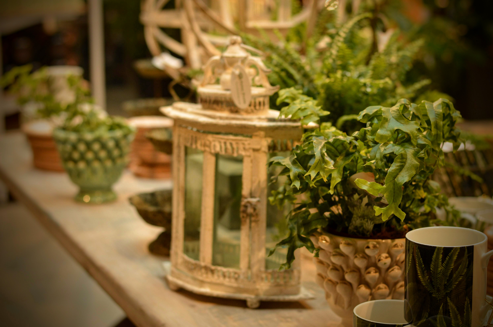 | 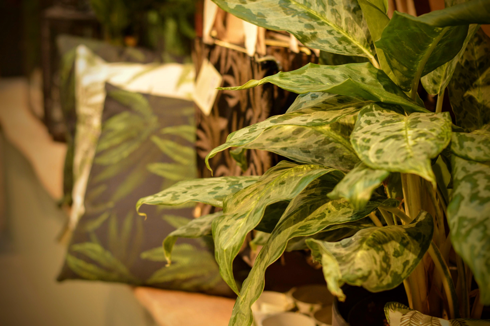 |

###The useful bits:###

- RHS Wisley is near Woking, Surrey, and is located just off the A3 (London to Portsmouth A-road).
- We drove to the Garden (parking is free), but public transport is possible. Plan your visit [here](https://www.rhs.org.uk/gardens/wisley/Plan-your-visit).
- If you do use public transport, your entry ticket is a discounted £12.
- Normal entry costs £16.50, however we opted to sign up for a year's [RHS membership](https://www.rhs.org.uk/join). At just shy of £50, it was a no brainer as we'll definitely be visiting again.
